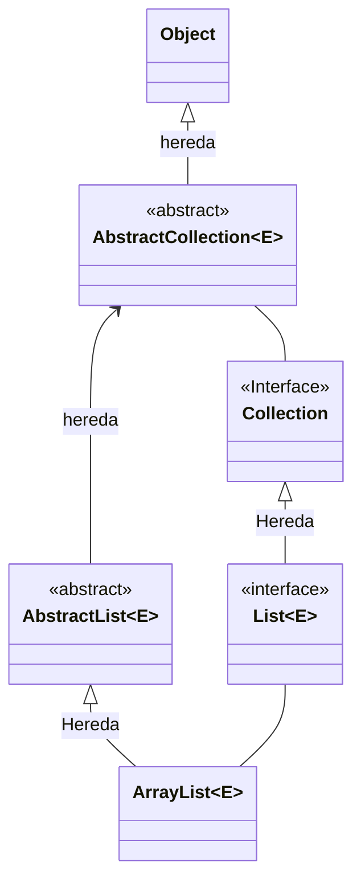
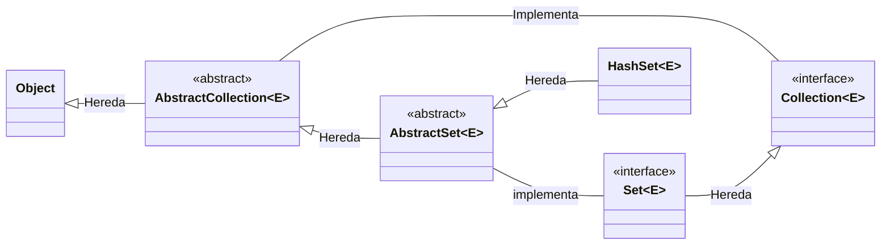
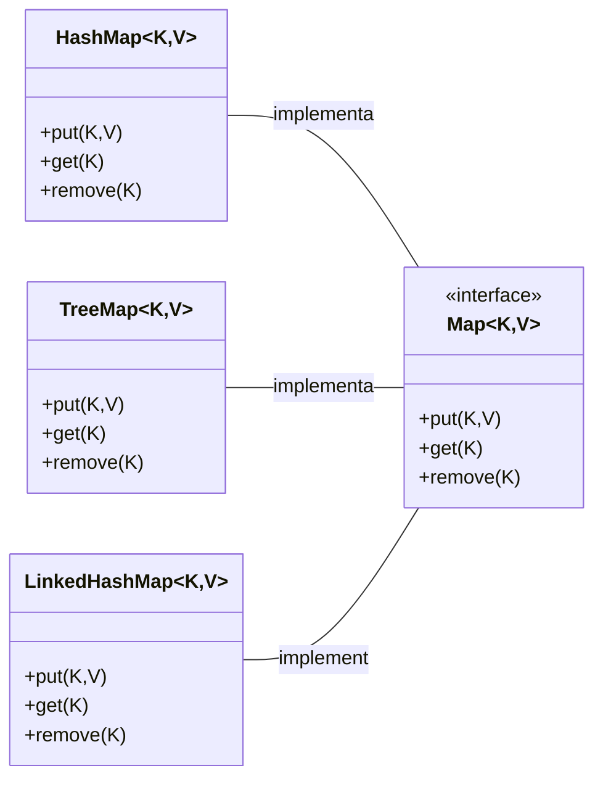
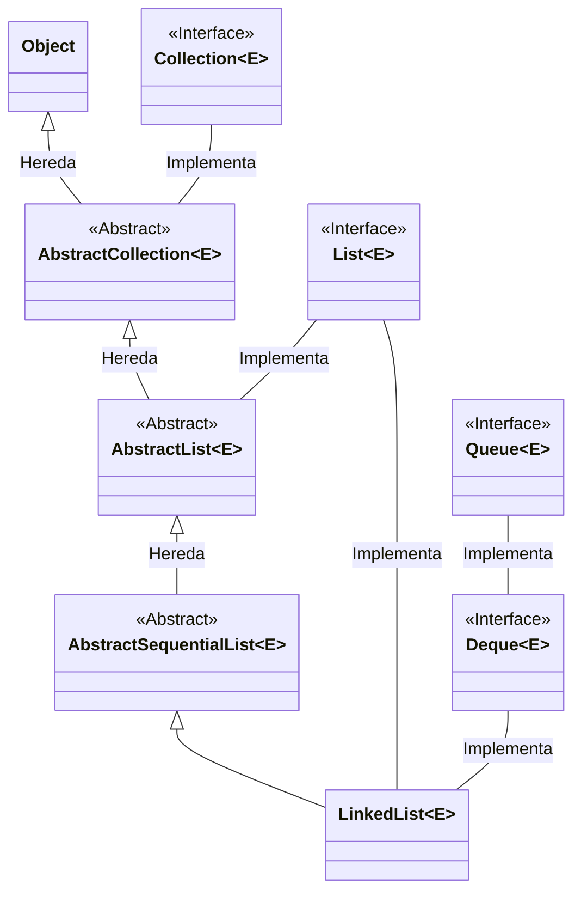

# Laboratorio 07 - Colecciones de Objetos

# Sistema de Biblioteca - Colecciones de Objetos

En esta práctica, exploraremos la implementación de un sistema de biblioteca utilizando el Java Collections Framework (JCF). El objetivo principal es mejorar nuestro sistema desarrollado en el laboratorio anterior anterior mediante el uso de estructuras de datos más eficientes y flexibles proporcionadas por JCF.

Las principales modificaciones incluyen:

- Reemplazo de arreglos por `ArrayList` para gestionar libros y usuarios
- Implementación de `HashMap` para manejar empleados de manera eficiente
- Incorporación de `Queue` para gestionar préstamos en proceso
- Utilización de `Set` para mantener el historial de préstamos sin duplicados

Estas modificaciones nos permitirán:

- Mejorar el rendimiento en operaciones de búsqueda y manipulación de datos
- Implementar funcionalidades más robustas y escalables
- Reducir la complejidad del código mediante el uso de métodos predefinidos de JCF
- Garantizar un manejo más eficiente de la memoria

A continuación, se presenta la implementación detallada de las clases principales del sistema.

# ArrayList



`ArrayList` es una clase que implementa la interfaz `List`, que a su vez extiende la interfaz `Collection`. Esta jerarquía es fundamental para entender su funcionamiento en Java. 

<aside>
⚠️

**List** es una interfaz que define el comportamiento de una colección ordenada que permite elementos duplicados, mientras que `ArrayList` es una implementación específica que utiliza un arreglo dinámico internamente.

</aside>

La principal diferencia entre `List` y `ArrayList` es que `List` es una interfaz que define un contrato de comportamiento, mientras que `ArrayList` es una implementación concreta que proporciona la funcionalidad real. List puede ser implementada por diferentes clases como `LinkedList` o `Vector`, cada una con sus propias características de rendimiento.

## Diferencias entre Arreglo (Array) y ArrayList

| **Característica** | **Array** | **ArrayList** |
| --- | --- | --- |
| Tamaño | Fijo, se define al crearlo | Dinámico, crece automáticamente |
| Tipo de datos | Puede almacenar primitivos y objetos | Solo almacena objetos |
| Sintaxis | int[] array = new int[10]; | ArrayList<Integer> list = new ArrayList<>(); |
| Rendimiento | Más rápido para operaciones simples | Más lento debido a la sobrecarga de objetos |
| Funcionalidad | Operaciones básicas | Métodos adicionales como add(), remove(), contains() |

`ArrayList` destaca por proporcionar acceso aleatorio rápido a los elementos y un rendimiento eficiente al agregar elementos al final de la lista. Sin embargo, las inserciones y eliminaciones en medio de la lista son más costosas, ya que requieren desplazar elementos. El tamaño del ArrayList se ajusta dinámicamente, creciendo automáticamente cuando es necesario, lo que lo hace más flexible que un array tradicional.

**Documentación de ArrayList**

[ArrayList (Java Platform SE 8 )](https://docs.oracle.com/javase/8/docs/api/java/util/ArrayList.html)

1. Comenzaremos a modificar nuestra clase Biblioteca. Si pretendemos Usar las Colecciones de Java (Java Collection Framework) debemos importar el paquete `java.util`. Como vamos a utilizar varias clases de del JCF importaremos tod el paquete (*)
    
    ```java
    import java.util.*;
    
    public class Biblioteca {
    
    }
    ```
    
2. La razón por la que transformaremos una variable Libro a una colección obedece a que  una biblioteca necesita una estructura de datos dinámica que pueda crecer o reducirse según las necesidades, ya que el inventario de libros no es estático y cambia constantemente con nuevas adquisiciones o bajas. ArrayList proporciona esta flexibilidad al permitir agregar o eliminar elementos sin preocuparse por el tamaño fijo que tendría un array tradicional.
    
    Además, ArrayList ofrece métodos predefinidos como add(), remove(), y contains() que simplifican significativamente las operaciones comunes en una biblioteca, como agregar nuevos libros, eliminar ejemplares obsoletos o buscar títulos específicos. Estas operaciones serían más complejas de implementar con un array tradicional, donde se necesitaría código adicional para manejar el redimensionamiento y el desplazamiento de elementos.
    
    ```java
    import java.util.*;
    
    public class Biblioteca {
    		private List<Libro> libros;
    }
    ```
    
3. Ahora modificaremos el constructor al nuevo tipo de dato:
    
    ```java
    import java.util.*;
    
    public class Biblioteca {
    		public Biblioteca(String nombre, String ubicacion) {
    				this.libros = new ArrayList<>();
    		}
    }
    ```
    
    <aside>
    ⚠️
    
    La declaración del atributo `libros` como `List` en lugar de `ArrayList` es un ejemplo del principio de programación "programar hacia interfaces" mejor conocido como “**Principio de Sustitución de Liskov**”
    
    </aside>
    
    Este patrón de diseño (programar hacia interfaces) tiene varias ventajas importantes:
    
    - Proporciona mayor flexibilidad: Si en el futuro necesitamos cambiar la implementación (por ejemplo, a `LinkedList`), solo necesitamos modificar el constructor, no toda la lógica del programa.
    - Mejor abstracción: Al trabajar con la interfaz `List`, nos centramos en qué operaciones podemos realizar (el contrato de la interfaz) en lugar de cómo se implementan.
    - Acoplamiento reducido: El código que usa la variable `libros` solo depende de los métodos definidos en la interfaz `List`, no de la implementación específica de `ArrayList`.
    
    En el constructor, elegimos `ArrayList` porque es la implementación concreta que mejor se adapta a nuestras necesidades actuales, ofreciendo acceso aleatorio eficiente y buen rendimiento para la mayoría de las operaciones que realizaremos.
    
    <aside>
    ⚠️
    
    Un **patrón de diseño** es una solución reutilizable a un problema común en el desarrollo de software. Es como una plantilla o guía que describe cómo resolver problemas que ocurren frecuentemente en el diseño de software de una manera elegante y probada.
    
    </aside>
    
4. Este cambio en el atributo libros cambia el código, por lo que debemos eliminar `setLibro()` y `getLibro()` de nuestro código actual. 
    
    ```java
    import java.util.*;
    
    public class Biblioteca {
    		//  Eliminamos los métodos setLibro() y getLibro()
    }
    ```
    
5. Debemos ahora reemplazar los métodos *set* y *get* eliminados por los métodos que agregan libros a la colección. La convención de nomenclatura en Java para métodos que agregan elementos a colecciones suele utilizar el prefijo "add"  Sin embargo, si estás desarrollando una aplicación específicamente para un público hispanohablante y la consistencia del lenguaje es una prioridad, usar "agregar" es aceptable, siempre que se mantenga esta convención de forma consistente en todo el código.
    
    ```java
    import java.util.*;
    
    public class Biblioteca {
    		public void agregarLibro(Libro libro) {
            libros.add(libro);
        }
    }
    ```
    
    El método `add()` de ArrayList agrega un elemento al final de la lista. Cuando se llama a `add()`, el elemento se coloca en la siguiente posición disponible y, si es necesario, el `ArrayList` aumenta automáticamente su capacidad interna para acomodar el nuevo elemento.
    
    <aside>
    ⚠️
    
    Si el ArrayList necesita crecer, típicamente aumenta su capacidad en un 50% de su tamaño actual, lo que hace que las operaciones de inserción sean eficientes en promedio.
    
    </aside>
    
6. El cambio de `getLibro()` por `buscarLibroPorTitulo()` representa una mejora significativa en la funcionalidad del sistema. Mientras que `getLibro()` típicamente retorna un único libro basado en un índice o identificador específico, `buscarLibroPorTitulo()` ofrece una búsqueda más flexible y útil que permite encontrar libros basándose en coincidencias parciales del título. El retornar una lista de libros en lugar de un solo libro, permite manejar múltiples coincidencias, lo que es más realista considerando que pueden existir diferentes ediciones o versiones del mismo título.
    
    ```java
    import java.util.*;
    
    public class Biblioteca {
    		public List<Libro> buscarLibrosPorTitulo(String titulo) {
    		    List<Libro> resultados = new ArrayList<>();
    		    for (Libro libro : libros) {
    		        if (libro.getTitulo().toLowerCase().contains(titulo.toLowerCase())) {
    		            resultados.add(libro);
    		        }
    		    }
    		    return resultados;
    		}
    }
    ```
    
    La implementación utiliza un enfoque tradicional e intuitivo: crea una nueva lista vacía llamada 'resultados' y luego itera sobre todos los libros en la biblioteca usando un bucle for-each. Para cada libro, verifica si su título contiene la cadena buscada, ignorando mayúsculas y minúsculas mediante el uso de toLowerCase(). Si encuentra una coincidencia, agrega el libro a la lista de resultados.
    
    <aside>
    ⚠️
    
    Las **llamadas en cadena** (*method chaining*) en Java permiten invocar múltiples métodos en secuencia, donde cada método retorna un objeto sobre el cual se puede llamar al siguiente método. Por ejemplo, en `getTitulo().toLowerCase().contains()`., primero se ejecuta `getTitulo()` que devuelve un objeto, luego sobre ese objeto se llama `toString()`, que devuelve otro objeto y sobre de el, se ejecuta `contains()`. Esta técnica permite escribir código más conciso y fluido, evitando el uso de variables intermedias.
    
    </aside>
    
7. El nuevo enfoque nos permite eliminar un libro del acervo de biblioteca, por eso proveemos de un método adicional. El método `remove()` de `ArrayList` elimina la primera ocurrencia del elemento especificado de la lista. Si el elemento existe, lo elimina y desplaza los elementos restantes para llenar el espacio, retornando true. Si el elemento no existe en la lista, retorna false.
    
    ```java
    import java.util.*;
    
    public class Biblioteca {
    		public void eliminarLibro(Libro libro) {
            libros.remove(libro);
        }
    }
    ```
    

# Set

La jerarquía de clases de HashSet muestra su relación con otras clases e interfaces en Java Collections Framework. Como se ilustra en el diagrama:



Un `Set` en Java es una colección que no permite elementos duplicados y no mantiene un orden específico de los elementos. Esta característica lo hace ideal para casos donde necesitamos asegurar la unicidad de los elementos, como por ejemplo, para mantener un registro de números de identificación únicos o correos electrónicos de usuarios.

La interfaz Set es implementada por varias clases, siendo las más comunes HashSet, TreeSet y LinkedHashSet. Cada implementación tiene sus propias características y casos de uso específicos.

| **Característica** | **List** | **Set** |
| --- | --- | --- |
| Duplicados | Permite elementos duplicados | No permite elementos duplicados |
| Orden | Mantiene el orden de inserción | No garantiza ningún orden (HashSet) |
| Acceso | Acceso por índice | Solo iteración sobre elementos |
| Rendimiento | O(n) para búsquedas | O(1) para búsquedas en HashSet |
| Uso común | Cuando el orden importa o se necesitan duplicados | Cuando se requiere unicidad de elementos |

Las principales implementaciones de Set son:

- **HashSet:** La implementación más común, ofrece el mejor rendimiento pero no garantiza ningún orden
- **TreeSet:** Mantiene los elementos ordenados naturalmente, pero es más lento
- **LinkedHashSet:** Mantiene el orden de inserción, con un rendimiento intermedio

## Hash

<aside>
⚠️

Un hash es una función o algoritmo que convierte datos de longitud variable en valores de longitud fija, generalmente representados como cadenas de caracteres. En el contexto de HashSet, el algoritmo hash se utiliza para determinar dónde se almacenará cada elemento en la estructura de datos subyacente, permitiendo un acceso rápido y eficiente.

</aside>

La función hash toma un objeto como entrada y devuelve un valor numérico (el código hash) que se utiliza como índice para almacenar el elemento. Cuando se busca un elemento, se calcula su hash y se va directamente a esa ubicación, lo que permite operaciones de búsqueda muy rápidas.

Es importante notar que diferentes objetos pueden producir el mismo valor hash (esto se conoce como "colisión"). HashSet maneja estas colisiones internamente usando técnicas como el encadenamiento, donde múltiples elementos que comparten el mismo valor hash se almacenan en una lista enlazada.

1. En el contexto de nuestro sistema de biblioteca, es más apropiado utilizar un `Set` en lugar de una `List` para gestionar los usuarios. La razón principal es que cada usuario debe ser único en el sistema, identificado por su ID o número de membresía. Un Set garantiza automáticamente esta unicidad, evitando duplicados que podrían causar problemas en la gestión de préstamos, historial y membresías. Además, las operaciones de búsqueda en un `HashSet` son más eficientes comparadas con una `List`, lo que mejora el rendimiento del sistema cuando se necesita verificar la existencia de un usuario o buscar sus datos, operaciones frecuentes en una biblioteca.
    
    ```java
    import java.util.*;
    
    public class Biblioteca {
    		private Set<Usuario> usuarios;
    }
    ```
    
2. El constructor creará la colección HashSet para los usuarios
    
    ```java
    import java.util.*;
    
    public class Biblioteca {
    		public Biblioteca(String nombre, String ubicacion) {
            this.usuarios = new HashSet<>();
        }
    }
    ```
    
3. Nuevamente este cambio hace inútiles el set y get que nuestro sistema tenía. Los reemplazaremos por  `agregarUsuario()` y `eliminarUsuario()`:
    
    ```java
    import java.util.*;
    
    public class Biblioteca {
    		public void agregarUsuario(Usuario usuario) {
            usuarios.add(usuario);
        }
    
        public void eliminarUsuario(Usuario usuario) {
            usuarios.remove(usuario);
        }
    }
    ```
    
    Una característica notable de las colecciones en Java es la consistencia en sus métodos. Por ejemplo, el método `add()` funciona de manera similar tanto en List como en Set:
    
    - En List: `add()` agrega el elemento al final de la lista
    - En Set: `add()` agrega el elemento manteniendo la unicidad
    
    <aside>
    ⚠️
    
    Esta consistencia se extiende a otros métodos como `remove()`, `contains()`, y `size()`, lo que facilita el aprendizaje y uso del framework de colecciones Java, permitiendo intercambiar implementaciones sin necesidad de modificar significativamente el código que las utiliza.
    
    </aside>
    
4. El método `buscarUsuarioPorId()` utiliza un ciclo `for-each` para iterar sobre la colección de usuarios. Para cada usuario, compara su ID con el ID buscado usando el método `equals()`. Si encuentra una coincidencia, retorna ese usuario inmediatamente. Si termina el bucle sin encontrar coincidencia, retorna null.
    
    ```java
    public class Biblioteca {
    		public Usuario buscarUsuarioPorId(String id) {
    		    for (Usuario usuario : usuarios) {
    		        if (usuario.getId().equals(id)) {
    		            return usuario;
    		        }
    		    }
    		    return null;
    		}
    }
    ```
    

# Map



Un `Map` en Java es una interfaz que representa una colección de pares **clave-valor**, donde cada **clave** debe ser única pero los **valores** pueden repetirse. Esta estructura es ideal para situaciones donde necesitamos asociar datos relacionados, como un ID de empleado con su información, o un número de ISBN con un libro.

La característica distintiva de `Map` es que permite acceder a los valores a través de sus claves de manera eficiente. A diferencia de `List` o `Set`, Map no hereda de Collection, sino que es una estructura de datos independiente con sus propias operaciones específicas.

Las implementaciones más comunes de `Map` son:

**HashMap:** La implementación más utilizada, pero no mantiene ningún orden específico.

**TreeMap:** Mantiene las claves ordenadas según su orden natural o un comparador personalizado.

**LinkedHashMap:** Preserva el orden de inserción de los elementos mientras mantiene la eficiencia de HashMap.

Los métodos principales de Map incluyen:

- put(K key, V value): Asocia una clave con un valor
- get(Object key): Obtiene el valor asociado a una clave
- remove(Object key): Elimina la entrada para la clave especificada
- containsKey(Object key): Verifica si existe una clave
- containsValue(Object value): Verifica si existe un valor

<aside>
⚠️

En el contexto de una biblioteca, `Map` es especialmente útil para gestionar empleados donde el ID del empleado actúa como clave y el objeto Empleado como valor, permitiendo búsquedas rápidas y eficientes por ID.

</aside>

1. Ahora reemplazaremos la definición de Empleado para convertirla en una Colección `Map`: La declaración `Map<String, Empleado>;` representa una estructura de datos que almacena pares de clave-valor, donde la clave es de tipo `String` (en este caso, el ID del empleado) y el valor es un objeto de tipo `Empleado`. Esta estructura permite asociar cada empleado con su identificador único, facilitando búsquedas rápidas y eficientes. Por ejemplo, si tenemos un empleado con ID "E001", podemos almacenarlo en el `Map` usando `empleados.put("E001", empleadoObj)` y posteriormente recuperarlo usando `empleados.get("E001")`. Esta operación de búsqueda es muy eficiente, con una complejidad de tiempo O(1) en el caso promedio cuando se utiliza HashMap.
    
    ```java
    import java.util.*;
    
    public class Biblioteca {
    		private Map<String, Empleado> empleados;
    }
    ```
    
2. A la hora de crear la instancia elegimos HashMap para la colección de empleados porque necesitamos acceder frecuentemente a los empleados por su ID, y HashMap proporciona búsquedas rápidas, lo que es significativamente más eficiente que buscar en una `List` o `Set`. Además, cada empleado debe tener un ID único, y `HashMap` garantiza naturalmente esta unicidad en las claves. 
    
    ```java
    import java.util.*;
    
    public class Biblioteca {
    		public Biblioteca(String nombre, String ubicacion) {
            this.empleados = new HashMap<>();
        }
    }
    ```
    
    <aside>
    ⚠️
    
    No podemos crear una instancia directa de `Map` (o de `List,` o de `Set`) porque `Map` es una *interfaz*, no una clase concreta. Una **interfaz** define un contrato de comportamiento pero no proporciona la implementación real. Por esta razón, debemos usar una de sus implementaciones concretas como `HashMap`, `TreeMap` o `LinkedHashMap` para crear una instancia que podamos utilizar en nuestro código.
    
    </aside>
    
3. En versión anterior, `setEmpleado()` se utilizaba para asignar un objeto a la biblioteca. Sin embargo, con la nueva implementación usando Map, este enfoque ya no es apropiado. Primero, la gestión de empleados ahora se realiza de manera individual a través del Map, donde cada empleado se asocia con su ID único como clave. El objeto Empleado debe crearse fuera de la clase Biblioteca, típicamente en la capa de servicio o controlador, donde se pueden validar sus datos antes de agregarlo al sistema.
    
    <aside>
    ⚠️
    
    El controlador es una capa de software que actúa como intermediario entre la interfaz de usuario y la lógica de negocio (como la clase Biblioteca). Es responsable de recibir las solicitudes del usuario, validar los datos de entrada, coordinar las operaciones necesarias y gestionar las respuestas. En el contexto de la biblioteca, el controlador se encargaría de verificar que los datos del empleado sean válidos antes de llamar al método agregarEmpleado() de la clase Biblioteca.
    
    </aside>
    
    Segundo, el método `agregarEmpleado()` refleja mejor la operación real que se está realizando: añadir un empleado individual al Map de empleados. Este método toma un objeto Empleado ya construido y lo almacena en el Map usando su ID como clave, lo que es más coherente con el patrón de diseño de colecciones y proporciona un mejor control sobre cómo se agregan los empleados al sistema.
    
    ```java
    import java.util.*;
    
    public class Biblioteca {
    		public void agregarEmpleado(Empleado empleado) {
            empleados.put(empleado.getId(), empleado);
        }
    
    }
    ```
    
4. Los métodos *set* y *get*, nuevamente serán remplazados por agregar `Empleado()` y `obtenerEmpleado()`. Agregamos también el método Eliminar empleado para eliminarlo de la colección reemplazando el método `getEmpleadoBibliotecario()` de la versión anterior
    
    ```java
    import java.util.*;
    
    public class Biblioteca {
    		
        public void eliminarEmpleado(String id) {
            empleados.remove(id);
        }
    
        public Empleado obtenerEmpleado(String id) {
            return empleados.get(id);
        }
    }
    ```
    

Necesitamos actualizar las clases Usuario y Empleado antes de continuar trabajando con la clase Biblioteca.

# Actualizando las clases Usuario y Empleado

Las clases Usuario y Empleado ahora necesitan actualizarse para incorporar colecciones que gestionen de manera más eficiente sus datos y operaciones. Estos cambios son necesarios por dos razones:

Primero, debido a las modificaciones realizadas en la clase Biblioteca, donde ahora utilizamos colecciones como `List`, `Set` y `Map`, es esencial que las clases `Usuario` y `Empleado` se adapten para mantener la coherencia y compatibilidad con estas nuevas estructuras de datos.

Segundo, las propias clases Usuario y Empleado pueden beneficiarse significativamente del uso de colecciones para manejar sus datos internos. Por ejemplo:

- La clase Usuario puede utilizar List para gestionar sus libros prestados actuales y Set para mantener un historial de préstamos sin duplicados
- La clase Empleado puede implementar Queue para manejar préstamos en proceso y List para mantener un historial ordenado de todas las transacciones realizadas

Estas actualizaciones no solo mejorarán el rendimiento y la eficiencia de las operaciones, sino que también harán el código más mantenible y flexible para futuras modificaciones.

# Actualizando la clase Usuario

La actualización de la clase Usuario representa un cambio en la forma en que gestionamos los datos relacionados con los préstamos de libros. En la implementación anterior, solo podía tener un libro prestado, lo cual limitaba la flexibilidad y eficiencia de las operaciones. La nueva versión incorpora dos estructuras de datos fundamentales del Java Collections Framework: `List` y `Set`.

La decisión de usar `List<Libro>` para `librosPrestados` se justifica por la necesidad de mantener un registro ordenado y dinámico de los libros que el usuario tiene actualmente en préstamo. ArrayList, como implementación específica, proporciona acceso rápido por índice y permite modificaciones eficientes de la colección, características esenciales para gestionar préstamos activos.

Por otro lado, la introducción de `Set<String>` para `historialPrestamos` responde a la necesidad de mantener un registro único de todos los IDs de libros que el usuario ha tomado prestados a lo largo del tiempo. La naturaleza del Set garantiza automáticamente que no habrá duplicados en el historial, mientras que su implementación HashSet ofrece operaciones de búsqueda y agregación altamente eficientes.

Esta actualización mejora significativamente el rendimiento y la mantenibilidad del código. Las operaciones de préstamo y devolución ahora son más robustas, y la gestión del historial es más precisa y eficiente. Además, el uso de estas colecciones facilita la implementación de nuevas funcionalidades, como la búsqueda de patrones de préstamo o la generación de reportes de actividad del usuario.

1. Si queremos usar Java Collections Framework, deberemos importarla del paquete `java.util`.
    
    ```java
    import java.util.*;
    
    public class Usuario extends Persona {
    		
    }
    ```
    
2. Primero reemplazaremos el atributo `libroPrestado` por un `List` de objetos `Libro` llamada `librosPrestados` y agregamos un nuevo atributo de tipo `Set` de `String`  llamado historial prestamos:
    
    ```java
    import java.util.*;
    
    public class Usuario extends Persona {
    		private List<Libro> librosPrestados;
    		private Set<String> historialPrestamos;
    }
    ```
    
3. El constructor creará dos implementaciones, `ArrayList<>` para `librosPrestados` y `HashSet<>` para `historialPrestamos`.
    
    ```java
    import java.util.*;
    
    public class Usuario extends Persona {
    		public Usuario(String nombre, String id) {
            super(nombre, id);
            this.librosPrestados = new ArrayList<>();
            this.historialPrestamos = new HashSet<>();
        }
    }
    ```
    
4. El método `solicitarPrestamo` implementa la lógica para que un usuario solicite un préstamo de un libro. Primero verifica si el libro no está prestado usando `!libro.isPrestado()`. Si el libro está disponible, intenta prestarlo usando `libro.prestarLibro()`. Si ambas condiciones se cumplen, el libro se agrega a la lista de `librosPrestados` del usuario y su ID se registra en el `historialPrestamos`.
    
    El uso de `add()` para `librosPrestados` agrega el libro al final de la lista `ArrayList`, manteniendo el orden cronológico de los préstamos. Para el historialPrestamos, `add()` agrega el ISBN del libro al `HashSet`, que automáticamente evita duplicados.
    
    El método retorna `true` si el préstamo fue exitoso (el libro estaba disponible y se pudo prestar) o `false` si no se pudo realizar el préstamo (el libro ya estaba prestado o no se pudo marcar como prestado).
    
    ```java
    import java.util.*;
    
    public class Usuario extends Persona {
    		public boolean solicitarPrestamo(Libro libro) {
            if (!libro.isPrestado() && libro.prestarLibro()) {
                librosPrestados.add(libro);
                historialPrestamos.add(libro.getIsbn());
                return true;
            }
            return false;
        }
    }
    ```
    
    <aside>
    ⚠️
    
    Es importante destacar que al actualizar los métodos para usar colecciones, hemos mantenido la misma firma (argumentos y tipo de retorno) mientras modificamos la implementación interna. Esto ejemplifica el principio de encapsulación: los cambios internos en cómo gestionamos los datos no afectan la forma en que otros componentes interactúan con nuestra clase. Esto permite evolucionar la implementación sin romper el código existente que depende de estos métodos.
    
    </aside>
    
5. El método `devolverLibro()` implementa la lógica para devolver un libro prestado. Veamos su funcionamiento paso a paso:
    
    El método comienza verificando si el libro está en la lista de `librosPrestados` usando el método `contains()`. Este método de ArrayList busca el objeto especificado en la colección y retorna `true` si lo encuentra, o `false` si no está presente. La búsqueda se realiza utilizando el método `equals()` del objeto para comparar con cada elemento de la lista.
    
    Si el libro se encuentra en la lista, procede a ejecutar tres acciones: llama al método `devolverLibro()` del objeto libro para marcarlo como disponible, remueve el libro de la lista `librosPrestados` usando `remove()`, y finalmente retorna `true` indicando que la devolución fue exitosa. En caso de que el libro no esté en la lista de préstamos del usuario, el método retorna `false`.
    
    ```java
    import java.util.*;
    
    public class Usuario extends Persona {
    		public boolean devolverLibro(Libro libro) {    
            if (librosPrestados.contains(libro)) {
                libro.devolverLibro();
                librosPrestados.remove(libro);
                return true;
            }
            return false;
        }
    }
    ```
    
6. El método `getLibrosPrestados()` devuelve una nueva `ArrayList` que es una copia de `librosPrestados` en lugar de devolver la referencia directa a la lista original. Esta decisión de diseño es crucial para mantener el principio de encapsulamiento y proteger la integridad de los datos internos de la clase. Cuando devolvemos `new ArrayList<>(librosPrestados)`, estamos creando una copia defensiva de la colección. Si simplemente devolviéramos la referencia directa a `librosPrestados`, cualquier código externo que reciba esta referencia podría modificar la lista original, potencialmente corrompiendo el estado interno del objeto `Usuario` y violando la encapsulación.
    
    ```java
    import java.util.*;
    
    public class Usuario extends Persona {
    		public List<Libro> getLibrosPrestados() {
            return new ArrayList<>(librosPrestados);
        }
    }
    ```
    
7. Al modificar el tipo de retorno de un método como `getLibrosPrestados()`, debemos considerar varios aspectos importantes.
    
    El cambio de tipo de retorno de un solo `Libro` a `List<Libro>;` es un cambio que rompe la compatibilidad hacia atrás (*breaking change*). Cualquier código que llame a este método necesitará ser actualizado para manejar una lista en lugar de un solo objeto.
    
    Para manejar este tipo de cambios, es recomendable documentar claramente el cambio en el código, considerar mantener temporalmente ambas versiones del método (con nombres diferentes) durante un período de transición, y actualizar todas las pruebas unitarias existentes.
    
    <aside>
    ⚠️
    
    En programación, cuando algo está "**deprecado**" significa que aunque todavía funciona, ya no se recomienda su uso porque existe una mejor alternativa. Es una forma de indicar que esa funcionalidad será eliminada en futuras versiones del software. Se marca con la anotación @Deprecated para advertir a otros desarrolladores que deberían migrar a las nuevas funciones recomendadas.
    
    </aside>
    
    Deberemos ajustar el código del método deprecado para ajustarlo a la nueva estructura y poder continuar disponible mientras ocurre el cambio a la nueva versión.
    
    ```java
    		/**
         *** Deprecado, para eliminación: Este elemento de la API será eliminado en una versión futura.**
         * Obtiene una copia del libro prestado actualmente 
         * 
         * @return Una copia del libro prestado o null si no hay préstamos activos
         */	
    		public Libro getLibrosPrestados() {
            if(librosPrestados.size() > 0 )
                return new Libro(librosPrestados.get(0)); // Retorna una copia de la lista
            else
                return null;
        }
        
        public List<Libro> getLibrosPrestado() {
            return new ArrayList<>(librosPrestados);
        }
    ```
    
8. El cambio en el método `getLibrosPrestados()` para retornar una copia defensiva de la lista en lugar de una referencia directa es crucial para el funcionamiento correcto del constructor de copia de Usuario. Este constructor necesita crear una nueva instancia de Usuario que sea independiente del original, y esto incluye tener su propia lista de libros prestados.
    
    ```java
    import java.util.*;
    
    public class Usuario extends Persona {
    		public Usuario(Usuario usuario) {
            super(usuario.getNombre(), usuario.getId());
            this.librosPrestados = usuario.getLibrosPrestado();
        }
    }
    ```
    
9. Un nuevo Atributo obliga a nueva conducta (nuevos métodos). Por eso agregamos el método `getHistorialPrestamos()`, que devuelve una copia defensiva del conjunto `historialPrestamos` utilizando un nuevo `HashSet`. Esta implementación protege la integridad de los datos internos de la clase al evitar que el código externo modifique directamente el historial original.
    
    ```java
    import java.util.*;
    
    public class Usuario extends Persona {
    		public Set<String> getHistorialPrestamos() {
            return new HashSet<>(historialPrestamos);
        }
    }
    ```
    
10. Solo nos falta modificar el método `toString()`: 
    
    ```java
    import java.util.*;
    		public String toString() {
            String cad = "ID: " + getId() + ", " + "Nombre: " + getNombre() + ". ";
            if (librosPrestados.size() > 0)
                cad += "Tiene en préstamo" + librosPrestados.toString() +  " libros.";
            else
                cad += "No tiene en préstamo un libro.";
            return cad;
        }
    
    }
    ```
    
11. La versión 1.1 de nuestra clase Usuario queda así
    
    ```mermaid
    classDiagram
    		namespace java.util {
    				class ArrayList~E~ { 
    				}
    				class HashSet~E~ {
    				}
    		}
    		class Libro {
    		
    		}
    		class Persona {
    		}
    		class Usuario {
    				- libroPrestados: List~Libro~
    				- historialPrestamos: Set~E~
    				+ Usuario(id : String, nombre : String)
    				+ Usuario(otro : Usuario)
    				+ solicitarPrestamo(libro : Libro) boolean
    				+ devolverLibro() boolean
    				+ getLibrosPrestados() Libro
    				+ getLibroPrestado() List~Libro~
    				+ obtenerTipo() String
    				+ toString() String
    		}
    		note for Usuario "Versión 1.1"
    		direction TB
    		Persona <|-- Usuario
    		Usuario o-- Libro
    		Usuario o-- ArrayList
    		Usuario o-- HashSet
    ```
    
12. Nuestros casos de Prueba también se ajustan a la nueva versión de Empleado
- Casos de Prueba
    
    ```java
    /**
     * Clase de pruebas para la clase Empleado.
     * Esta clase contiene pruebas unitarias para verificar el correcto funcionamiento
     * de todos los métodos y funcionalidades de la clase Empleado.
     * 
     * @author Roberto SALAZAR MARQUEZ
     * @version 1.1
     */
    
    import static org.junit.jupiter.api.Assertions.*;
    import org.junit.jupiter.api.AfterEach;
    import org.junit.jupiter.api.BeforeEach;
    import org.junit.jupiter.api.Test;
    import java.util.*;
    
    public class EmpleadoTest
    {
        /** Variable de instancia para el empleado que se utilizará en las pruebas */
        private Empleado empleado;
        /** Variable de instancia para el usuario que se utilizará en las pruebas de préstamo */
        private Usuario usuario;
        /** Variable de instancia para el libro que se utilizará en las pruebas de préstamo */
        private Libro libro;
    
        /**
         * Configura el escenario de pruebas antes de cada método.
         * Crea nuevas instancias de Empleado, Usuario y Libro para usar en las pruebas.
         */
        @BeforeEach
        public void setUp() {
            empleado = new Empleado("Juan Pérez", "EMP001", 25000.0, "Bibliotecario");
            usuario = new Usuario("Ana García", "U001");
            libro = new Libro("1984", "George Orwell", "9788499890944", 326);
        }
        
        /**
         * Prueba el constructor de la clase Empleado.
         * Verifica que todos los atributos se inicialicen correctamente.
         */
        @Test
        public void testConstructor() {
            assertEquals("Juan Pérez", empleado.getNombre());
            assertEquals("EMP001", empleado.getId());
            assertEquals(25000.00, empleado.getSalario());
            assertEquals("Bibliotecario", empleado.getPuesto());
        }
        
        /**
         * Prueba los métodos setter y getter de la clase Empleado.
         * Verifica que los valores se establezcan y recuperen correctamente.
         */
        @Test
        public void testSettersAndGetters() {
            empleado.setPuesto("Supervisor");
            empleado.setSalario(25000.0);
            empleado.setTurno(Empleado.MATUTINO);
    
            assertEquals("Supervisor", empleado.getPuesto());
            assertEquals(25000.0, empleado.getSalario(), 0.01);
            assertEquals(Empleado.MATUTINO, empleado.getTurno());
        }
    
        /**
         * Prueba el método obtenerTipo().
         * Verifica que retorne correctamente el tipo "Empleado".
         */
        @Test
        public void testObtenerTipo() {
            assertEquals("Empleado", empleado.obtenerTipo());
        }
    
        /**
         * Prueba el método generarId().
         * Verifica que genere IDs únicos y con el formato correcto.
         */
        @Test
        public void testGenerarId() {
            String id1 = Empleado.generarId();
            String id2 = Empleado.generarId();
            
            assertTrue(id1.startsWith("P"));
            assertTrue(id2.startsWith("P"));
            assertNotEquals(id1, id2);
        }
        
        @Test
        public void testDevolverPrestamo() {
            empleado.procesarPrestamo(libro, usuario);
            assertTrue(empleado.devolverPrestamo());
            
            // Verificar que la cola está vacía después de la devolución
            Queue<Prestamo> prestamos = empleado.getPrestamosEnProceso();
            assertTrue(prestamos.isEmpty());
        }
    
        @Test
        public void testDevolverPrestamoSinPrestamosActivos() {
            assertFalse(empleado.devolverPrestamo());
        }
    
        /**
         * Prueba el procesamiento exitoso de un préstamo.
         * Verifica el comportamiento cuando el libro está prestado.
         */
        @Test
        public void testProcesarPrestamoExitoso() {
            assertTrue(empleado.procesarPrestamo(libro, usuario));
            
            // Verificar que el préstamo se agregó a la cola
            Queue<Prestamo> prestamos = empleado.getPrestamosEnProceso();
            assertFalse(prestamos.isEmpty());
            assertEquals(1, prestamos.size());
            
            // Verificar que se agregó al historial
            List<Prestamo> historial = empleado.getHistorialPrestamos();
            assertFalse(historial.isEmpty());
            assertEquals(1, historial.size());
        }
    
        /**
         * Prueba el procesamiento de préstamo con parámetros nulos.
         * Verifica que el método maneje correctamente los casos de entrada nula.
         */
        @Test
        public void testProcesarPrestamoConParametrosInvalidos() {
            assertFalse(empleado.procesarPrestamo(null, usuario));
            assertFalse(empleado.procesarPrestamo(libro, null));
            
            // Intentar prestar un libro ya prestado
            empleado.procesarPrestamo(libro, usuario);
            assertFalse(empleado.procesarPrestamo(libro, usuario));
        }
    
        /**
         * Prueba el método toString().
         * Verifica que la representación en cadena del empleado incluya todos los atributos relevantes.
         */
        @Test
        public void testToString() {
            empleado.setSalario(25000.0);
            empleado.setTurno(Empleado.MATUTINO);
            
            String resultado = empleado.toString();
            
            assertTrue(resultado.contains("Juan Pérez"));
            assertTrue(resultado.contains("EMP001"));
            assertTrue(resultado.contains("Bibliotecario"));
            assertTrue(resultado.contains("25000.0"));
            assertTrue(resultado.contains("0")); // turno MATUTINO
        }
    
        /**
         * Limpia el escenario de pruebas después de cada método.
         */
        @AfterEach
        public void tearDown()
        {
        }
    }
    
    ```
    

# Queue y Deque



## Queue

El principio FIFO garantiza que los elementos se procesen en el orden exacto en que fueron insertados. Esto es fundamental para mantener un orden justo y predecible en el procesamiento de datos.

Las operaciones principales de una Queue incluyen offer() para añadir elementos al final de la cola, poll() para retirar y devolver el elemento al frente, y peek() para mostrar el elemento al frente sin retirarlo. A diferencia de una List, Queue no permite acceso aleatorio a los elementos.

Esta estructura es ideal para gestionar tareas que deben procesarse en orden secuencial, manteniendo la integridad del orden de llegada.

| **Característica** | **Queue** | **List** |
| --- | --- | --- |
| Orden de elementos | FIFO (First In, First Out) | Mantiene orden de inserción, permite reordenamiento |
| Acceso a elementos | Solo al frente de la cola | Acceso aleatorio por índice |
| Operaciones principales | offer(), poll(), peek() | add(), get(), set(), remove() |
| Uso típico | Procesamiento secuencial, gestión de tareas | Almacenamiento general, manipulación de datos |
| Implementaciones comunes | LinkedList, PriorityQueue | ArrayList, LinkedList |
| Duplicados | Permite duplicados | Permite duplicados |
| Elementos Null  | Generalmente no permitidos | Permitidos |

## Deque

`Deque` (Double Ended Queue) es una interfaz que extiende `Queue` para permitir la inserción y eliminación de elementos en ambos extremos de la cola. Esta versatilidad la hace más flexible que una `Queue` estándar, ya que puede funcionar tanto como una cola FIFO (*First In, First Out*) o como una pila LIFO (*Last In, First Out*).

Las operaciones principales de `Deque` incluyen `addFirst()` y `addLast()` para insertar elementos al inicio o final, `removeFirst()` y `removeLast()` para eliminar elementos de los extremos, y `getFirst()` y `getLast()` para consultar elementos sin eliminarlos. Esta dualidad permite implementar estructuras más complejas y adaptables a diferentes necesidades.

## LinkedList

`LinkedList` es una implementación de las interfaces `List` y `Deque` que utiliza una estructura de datos doblemente enlazada. Cada elemento mantiene referencias tanto al elemento anterior como al siguiente, lo que permite inserciones y eliminaciones eficientes en ambos extremos de la lista. A diferencia de `ArrayList`, que usa un arreglo redimensionable, `LinkedList` no necesita reasignar memoria cuando crece, pero requiere más espacio debido a las referencias adicionales por elemento.

Esta estructura es especialmente útil cuando se necesitan frecuentes inserciones y eliminaciones en cualquier posición de la lista. Sin embargo, el acceso aleatorio a elementos es menos eficiente que en `ArrayList`, ya que requiere recorrer la lista desde el principio o el final hasta la posición deseada.

`LinkedList` permite elementos `null` y mantiene el orden de inserción. Es particularmente eficiente cuando se usa como cola o pila, ya que implementa tanto la interfaz `Queue` como `Deque`, permitiendo operaciones como `addFirst()`, `addLast()`, `removeFirst()` y `removeLast()` de manera eficiente.

# Actualizando la clase Empleado

La clase Empleado implementa un atributo `prestamosEnProceso` de tipo `Queue` (cola) porque esta estructura de datos es ideal para manejar préstamos que deben procesarse en un orden específico, siguiendo el principio FIFO (First In, First Out). Esto significa que los préstamos se procesan en el orden exacto en que fueron solicitados, garantizando un tratamiento justo y ordenado de las solicitudes. La cola es particularmente útil en un entorno de biblioteca donde los empleados necesitan gestionar múltiples solicitudes de préstamo de manera secuencial.

La implementación específica utiliza `LinkedList` como la estructura subyacente para la `Queue`, lo que proporciona operaciones eficientes de inserción y eliminación en ambos extremos de la cola. Los métodos `offer()` para agregar nuevos préstamos y `poll()` para procesar y remover préstamos de la cola.

Además, el uso de `Queue` ayuda a mantener un flujo de trabajo organizado y predecible, facilitando el seguimiento de qué préstamos están pendientes de procesamiento y asegurando que ninguna solicitud se pierda o se procese fuera de orden. Esta estructura es especialmente valiosa en situaciones donde múltiples empleados pueden estar procesando préstamos simultáneamente, ya que mantiene la integridad del orden de procesamiento.

La clase Empleado implementa un atributo `historialPrestamos` de tipo `List` porque necesita mantener un registro ordenado y cronológico de todos los préstamos que ha procesado el empleado a lo largo del tiempo. A diferencia de la cola (`Queue`) que se usa para préstamos en proceso, el historial necesita permitir acceso aleatorio a cualquier préstamo pasado y mantener el orden exacto en que ocurrieron. La interfaz `List`, específicamente implementada como `ArrayList`, es ideal para este propósito ya que permite acceso indexado eficiente, mantiene el orden de inserción, y puede crecer dinámicamente según se necesite.

Además, `List` permite operaciones como la búsqueda de préstamos específicos, filtrado por fechas o usuarios, y la capacidad de recorrer todo el historial para generar reportes o estadísticas. Esta flexibilidad es esencial para funciones administrativas y de auditoría que podrían requerir analizar el historial completo de préstamos procesados por un empleado específico. La estructura de List también facilita la implementación de funcionalidades futuras como la paginación del historial o la exportación de datos para reportes.

1. Comenzaremos por reemplazar el atributo `prestamoGestionado` por otro llamado `prestamosEnProceso` de tipo `Queue` y agregamos el atributo `historialPrestamos` de tipo `List`:
    
    ```java
    public class Empleado extends Persona {
    		private Queue<Prestamo> prestamosEnProceso;
        private List<Prestamo> historialPrestamos;
    }
    ```
    
2. Necesitamos eliminar la inicialización del manejador `prestamoGestionado` a `null` y agregamos la creación de las 2 colecciones nuevas:
    
    ```java
    public class Empleado extends Persona {
    		public Empleado(String nombre, String id, double salario, String puesto) {
            this.prestamosEnProceso = new LinkedList<>();
            this.historialPrestamos = new ArrayList<>();
        }
    }
    ```
    
3. Si hemos elimi9naod el atributo `prestamoGestionado`, ya no tiene sentido mantener su *getter*. Eliminamos  entonces `getPrestamosGestionado()`.
4. Los atributos `prestamosEnProceso` y `historialPrestamos` no requieren *setters* porque son colecciones que se manejan internamente a través de los métodos de la clase como procesarPrestamo() y devolverPrestamo(). 
    
    <aside>
    ⚠️
    
    Permitir modificar estas colecciones directamente desde fuera de la clase violaría el principio de encapsulamiento y podría comprometer la integridad de los datos y la lógica del negocio.
    
    </aside>
    
    En cuanto a los getters, si bien existen (`getPrestamosEnProceso()` y `getHistorialPrestamos()`), estos retornan copias defensivas de las colecciones originales usando new LinkedList<>(prestamosEnProceso) y new ArrayList<>(historialPrestamos) respectivamente. Esto permite consultar el estado de los préstamos sin exponer las colecciones internas, protegiendo así la integridad de los datos mientras se mantiene la transparencia necesaria para el funcionamiento del sistema.
    
    ```java
    public class Empleado extends Persona {
    		public Queue<Prestamo> getPrestamosEnProceso() {
    		    return new LinkedList<>(prestamosEnProceso);
    		}
    		
    		public List<Prestamo> getHistorialPrestamos() {
    		    return new ArrayList<>(historialPrestamos);
    		}
    }
    ```
    
5. Necesitamos modificar el método `procesarPrestamo()` para procesar una nueva solicitud de préstamo de libro. Este método utiliza dos operaciones clave:  El método `offer()` de `Queue` añade el nuevo préstamo a la cola `prestamosEnProceso`. Esta operación inserta el elemento al final de la cola de manera segura, retornando false si la cola está llena. Por otro lado, el método `add()` de `List` agrega el préstamo al historialPrestamos. Esta operación añade el elemento al final de la lista, manteniendo el orden cronológico de los préstamos realizados. El método retorna true si el préstamo se procesa exitosamente, o false si hay algún problema (libro no disponible, usuario inválido, etc.).
    
    ```java
    public class Empleado extends Persona {
    		public boolean procesarPrestamo(Libro libro, Usuario usuario) {
            if (libro != null && usuario != null && !libro.isPrestado()) {
                if (usuario.solicitarPrestamo(libro)) {
                    Prestamo nuevoPrestamo = new Prestamo(generarId(), usuario, libro);
                    prestamosEnProceso.offer(nuevoPrestamo);
                    historialPrestamos.add(nuevoPrestamo);
                    return true;
                }
            }
            return false;
        }
    }
    ```
    
    <aside>
    ⚠️
    
    Es importante notar que en esta modificación mantuvimos la misma firma del método `procesarPrestamo(Libro libro, Usuario usuario)`, preservando así la compatibilidad con el código existente. Los cambios se realizaron internamente en la implementación, reemplazando el manejo de un solo préstamo por el uso de colecciones, sin afectar la forma en que otros componentes del sistema interactúan con este método.
    
    </aside>
    
6. El método `devolverPrestamo()` ha sido simplificado significativamente gracias al uso de la interfaz `Queue`. En lugar de manejar manualmente la lógica de devolución y el estado del préstamo, ahora utiliza el método `poll()` de la cola, que automáticamente recupera y elimina el primer préstamo de la cola (el más antiguo, siguiendo el principio FIFO). Si la cola está vacía, `poll()` retorna `null`, lo que simplifica la verificación de si hay préstamos pendientes. El método retorna `true` si se completó exitosamente la devolución (había un préstamo para devolver) o `false` si no había préstamos pendientes en la cola.
    
    ```java
    public class Empleado extends Persona {
    		public boolean devolverPrestamo() {
            Prestamo prestamo = prestamosEnProceso.poll();
            return prestamo != null;
        }
    }
    ```
    
7. Finalmente, el método `toString()` solo requiere un pequeño ajuste relatico a `prestamosEnProceso`:
    
    ```java
    public class Empleado extends Persona {
    		public String toString() {
            return "Empleado [puesto=" + puesto + 
                   ", salario=" + salario + 
                   ", turno=" + turno + 
                   ", prestamos activos=" + prestamosEnProceso.size() + 
                   ", nombre=" + getNombre() + 
                   ", id=" + getId() + "]";
        }
    }
    ```
    
8. El diagrama UML de la clase Camba a su versión 1.1
    
    ```mermaid
    classDiagram
        class Persona {
            <<abstract>>
        }
       namespace java.util {
    				class ArrayList~E~ { 
    				}
    				class LinkedList~E~ {
    				}
    		}
        
        class Empleado {
            - numeroEmpleado: String
            - puesto: String
            - salario: double
            - turno: String
            - prestamosEnProceso: Queue~Prestamo~ 
            - histoialPrestamos: List~Prestamo~
            - contadorId: int$
            + MATUTINO: int = 0$
            + VESPERTINO: int$
            + MIXTO: int = 2$
            + Empleado(nobre: String, id: String, numeroEmpleado: String, puesto: String)
            + getPuesto() String
            + setPuesto(puesto: String) void
            + getSalario() double
            + setSalario(salario: double) void
            + getTurno() String
            + setTurno(turno: String) void
            + getPrestamoEnProceso() Queue~Prestamo~ 
            + getHistorialPrestamo() List~Prestamo~
            + obtenerTipo() String
            + generarId() String$
            +procesarPrestamo(libro: Libro, usuario: Usuario): boolean
            + toString() String
        }
        note for Empleado "Versión 1.1"
    
        Persona <|-- Empleado
        Empleado o-- LinkedList
        Empleado o-- ArrayList
    ```
    

# Actualización de la clase Prestamo

La clase `Prestamo` solo requiere un cambio mínimo. La corrección principal es en el método `procesarDevolución()`  pasar el libro como parámetro al método `devolverLibro()` del usuario, y manejar también el estado del libro directamente. Además, se añade lógica para revertir el estado del libro en caso de que la devolución falle.

1. El método `procesarDevolucion()` verifica primero si el préstamo está activo. Si lo está, registra la fecha actual como fecha de devolución real, marca el libro como disponible usando `devolverLibro()`, y luego intenta procesar la devolución con el usuario. Si la devolución es exitosa, el estado del préstamo se actualiza a DEVUELTO y retorna true. Sin embargo, si la devolución falla por alguna razón, el método revierte el estado del libro marcándolo nuevamente como prestado usando `libro.prestar()` para mantener la consistencia del sistema. Si el préstamo no está activo o algo falla, el método retorna false.
    
    ```java
    
    public boolean procesarDevolucion() {
        if (estado == ACTIVO) {
            fechaDevolucionReal = LocalDate.now();
            libro.devolverLibro();  // Primero marcamos el libro como disponible
            if (usuario.devolverLibro(libro)) {  // Pasamos el libro como parámetro
                estado = DEVUELTO;
                return true;
            }
            // Si la devolución falla, revertimos el estado del libro
            libro.prestarLibro();
        }
        return false;
    }
    ```
    
2. El Diagrama de Clases de Prestano no cambia peros si su versión: 
    
    ```mermaid
    classDiagram
    		direction LR
    		class Prestamo {
    				- id: String
    				- usuario: Usuario
    				- libro: Libro
    				- fechaPrestamo: LocalDate
    				- fechaDevolucionEsperada: LocalDate
    				- fechaDevolucionReal: LocalDate
    				- estado: int
    				+ ACTIVO: int = 0$
    				+ DEVUELTO: int = 1$
    				+ VENCIDO: int = 2$
    				+ Prestamo(id: String, usuario: Usuario, libro: Libro)
    				+ getId() int
    				+ getUsuario() Usuario
    				+ getLibro() Libro
    				+ getFechaPrestamo() LocalDate
    				+ getFechaDevoluciónEsperada() LocalDate
    				+ getFechaDevoluciónEsperada() LocalDate
    				+ getEstado() int
    				+ registrarPrestamo() boolean
    				+ procesarDevolución() boolean
    				+ varificarEstado() void
    				+ extenderPrestamo(dias : int) boolean
    				+ toString() String
    		} 
    		note for Prestamo "Versión 1.1"
    		class Usuario {
    		}
    		class Libro {
    		}
    		namespace java.util {
    				class LocalDate {
    				}
    		}
    		Prestamo o-- Usuario
    		Prestamo o-- LocalDate
    		Prestamo o-- Libro
    ```
    
3. Los casos de prueba solo sufren un ajuste minimo para su versión 1.1:
- **Casos de Prueba**
    
    ```java
    
    import static org.junit.jupiter.api.Assertions.*;
    import org.junit.jupiter.api.AfterEach;
    import org.junit.jupiter.api.BeforeEach;
    import org.junit.jupiter.api.Test;
    import java.time.LocalDate;
    
    public class PrestamoTest
    {
        private Prestamo prestamo;
        private Usuario usuario;
        private Libro libro;
    
        /**
         * Sets up the test fixture.
         *
         * Called before every test case method.
         */
        @BeforeEach
        public void setUp() {
            usuario = new Usuario("U001", "Juan Pérez");
            libro = new Libro("Don Quijote de la Mancha", "Miguel de Cervantes", "9788424922498", 863);
            prestamo = new Prestamo("P001", usuario, libro);
        }
        
        @Test
        public void testConstructor() {
            assertEquals("P001", prestamo.getId());
            assertEquals(usuario.getId(), prestamo.getUsuario().getId());
            assertEquals(libro.getIsbn(), prestamo.getLibro().getIsbn());
            assertEquals(prestamo.getFechaPrestamo(), prestamo.getFechaPrestamo());
            assertEquals(Prestamo.ACTIVO, prestamo.getEstado());
        }
        
        @Test
        public void testRegistrarPrestamoExitoso() {
            assertTrue(prestamo.registrarPrestamo());
            assertEquals(Prestamo.ACTIVO, prestamo.getEstado());
        }
        
        @Test
        public void testRegistrarPrestamoLibroNoPrestado() {
            libro.prestarLibro(); // Libro ya prestado
            assertFalse(prestamo.registrarPrestamo());
        }
        
        @Test
        public void testProcesarDevolucionExitosa() {
            prestamo.registrarPrestamo();
            assertTrue(prestamo.procesarDevolucion());
            assertEquals(Prestamo.DEVUELTO, prestamo.getEstado());
            assertNotNull(prestamo.getFechaDevolucionReal());
        }
        
        @Test
        public void testProcesarDevolucionPrestamoNoActivo() {
            assertFalse(prestamo.procesarDevolucion());
        }
        
        @Test
        void testProcesarDevolucion() {
            prestamo.registrarPrestamo();
            assertTrue(prestamo.procesarDevolucion());
            assertEquals(Prestamo.DEVUELTO, prestamo.getEstado());
            assertNotNull(prestamo.getFechaDevolucionReal());
            assertFalse(libro.isPrestado());
            
            // Intentar devolver un préstamo ya devuelto
            assertFalse(prestamo.procesarDevolucion());
        }
        
        
        @Test
        public void testExtenderPrestamoExitoso() {
            prestamo.registrarPrestamo();
            LocalDate fechaOriginal = prestamo.getFechaDevolucionEsperada();
            assertTrue(prestamo.extenderPrestamo(7));
            assertEquals(fechaOriginal.plusDays(7), prestamo.getFechaDevolucionEsperada());
        }
        
        
        @Test
        public void testToString() {
            String resultado = prestamo.toString();
            assertTrue(resultado.contains("P001"));
            assertTrue(resultado.contains(usuario.getNombre()));
            assertTrue(resultado.contains(libro.getTitulo()));
            assertTrue(resultado.contains("ACTIVO"));
        }
    
        @AfterEach
        public void tearDown()
        {
        }
    }
    
    ```
    

<aside>
⚠️

La **lógica de negocio** en software representa las reglas, procesos y operaciones fundamentales que definen cómo funciona una organización. Es la capa que contiene toda la funcionalidad central y las reglas que procesan los datos, independiente de la interfaz de usuario o el almacenamiento de datos. 

</aside>

En el contexto de una biblioteca, incluye operaciones como el préstamo de libros, la gestión de usuarios, el control de inventario y las políticas de préstamo, implementadas en código de manera que refleje fielmente los requisitos y procedimientos reales de la biblioteca.

Los cambios en las colecciones impactan significativamente la forma en que escribimos los métodos de la lógica de negocio. Por ejemplo, al usar `Map` para empleados, las búsquedas se realizan directamente con `get()` en lugar de iterar sobre una lista. El uso de `Set` para usuarios garantiza automáticamente que no haya duplicados, eliminando la necesidad de verificaciones manuales. Las operaciones de préstamo se benefician de `ArrayList` para libros, permitiendo búsquedas flexibles y modificaciones dinámicas.

La implementación de `Queue` para préstamos en proceso permite gestionar las operaciones en orden FIFO (First In, First Out), mientras que el historial de préstamos utiliza `List` para mantener un registro cronológico. Estas estructuras de datos no solo mejoran el rendimiento, sino que también hacen que el código sea más claro y mantenible al aprovechar las características específicas de cada tipo de colección.

1. Realizamos una búsqueda manual del libro mediante un ciclo *for de colecciones* que itera sobre la colección de libros. El método recorre cada libro en la lista hasta encontrar uno cuyo isbn coincida con el parámetro `isbn` proporcionado. Una vez encontrado el libro (o no), la lógica continúa de manera idéntica: se busca el usuario y el empleado correspondientes.
    
    La verificación de las condiciones necesarias para realizar el préstamo permanece igual: se comprueba que el libro, usuario y empleado existan (no sean null) y que el libro no esté prestado actualmente. Si todas estas condiciones se cumplen, se procede a realizar el préstamo mediante el método procesarPrestamo del empleado.
    
    ```java
    public class Biblioteca {
    		public boolean prestarLibro(String idLibro, String idUsuario, String idEmpleado) {
    		    Libro libro = null;
    		    for (Libro l : libros) {
    		        if (l.getIsbn().equals(isbn)) {
    		            libro = l;
    		            break;
    		        }
    		    }
    		    
    		    Usuario usuario = buscarUsuarioPorId(idUsuario);
    		    Empleado empleado = empleados.get(idEmpleado);
    		
    		    if (libro != null && usuario != null && empleado != null && !libro.isPrestado()) {
    		        return empleado.procesarPrestamo(libro, usuario);
    		    }
    		    return false;
    		}
    }
    ```
    
2. El método `devolverLibro()` busca el libro correspondiente en la colección de libros utilizando el `isbn` proporcionado. La búsqueda se realiza de manera secuencial, iterando sobre la colección hasta encontrar una coincidencia. Si no se encuentra el libro, la variable libro permanece como `null`. Después, obtiene la referencia al empleado y el usuario. Si el Libro, Usuario y Empleado existen, el método ejecuta tres acciones: marca el libro como devuelto usando `libro.devolverLibro(`), registra la devolución en el empleado con `empleado.devolverPrestamo()`, y retorna `true` para indicar una devolución exitosa. Si alguna de las condiciones no se cumple, el método retorna false, indicando que la devolución no pudo realizarse.
    
    ```java
    public class Biblioteca {
    		public boolean devolverLibro(String idLibro, String idEmpleado) {
    		    Libro libro = null;
    		    for (Libro l : libros) {
    		        if (l.getId().equals(idLibro)) {
    		            libro = l;
    		            break;
    		        }
    		    }
    		    
    		    Empleado empleado = empleados.get(idEmpleado);
    		
    		    if (libro != null && empleado != null && libro.isPrestado()) {
    		        libro.devolverLibro();
    		        empleado.devolverPrestamo();
    		        return true;
    		    }
    		    return false;
    		}
    }
    ```
    
3. Los cambios hechos nos permiten implementar una nueva funcionalidad a la biblioteca, El método `getLibrosDisponibles()` tiene la **responsabilidad** de obtener y retornar una lista de todos los libros que actualmente están disponibles para préstamo en la biblioteca. La implementación utiliza una nueva estructura de datos `ArrayList` para almacenar y retornar los resultados. Esto se logra mediante un ciclo `for-each` (o for de colecciones) que itera sobre la colección completa de libros de la biblioteca. Durante cada iteración, el método verifica si el libro actual no está prestado utilizando el método `isPrestado()`. Cuando encuentra un libro que no está prestado, lo agrega a la lista de libros disponibles. Además, al retornar una nueva lista con solo los libros disponibles, se mantiene el encapsulamiento y se previene la modificación directa de la colección principal de libros de la biblioteca.
    
    ```java
    public class Biblioteca {
    		public List<Libro> getLibrosDisponibles() {
        List<Libro> disponibles = new ArrayList<>();
        for (Libro libro : libros) {
            if (!libro.isPrestado()) {
                disponibles.add(libro);
            }
        }
        return disponibles;
    }
    }
    ```
    
    <aside>
    ⚠️
    
    El **diseño basado en responsabilidades** es un principio fundamental de la programación orientada a objetos que se centra en asignar a cada clase un conjunto específico y bien definido de tareas o "responsabilidades". Este enfoque sostiene que cada objeto en el sistema debe tener un propósito claro y único, encapsulando solo la funcionalidad necesaria para cumplir con ese propósito.
    
    </aside>
    
    Este enfoque mejora la mantenibilidad del código, facilita las pruebas y permite una mejor reutilización de componentes, ya que cada clase tiene un rol claro y bien definido dentro del sistema. Además, cuando las responsabilidades están bien distribuidas, los cambios en una parte del sistema tienen menos probabilidades de afectar a otras partes, lo que resulta en un código más robusto y adaptable.
    
4. La contraparte, una lista de libros prestados se genera de la misma manera que la lista de libros disponibles:
    
    ```java
    public class Biblioteca {
    		public List<Libro> getLibrosPrestados() {
            List<Libro> prestados = new ArrayList<>();
            for (Libro libro : libros) {
                if (libro.isPrestado()) {
                    prestados.add(libro);
                }
            }
            return prestados;
        }
    }
    ```
    
5. Finalmente, el método `toString()` proporciona una representación textual del estado actual de la biblioteca, incluyendo información sobre el nombre, ubicación, cantidades totales de libros (disponibles y prestados), usuarios y empleados, además de una lista detallada de los libros que están actualmente prestados.
    
    ```java
    public class Biblioteca {
    		public String toString() {
            String estado = "";
            estado += "Biblioteca: " + nombre + "\n";
            estado += "Ubicación: " + ubicacion + "\n";
            estado += "Total de libros: " + libros.size() + "\n";
            estado += "Libros disponibles: " + getLibrosDisponibles().size() + "\n";
            estado += "Libros prestados: " + getLibrosPrestados().size() + "\n";
            estado += "Total de usuarios registrados: " + usuarios.size() + "\n";
            estado += "Total de empleados: " + empleados.size() + "\n";
            
            // Información detallada de libros prestados
            estado += "\nLibros actualmente prestados:\n";
            for (Libro libro : getLibrosPrestados()) {
                estado += "- " + libro.getTitulo() + "\n";
            }
            
            return estado;
        }
    }
    ```
    
6. Nuestro diagrama UML si ha cambiado significativamen en su versión 1.1:
    
    ```mermaid
    classDiagram
    		namespace java.util {
    				class ArrayList~E~ { 
    				}
    				class HashSet~E~ {
    				}
    				class HashMap~e~ {
    				}
    		}
    		class Libro {  }
    		class Empleado {  }
    		class Usuario {  }
    		class Biblioteca {
    				- nombre: String
    				- ubicación: String
    				- libros: List~Libro~ 
    				- usuarios: Set~Usuario~
    				- empleados: Map~String, Empleado~ 
    				+ Biblioteca(nombre: String, ubicación: String)
    				+ agregarEmpleado(empleado: Empleado) void
    				+ eliminarEmpleado(empleado: Empleado) void
    				+ obtenerEmpleado(id: String) Empleado
    				+ agregarLibro()libro: Libro
    				+ eliminarLibro(libro: Libro) void
    				+ buscarLibrosPorTitulo(titulo: String) List~Libro~
    				+ agregaUsuario(usuario: Usuario) void
    				+ eliminarUsuario(usuario: Usuario) void
    				+ buscarUsuarioPorId(id: String) Usuario
    				+ getNombre() String
    				+ getUbicación() String
    				+ prestarLibro(isbn: String, idUsuario: String, idEmpleado: String) boolean
    				+ devolverLibro(isbn: String, idEmpleado: String) boolean
    				+ getLibrosDisponibles() List~Libro~ 
    				+ getLibrosPrestados() List~Libro~
    				+ toString() String
    		}
    		
    		Biblioteca o-- ArrayList
    		Biblioteca o-- HashSet
    		Biblioteca o-- HashMap
    		Biblioteca o-- Libro
    		Biblioteca o-- Usuario
    		Biblioteca o-- Empleado
    		note for Biblioteca "Version 1.1"
    ```
    

# Clase Main

Toda esta actualización a nuestras clases requiere un nueva prueba de sistema. Escribamos una nueva versión de la clase Main.java:

```java
/**
 * Clase principal para probar la funcionalidad de la biblioteca.
 * 
 * @author Roberto Salazar Marquez
 * @version 1.1
 */
public class Main {
    public static void main(String[] args) {
        // Crear una nueva biblioteca
        Biblioteca biblioteca = new Biblioteca("Biblioteca Central", "Av. Universidad 3000");
        
        // Crear y agregar empleados
        Empleado emp1 = new Empleado("E001", "Juan Pérez", "Bibliotecario");
        Empleado emp2 = new Empleado("E002", "María García", "Asistente");
        biblioteca.agregarEmpleado(emp1);
        biblioteca.agregarEmpleado(emp2);
        
        // Crear y agregar libros
        Libro libro1 = new Libro("9788423919", "Don Quijote", "Miguel de Cervantes");
        Libro libro2 = new Libro("9780140449", "Crimen y Castigo", "Fiódor Dostoyevski");
        Libro libro3 = new Libro("9788420674", "Cien años de soledad", "Gabriel García Márquez");
        biblioteca.agregarLibro(libro1);
        biblioteca.agregarLibro(libro2);
        biblioteca.agregarLibro(libro3);
        
        // Crear y agregar usuarios
        Usuario user1 = new Usuario("U001", "Ana López", "Estudiante");
        Usuario user2 = new Usuario("U002", "Carlos Ruiz", "Profesor");
        biblioteca.agregarUsuario(user1);
        biblioteca.agregarUsuario(user2);
        
        // Probar búsqueda de libros
        System.out.println("Búsqueda de libros con 'don':");
        for (Libro libro : biblioteca.buscarLibrosPorTitulo("don")) {
            System.out.println(libro.getTitulo());
        }
        
        // Probar préstamo de libro
        System.out.println("\nProbando préstamo de libro:");
        if (biblioteca.prestarLibro("9788423919", "U001", "E001")) {
            System.out.println("Préstamo realizado con éxito");
        } else {
            System.out.println("No se pudo realizar el préstamo");
        }
        
        // Mostrar libros prestados
        System.out.println("\nLibros prestados:");
        for (Libro libro : biblioteca.getLibrosPrestados()) {
            System.out.println(libro.getTitulo());
        }
        
        // Probar devolución de libro
        System.out.println("\nProbando devolución de libro:");
        if (biblioteca.devolverLibro("9788423919", "E001")) {
            System.out.println("Devolución realizada con éxito");
        } else {
            System.out.println("No se pudo realizar la devolución");
        }
        
        // Mostrar estado final de la biblioteca
        System.out.println("\nEstado final de la biblioteca:");
        System.out.println(biblioteca.toString());
    }
}
```

La salida de este programa es el siguente:

```powershell
Búsqueda de libros con 'don':
Don Quijote de la Mancha

Probando préstamo de libro:
Préstamo realizado con éxito

Probando préstamo de libro:
Préstamo realizado con éxito

Libros prestados:
El Principito
Fahrenheit 451

Probando devolución de libro:
Devolución realizada con éxito

Estado final de la biblioteca:
Biblioteca: Biblioteca Central
Ubicación: Av. Universidad 3000
Total de libros: 9
Libros disponibles: 8
Libros prestados: 1
Total de usuarios registrados: 2
Total de empleados: 2

Libros actualmente prestados:
- Fahrenheit 451
```

# Sugerencias de Mejora

Basado en la implementación actual, se sugieren las siguientes mejoras para el sistema:

- **Sistema de reservas:** Agregar funcionalidad para que los usuarios puedan reservar libros que están actualmente prestados.
- **Notificaciones:** Agregar un sistema de notificaciones para avisar sobre fechas de vencimiento y reservas disponibles.
- **Categorización de libros:** Implementar un sistema de categorías usando enums o clases específicas para mejorar la organización.

Estas mejoras ayudarían a hacer el sistema más robusto y útil en un entorno real.

---

Otra posible mejora sería implementar un contador de préstamos por libro. Actualmente, el sistema no rastrea cuántas veces se ha prestado cada libro. Se podría agregar un atributo `contadorPrestamos` a la clase `Libro` que se incremente cada vez que se realiza un préstamo exitoso.

```java
public class Libro {
    private int contadorPrestamos = 0;
    
    public void incrementarPrestamos() {
        contadorPrestamos++;
    }
    
    public int getContadorPrestamos() {
        return contadorPrestamos;
    }
}
```

Esta funcionalidad permitiría generar estadísticas sobre los libros más populares y ayudaría en la toma de decisiones sobre nuevas adquisiciones para la biblioteca.

Para implementar un seguimiento mensual de préstamos, podríamos agregar una estructura que registre esta información en la clase Biblioteca:

```java
public class Biblioteca {
    // Mapa para almacenar préstamos por mes: Key = "YYYY-MM", Value = cantidad
    private Map<String, Integer> prestamosmensuales = new HashMap<>();
    
    private void registrarPrestamoMensual() {
        LocalDate fecha = LocalDate.now();
        String mesKey = String.format("%d-%02d", fecha.getYear(), fecha.getMonthValue());
        prestamosmensuales.merge(mesKey, 1, Integer::sum);
    }
    
    public Map<String, Integer> getEstadisticasMensuales() {
        return new HashMap<>(prestamosmensuales);
    }
    
    // Modificar el método prestarLibro para incluir el registro
    public boolean prestarLibro(String isbn, String idUsuario, String idEmpleado) {
        // ... código existente ...
        if (/* préstamo exitoso */) {
            registrarPrestamoMensual();
            return true;
        }
        return false;
    }
}
```

Esta implementación permite:

- Registrar automáticamente cada préstamo con su mes correspondiente
- Consultar estadísticas de préstamos por mes
- Generar reportes mensuales de actividad de la biblioteca

Para visualizar estas estadísticas, podríamos agregar un método que genere un reporte.

---