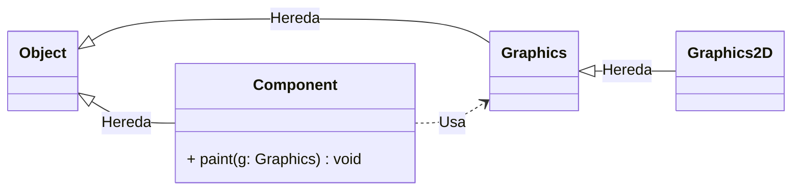
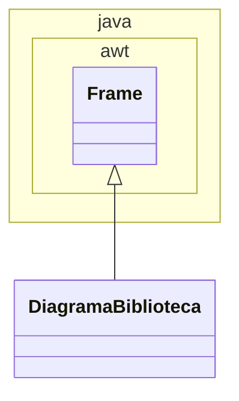
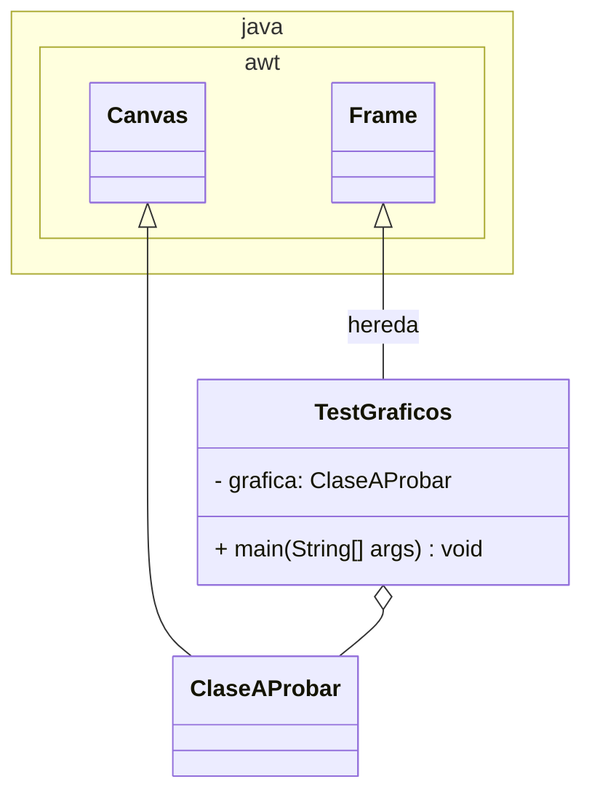

# Laboratorio 08 - Implementación de Gráficos Básicos con Java 2D

# Java2D

Java 2D es una API (Interfaz de Programación de Aplicaciones) que proporciona un conjunto completo de clases para crear gráficos bidimensionales avanzados, texto e imágenes en aplicaciones Java. Esta API forma parte del paquete `java.awt` y `java.awt.geom`.

Características principales de Java 2D:

- **Formas geométricas:** Permite dibujar líneas, rectángulos, elipses, arcos y formas personalizadas utilizando la clase Graphics2D.
- **Transformaciones:** Ofrece capacidades para realizar rotaciones, escalados y traslaciones de elementos gráficos.
- **Control de color:** Proporciona manejo avanzado de colores, incluyendo transparencia (alpha) y gradientes.
- **Manejo de texto:** Permite renderizar texto con diferentes fuentes, estilos y atributos.
- **Efectos visuales:** Incluye funcionalidades para aplicar efectos como antialiasing, degradados y patrones.

Para crear gráficos en Java, podemos utilizar las capacidades integradas en el SDK (*Software Development Kit*) que nos permiten desarrollar aplicaciones con interfaces gráficas ricas y dinámicas. El proceso comienza típicamente extendiendo componentes como `JPanel` o `Canvas`, que proporcionan una superficie donde podemos dibujar.

<aside>
⚠️

La creación de gráficos en Java se basa en un sistema de coordenadas cartesianas donde el origen `(0,0)` se encuentra en la esquina superior izquierda de la ventana o componente. Los valores positivos de X aumentan hacia la derecha, mientras que los valores positivos de Y aumentan hacia abajo. Este sistema nos permite posicionar y dimensionar elementos gráficos con precisión.

</aside>



Para implementar gráficos, generalmente sobrescribimos el método paint() o paintComponent() del componente visual. 

Estos métodos reciben un objeto `Graphics` que actúa como nuestro "pincel virtual", permitiéndonos dibujar formas, líneas, texto e imágenes. Java proporciona una jerarquía rica de clases y métodos que facilitan la creación desde gráficos simples hasta visualizaciones complejas.

La clase `Graphics` es una clase abstracta en Java que proporciona las funcionalidades básicas para dibujar elementos gráficos en componentes de la interfaz de usuario. Es la clase base para todas las operaciones de renderizado gráfico en Java. Características principales de la clase `Graphics`:

- **Operaciones básicas:** Permite dibujar líneas, rectángulos, óvalos y texto simple.
- **Sistema de coordenadas:** Utiliza un sistema de coordenadas donde (0,0) está en la esquina superior izquierda.
- **Colores básicos:** Maneja colores simples sin capacidades avanzadas como transparencia.
- **Limitaciones:** No soporta transformaciones geométricas avanzadas ni efectos sofisticados.

La evolución de `Graphics` a `Graphics2D` representa un salto significativo en las capacidades gráficas de Java. Mientras `Graphics` proporciona funcionalidades básicas para dibujar formas simples y texto, `Graphics2D` introduce características avanzadas como:

- **Mayor control sobre la geometría:** Permite trabajar con formas más complejas y precisas usando coordenadas flotantes.
- **Transformaciones avanzadas:** Facilita la aplicación de matrices de transformación para rotar, escalar y trasladar objetos gráficos.
- **Control de renderizado:** Ofrece opciones detalladas para controlar la calidad y el método de renderizado de los gráficos.
- **Manejo de atributos:** Permite establecer y modificar atributos como el grosor de línea, estilos de trazo, y patrones de relleno.

Graphics2D es una extensión directa de Graphics, lo que significa que mantiene toda la funcionalidad básica mientras agrega estas características avanzadas. Esto permite una transición suave desde aplicaciones que usan Graphics a aquellas que requieren las capacidades más sofisticadas de Graphics2D.



## Crear nuestra clase de visualización de gráficos

Para probar nuestra implementación de gráficos, crearemos una clase de que nos permitirá visualizar el funcionamiento de las clases de laboratorio. Esta clase de servirá como ejemplo de cómo integrar y utilizar nuestros componentes gráficos en una aplicación real.

La clase que desarrollaremos también puede servir como plantilla para probar otras implementaciones de gráficos, como gráficos de pastel, líneas o animaciones. Esta metodología de prueba es fundamental en el desarrollo de componentes visuales, ya que nos permite:

- Verificar el correcto funcionamiento de nuestros componentes gráficos
- Probar diferentes conjuntos de datos y configuraciones
- Demostrar el uso práctico de nuestras implementaciones
- Identificar posibles mejoras o errores en el diseño

<aside>
⚠️

Como se mencionó en clase y en este laboratorio, usaremos la vieja versión (deprecada) de  eventos para no interferir con las clases del tema Objetos de interfaz.

</aside>

1. Crearemos un nuevo archivo `TestGraficos.java` con la clase `TestGraficos`
    
    ```java
    public class TestGraficos {
    
    }
    ```
    
    ```mermaid
    classDiagram
    		class TestGraficos { }
    ```
    
2. Importaremos el paquete `awt` para diseñar Interfaces de Usuario (UI)
    
    ```java
    import java.awt.*;
    
    public class TestGraficos {
    
    }
    ```
    
3. Nuestra clase será una ventana de Sistema operativo por lo que la heredaremos de la clase `Frame`.
    
    ```java
    import java.awt.*;
    
    public class TestGraficos extends Frame {
    
    }
    ```
    
    ```mermaid
    classDiagram
    		namespace java.awt {
    				class Frame { }
    		}
    		class TestGraficos { }
    		
    		Frame<|-- TestGraficos : hereda
    ```
    
    <aside>
    ⚠️
    
    Nos enfocaremos en `Frame` en un siguiente Laboratorio
    
    </aside>
    
4. Necesitamos un manejador a la clase que nos interesa probar::
    
    ```java
    import java.awt.*;
    
    public class TestGraficos extends Frame {
        
        //  Aquí definimos el manejador de la clase que nos interesa probar (atributo de la clase)
    }
    ```
    
5. La implementación del constructor de la clase `TestGraficos` realiza tres tareas principales:
    - Primero, llama al constructor de la clase padre `Frame` usando el argumento titulo (`super(titulo)`) lo que establece el título de la ventana.
    - Segundo, crea una nueva instancia de `GraficoEstadisticas` pasándole los arreglos valores y etiquetas que fueron definidos previamente como atributos de la clase. Esto inicializa nuestro componente gráfico con los datos que queremos visualizar.
    - Segundo, crea una nueva instancia de la clase que nos interesa proba pasándole los pasándole los argumentos necesarios para que funcione apropiadamente. Esto inicializa nuestro componente gráfico con los datos que queremos probar.
    - Tercero, utiliza el método `add()` para agregar el componente gráfico a la ventana. El parámetro "`Center`" indica que el gráfico se colocará en el centro del `Frame`.
    
    <aside>
    ⚠️
    
    Por heredar de la clase `Canvas`, las clases que vamos a probar se convierte en un componente gráfico que puede ser posicionado y manipulado como cualquier otro componente AWT en la ventana del Frame.
    
    </aside>
    
    Esta implementación sigue el patrón común en aplicaciones de interfaz gráfica de Java, donde primero se inicializan los componentes y luego se agregan al contenedor principal en la ubicación deseada.
    
    ```java
    import java.awt.*;
    
    public class TestGrafico extends Frame {
    		
    		public TestGraficos (String titulo) {
            super(titulo);
            // Aquí creamos la instancia del componente gráfico a crear  
            //  clase grafica = new Clase()
            add(grafica,"Center");
        }
    }
    ```
    
6. Para poder cerrar la ventana `Frame` tendremos que procesar el evento cierre de ventana. El método `handleEvent` es un método heredado de la clase `Frame` que se utiliza para manejar eventos de ventana. En este caso específico, está configurado para manejar el evento de cierre de ventana:
    - Cuando el usuario intenta cerrar la ventana, se genera un evento `Event.WINDOW_DESTROY.` l método verifica si el ID del evento (`e.id`) corresponde a `Event.WINDOW_DESTROY`
    - Si es un evento de cierre, el método: Llama a `hide()` para ocultar la ventana. Luego llama a `dispose()` para liberar los recursos del sistema asociados con la ventana. Finalmente regresa `true` para indicar que el evento fue atendido,
    
    Si el evento no es de tipo `WINDOW_DESTROY`, el método delega el manejo del evento a la clase padre usando `super.handleEvent(e)`.
    
    ```java
    import java.awt.*;
    
    public class TestGrafico extends Frame {
    
    		public boolean ~~handleEvent~~(Event e) {
            if (e.id == Event.WINDOW_DESTROY) {
                ~~hide~~();
                dispose();
                return true;
            }
            return super.handleEvent(e);
        }
    }
    ```
    
    <aside>
    ⚠️  Este método es importante para asegurar que la aplicación se cierre correctamente y libere los recursos del sistema cuando el usuario cierra la ventana.
    
    </aside>
    
7. Finalmente el método `main()` es el punto de entrada principal para ejecutar nuestra aplicación gráfica mediante:
    - **Creación de la instancia:**  - Crea una nueva instancia de nuestra clase que contiene los elementos gráficos
    - **Establecer tamaño:**  Define las dimensiones de la ventana en píxeles (600 de ancho por 400 de alto)
    - **Mostrar ventana:** Hace visible la ventana en pantalla
    
    ```java
    import java.awt.*;
    
    public class TestGrafico extends Frame {
    		
    		public static void main(String[] args) {
            TestGrafico  grafico = new TestGrafico ("Gráfico");
            grafico.resize(600,400);
            grafico.show();
        }
    }
    ```
    
    <aside>
    ⚠️  Es importante mencionar que los métodos `resize()` y `show()` están marcados como deprecados (obsoletos) en versiones modernas de Java, aunque siguen funcionando. En futuros laboratorios aprenderemos las alternativas modernas recomendadas.
    
    </aside>
    

Para referencia, nuestra clase para probar clases graficas queda así:

```java
import java.awt.*;

public class TestGrafico extends Frame {

    //  Aquí definimos el manejador de la clase que nos interesa probar (atributo de la clase)
    //  private **clase grafica**;

    public TestGrafico(String titulo) {
        super(titulo);
        // Aquí creamos la instancia del componente gráfico a crear  
        //  clase **grafica** = new **Clase**()
        // add(**grafica**,"Center");
    }

    public boolean handleEvent(Event e) {
        if (e.id == Event.WINDOW_DESTROY) {
            hide();
            dispose();
            return true;
        }
        return super.handleEvent(e);
    }

    public static void main(String[] args) {
        TestGrafico  grafico = new TestGrafico ("Grafico");
        grafico.resize(600,400);
        grafico.show();
    }
    
}
```



# Dibujo de formas simples

## Distribución de la biblioteca

Vamos a implementar un diagrama de la distribución física de nuestra biblioteca. Integraremos este diagrama a nuestro sistema de bibliotecas mas adelante.

1. Crearemos un nuevo código Java llamado `DiagramaBiblioteca.java` con una clase con el mismo nombre:
    
    ```java
    public class DiagramaBiblioteca {
    		
    }
    ```
    
2. `Canvas` es una clase de Java AWT que proporciona un área de dibujo en blanco donde podemos realizar gráficos personalizados. Es un componente ligero diseñado específicamente para dibujar, que nos permite implementar nuestro propio método `paint()` para crear visualizaciones personalizadas. A diferencia de otros componentes que tienen una apariencia predeterminada, `Canvas` no dibuja nada por sí mismo, actuando como un lienzo en blanco para nuestros gráficos. Necesitamos importarla de `java.awt`:
    
    ```java
    import java.awt.*;
    
    public class DiagramaBiblioteca extends Canvas {
    		
    }
    ```
    
3. Por el momento dejaremos el constructor vacío ya que nuestra clase no tiene atributos que necesiten ser inicializados. Solo necesitamos que la clase herede de Frame para poder crear una ventana donde mostrar nuestros gráficos.
    
    ```java
    import java.awt.*;
    
    public class DiagramaBiblioteca extends Canvas {
    
        public DiagramaBiblioteca() {
            
        }
        
    }
    ```
    
4. El método `paint()` es un método heredado de la clase `Canvas` que debemos sobrescribir (*override*) para implementar nuestros propios gráficos. Este método es llamado automáticamente por el sistema cuando el componente necesita ser dibujado o redibujado. La sobrescritura del método `paint()` nos permite: 
    - Definir qué y cómo se dibujará en nuestro canvas
    - Acceder al contexto gráfico a través del parámetro Graphics g
    - Implementar nuestras propias rutinas de dibujo usando los métodos de la clase Graphics
    
    ```java
    import java.awt.*;
    
    public class DiagramaBiblioteca extends Canvas {
        
        public void paint(Graphics g) {
            // Aquí implementamos nuestro código de dibujo
        }
    }
    ```
    
    <aside>
    ⚠️
    
    Sin la sobrescritura de este método, nuestro canvas permanecería en blanco ya que Canvas por defecto no dibuja nada.
    
    </aside>
    
5. Para probar nuestra clase, usaremos la clase `TestGrafico`.
    
    ```mermaid
    classDiagram
    		namespace java.awt {
    				class Frame { }
    				class Canvas { }
    		}
    		class DiagramaBiblioteca {
    				+ paint(Graphics g) void
    		}
    		class TestGraficos {
    				- grafica:  DiagramaBiblioteca 
    				+ main(String[] args) void
    		}
    		
    		Frame<|-- TestGraficos : hereda
    		Canvas <|-- DiagramaBiblioteca 
    		TestGraficos o-- DiagramaBiblioteca 
    ```
    
6. necesitamos un método `main()` que cree una instancia de `DiagramaBiblioteca` y configure las propiedades básicas de la ventana: El método main crea una nueva instancia de nuestra clase, establece el tamaño de la ventana a 800x600 píxeles y la hace visible. Este es el punto de entrada para ejecutar nuestra aplicación gráfica.
    
    ```java
    import java.awt.*;
    
    public class TestGrafico extends Frame {
    
        //  Aquí definimos el manejador de la clase que nos interesa probar (atributo de la clase)
        private DiagramaBiblioteca grafica;
    
        public TestGrafico(String titulo) {
            super(titulo);
            // Aquí creamos la instancia del componente gráfico a crear  
            DiagramaBiblioteca grafica = new DiagramaBiblioteca();
            add(grafica,"Center");
        }
    }
    ```
    
7. Ya podemos compilar y ejecutar nuestra clase `TestGrafico`. Se abre una ventana en nuestra ventana:
    
    
    
8. En Java, una variable declarada como tipo de una superclase puede apuntar a una instancia de cualquiera de sus subclases. Por ejemplo, cuando recibimos un objeto `Graphics` en el método paint(), en realidad podemos estar recibiendo un objeto Graphics2D. 
    
    <aside>
    ⚠️
    
    Esto se debe al principio de sustitución de Liskov, que establece que los objetos de una subclase deben poder sustituir a los objetos de su superclase sin afectar la corrección del programa.
    
    </aside>
    
    Para aprovechar las características avanzadas de `Graphics2D`, podemos hacer un cast del objeto Graphics que recibimos:
    
    ```java
    import java.awt.*;
    
    public class DiagramaBiblioteca extends Canvas {
    		
    		public void paint(Graphics g) {
    				Graphics2D g2d = (Graphics2D) g;
    	    
    		}
    }
    ```
    
9. Cuando `Graphics2D` renderiza líneas diagonales o curvas, los píxeles individuales pueden crear bordes irregulares.  El **antialiasing** suaviza estos bordes añadiendo píxeles semitransparentes alrededor de los bordes, creando la ilusión de bordes más suaves y naturales.
    
    <aside>
    ⚠️
    
    El `antialiasing` es una técnica de suavizado que mejora la apariencia visual de los gráficos al reducir el efecto de "escalera" o "sierra" que se produce en los bordes de las formas y texto. 
    
    </aside>
    
    `Graphics2D` incluye esta capacidad como parte de sus mejoras sobre `Graphics` básico, permitiendo gráficos de mayor calidad visual. Para activar el *antialiasing*, se utiliza el método `setRenderingHint()` con los parámetros `RenderingHints.KEY_ANTIALIASING` y `RenderingHints.VALUE_ANTIALIAS_ON`.
    
    ```java
    import java.awt.*;
    
    public class DiagramaBiblioteca extends Canvas {
    		
    		public void paint(Graphics g) {
    				g2d.setRenderingHint(RenderingHints.KEY_ANTIALIASING, 
                                 RenderingHints.VALUE_ANTIALIAS_ON);
    	    
    		}
    }
    ```
    
    <aside>
    ⚠️
    
    En Java, puedes dividir una línea de código larga en varias líneas para mejorar la legibilidad del código. Java ignora los espacios en blanco y saltos de línea adicionales, lo que permite formatear el código de manera más clara y organizada. 
    
    </aside>
    
10. El método `setStroke()` en Java 2D es una función importante que permite personalizar cómo se dibujan las líneas y contornos de las formas. Este método acepta un objeto `Stroke` que define las características del trazo. Las características principales que se pueden controlar con setStroke:
    - **Grosor de línea:** Determina el ancho del trazo en píxeles (como en el ejemplo donde usamos 3.0f)
    - **Estilo de línea:** Permite crear líneas punteadas, discontinuas o patrones personalizados
    - **Uniones:** Define cómo se conectan los segmentos de línea (pueden ser redondeadas, en bisel o en ángulo)
    - **Terminaciones:** Especifica cómo se dibujan los extremos de las líneas (redondeados, cuadrados o sin extensión)
    
    La clase más común para crear un Stroke es `BasicStroke`, que permite especificar estas características. 
    
    ```java
    import java.awt.*;
    
    public class DiagramaBiblioteca extends Canvas {
    		
    		public void paint(Graphics g) {
    				g2d.setStroke(new BasicStroke(3.0f));
    	    
    		}
    }
    ```
    
11. El método `setColor()` en Java 2D se utiliza para establecer el color que se usará para todas las operaciones de dibujo subsiguientes. Este método es fundamental para controlar el aspecto visual de los elementos gráficos. La clase `Color` representa colores en el espacio de color RGB (Rojo, Verde, Azul). Hay varias formas de crear un objeto Color:
    - **Usando valores RGB:** `new Color(int r, int g, int b)` donde cada valor va de 0 a 255
    - **Usando colores predefinidos:** Color proporciona constantes para colores comunes `new Color(Color.RED)`
    - **Incluyendo transparencia (alfa):** `new Color(180, 0, 0, 128)` donde el cuarto atributo o *alpha* va de 0 (transparente) a 255 (opaco)
    
    Una vez establecido un color con `setColor()`, todos los elementos que se dibujen posteriormente utilizarán ese color hasta que se establezca un nuevo color.
    
    ```java
    import java.awt.*;
    
    public class DiagramaBiblioteca extends Canvas {
    		
    		public void paint(Graphics g) {
    				g2d.setColor(new Color(180, 0, 0)); 
    		}
    }
    ```
    
12. El método `drawRect()` es un método básico de la clase `Graphics` que permite dibujar un rectángulo. Toma cuatro parámetros:
    - **x:** La coordenada x de la esquina superior izquierda del rectángulo (40 en nuestro ejemplo)
    - **y:** La coordenada y de la esquina superior izquierda del rectángulo (40 en nuestro ejemplo)
    - **width:** El ancho del rectángulo en píxeles (720 en nuestro ejemplo)
    - **height:** La altura del rectángulo en píxeles (520 en nuestro ejemplo)
    
    Este método es parte de la API básica de `Graphics` y no aprovecha las capacidades avanzadas de Java 2D. Más adelante, utilizaremos el método equivalente de Java 2D: `draw()` con un objeto `Rectangle2D`.
    
    ```java
    import java.awt.*;
    
    public class DiagramaBiblioteca extends Canvas {
    		
    		public void paint(Graphics g) {
    				g2d.drawRect(40, 40, 720, 520);
    	    
    		}
    }
    ```
    
    <aside>
    ⚠️
    
    Como se observa, los modelos `Graphics` y `Graphics2D` pueden coexistir en nuestro código java. 
    
    </aside>
    
13. Si Ejecutamos en este momento nuestro programa, veremos las paredes de nuestra biblioteca:
    
    
    
14. El objeto `GradientPaint` en Java 2D permite crear degradados lineales entre dos colores. Sus parámetros principales son las coordenadas $(x1,y1)$ iniciales (pixel donde comienza el degradado), color inicial (el color en el punto de inicio), coordenadas finales $(x2,y2)$ (Punto donde termina el degradado), y color final (el color en el punto final).
    
    El método `setPaint()` en Java 2D es una función avanzada que permite establecer diferentes tipos de "pinturas" para el relleno y trazado de formas gráficas. A diferencia de `setColor()`, `setPaint()` puede trabajar con:
    
    - **Degradados lineales (GradientPaint):** Crea una transición suave entre dos o más colores en una dirección específica
    - **Degradados radiales (RadialGradientPaint):** Genera transiciones de color que se expanden desde un punto central
    - **Patrones de textura (TexturePaint):** Permite rellenar áreas con imágenes o patrones repetitivos
    - **Colores sólidos (Color):** También puede manejar colores simples como `setColor()`
    
    La versatilidad de `setPaint()` lo hace especialmente útil para crear efectos visuales más sofisticados y realistas en aplicaciones gráficas.
    
    Nuestro degradado va desde un gris claro (160, 160, 160) hasta un tono azul-grisáceo (90, 120, 120), creando una transición suave que puede usarse para dar profundidad o dimensión a los elementos gráficos.
    
    ```java
    import java.awt.*;
    import java.awt.geom.*;
    
    public class DiagramaBiblioteca extends Canvas {
    		
    		public void paint(Graphics g) {
    				GradientPaint gp = new GradientPaint(0, 0, 
                new Color(160, 160, 160), 80, 0, 
                new Color(90, 120, 120));
            g2d.setPaint(gp);
    	    
    		}
    }
    ```
    
15. El objeto `Rectangle2D` es una clase abstracta del paquete `java.awt.geom` que representa un rectángulo definido por sus coordenadas (x,y) y sus dimensiones (ancho y alto) utilizando números de punto flotante para mayor precisión.
    
    Existen dos subclases concretas de Rectangle2D:
    
    ```mermaid
    classDiagram
    		class Rectangle2D { <<abstract>> }
    		class Rectangle2D.Float {  }
    		class Rectangle2D.Double {  }
    		
    		Rectangle2D <|-- Rectangle2D.Float
    		Rectangle2D <|-- Rectangle2D.Double
    ```
    
    - **Rectangle2D.Double:** Utiliza valores de tipo `double` (64 bits) para las coordenadas y dimensiones, ofreciendo mayor precisión pero consumiendo más memoria
    - **Rectangle2D.Float:** Utiliza valores de tipo `float` (32 bits), proporcionando menos precisión pero consumiendo menos memoria
    
    Para utilizar Rectangle2D y otras clases geométricas avanzadas, es necesario importar el paquete `java.awt.geom`:
    
    ```java
    import java.awt.geom.*;
    ```
    
    El método `fill()` es específico de Graphics2D y se utiliza para rellenar formas geométricas con el color o patrón actual establecido por `setColor()` o `setPaint()`. A diferencia de `drawRect()` que solo dibuja el contorno, `fill()` rellena toda el área interior de la forma.
    
    Dibujaremos las estantería donde los libros se colocan dibujando cuatro rectángulos con las mismas dimensiones (120x60) pero en diferentes posiciones verticales (y=100, 200, 300, 400), manteniendo la misma posición horizontal (x=80).
    
    ```java
    import java.awt.*;
    import java.awt.geom.*;
    
    public class DiagramaBiblioteca extends Canvas {
    		
    		public void paint(Graphics g) {
    				g2d.fill(new Rectangle2D.Double(80, 100, 120, 60));
            g2d.fill(new Rectangle2D.Double(80, 200, 120, 60)); 
            g2d.fill(new Rectangle2D.Double(80, 300, 120, 60)); 
            g2d.fill(new Rectangle2D.Double(80, 400, 120, 60)); 
    	    
    		}
    }
    ```
    
16. Dibujaremos ahora los estantes del lado derecho. Cada rectángulo/estante se dibuja en una posición específica (600 en el eje X) y a diferentes alturas (100, 200, 300, 400 en el eje Y), todos con dimensiones de 120x60 píxeles. Uti el método fill() de Graphics2D para rellenar estos rectángulos con el color o gradiente previamente establecido.
    
    ```java
    import java.awt.*;
    import java.awt.geom.*;
    
    public class DiagramaBiblioteca extends Canvas  {
    		
    		public void paint(Graphics g) {
    
            g2d.fill(new Rectangle2D.Double(600, 100, 120, 60)); 
            g2d.fill(new Rectangle2D.Double(600, 200, 120, 60)); 
            g2d.fill(new Rectangle2D.Double(600, 300, 120, 60));
            g2d.fill(new Rectangle2D.Double(600, 400, 120, 60)); 
    	    
    		}
    }
    ```
    
17. Probamos nuestro programa:
    
    
    
18. Ubicaremos los libros en el estante correspondiente a los 3 últimos dígitos del ISBN. Rotularemos los estantes para guardar 100 números de por estante. El objeto `Font` en Java permite definir las características de la fuente que se utilizará para renderizar texto. El constructor de Font acepta tres parámetros principales:
    - **Nombre de la fuente:** Una cadena que especifica el nombre de la familia de fuentes (por ejemplo, "Arial", "Times New Roman", "Helvetica")
    - **Estilo:** Una constante que define el estilo de la fuente:
        - `Font.PLAIN` - Estilo normal
        - `Font.BOLD` - Negrita
        - `Font.ITALIC` - Cursiva
        - `Font.BOLD + Font.ITALIC` - Negrita y cursiva
    - **Tamaño:** Un entero que especifica el tamaño de la fuente en puntos
    
    El método `setFont()` se utiliza para establecer la fuente actual que se utilizará en todas las operaciones de dibujo de texto posteriores. Una vez que se establece una fuente con `setFont()`, todo el texto que se dibuje después utilizará esa configuración hasta que se establezca una nueva fuente.
    
    ```java
    import java.awt.*;
    import java.awt.geom.*;
    
    public class DiagramaBiblioteca extends Canvas {
    		
    		public void paint(Graphics g) {
    				g2d.setColor(Color.black);
            g2d.setFont(new Font("Arial", Font.BOLD, 12));
    	    
    		}
    }
    ```
    
19. Utilizaremos el método `drawString()` de `Graphics2D` para dibujar texto que indica los rangos de números ISBN en cada estante. Los estantes del lado izquierdo manejan los rangos del 100 al 500, mientras que los del lado derecho cubren del 501 al 999. Cada etiqueta se posiciona estratégicamente cerca de su estante correspondiente, usando coordenadas específicas para el texto $(x,y)$ que aseguran una clara visibilidad y asociación con el estante que describen.
    
    La posición horizontal se mantiene constante para cada lado (110 para el izquierdo y 630 para el derecho), mientras que la posición vertical se incrementa en intervalos regulares (135, 235, 335, 435) para alinear cada etiqueta con su respectivo estante. Este sistema de etiquetado facilita la organización y localización de libros basándose en los últimos dígitos de su ISBN.
    
    ```java
    import java.awt.*;
    import java.awt.geom.*;
    
    public class DiagramaBiblioteca extends Canvas {
    		
    		public void paint(Graphics g) {
    				
    				// Rangos izquierda
            g2d.drawString("100-200", 110, 135);
            g2d.drawString("201-300", 110, 235);
            g2d.drawString("301-400", 110, 335);
            g2d.drawString("401-500", 110, 435);
            
            // Rangos derecha
            g2d.drawString("501-600", 630, 135);
            g2d.drawString("601-700", 630, 235);
            g2d.drawString("701-800", 630, 335);
            g2d.drawString("801-900", 630, 435);
    	    
    		}
    }
    ```
    
    <aside>
    ⚠️
    
    Recuerda que las cadenas se “dibujan” en el contexto gráfico, es decir son simples pixeles prendidos y apagados.  
    
    </aside>
    
20. En la biblioteca existen un conjunto de cubículos individuales de lectura/trabajo. Vamos a configurar la manera en que se va a dibujar. La ubicación de los cubículos comienzan en las coordenadas (270,110).
    
    ```java
    import java.awt.*;
    import java.awt.geom.*;
    
    public class DiagramaBiblioteca extends Canvas {
    		
    		public void paint(Graphics g) {
    
            g2d.setColor(new Color(200, 200, 255));
            g2d.setStroke(new BasicStroke(2.0f));
    
            int startX = 270; 
            int startY = 110;
    	    
    		}
    }
    ```
    
21. Dibujar una cuadrícula de 4x4 que representa los cubículos individuales de la biblioteca requiere de dos ciclos. El ciclo exterior (`row`) controla las filas, mientras que el ciclo interior (`col`) maneja las columnas.
    
    Las variables `x` e `y` calculan la posición de cada cubículo. La posición horizontal (`x`) se determina tomando la posición inicial `startX` y añadiendo un desplazamiento basado en la columna actual multiplicada por 70 píxeles. De manera similar, la posición vertical (`y`) se calcula desde `startY` más un desplazamiento basado en la fila actual multiplicada por 70 píxeles.
    
    Este espaciamiento de 70 píxeles entre cubículos asegura una distribución uniforme y proporciona suficiente espacio entre cada uno. La estructura resultante crea una matriz ordenada de 16 cubículos (4x4) que comienza desde las coordenadas definidas por `startX` (270) y `startY` (110).
    
    ```java
    import java.awt.*;
    import java.awt.geom.*;
    
    public class DiagramaBiblioteca extends Canvas  {
    		
    		public void paint(Graphics g) {
    				for(int row = 0; row < 4; row++) {
                for(int col = 0; col < 4; col++) {
                    int x = startX + (col * 70);
                    int y = startY + (row * 70);
                    
                }
            }
    		}
    }
    ```
    
22. Cada cubículo se dibuja como un rectángulo relleno de 50x50 píxeles usando el método `fill()` con `Rectangle2D.Float`. Luego, se aplica un borde en un tono más oscuro de azul (100, 100, 200) utilizando el método `draw()`. Después de dibujar cada cubículo, el color se restablece al azul claro original para mantener la consistencia en el siguiente elemento.
    
    ```java
    import java.awt.*;
    import java.awt.geom.*;
    
    public class DiagramaBiblioteca extends Canvas {
    		
    		public void paint(Graphics g) {
    				for(int row = 0; row < 4; row++) {
                for(int col = 0; col < 4; col++) {
                
                    g2d.fill(new Rectangle2D.Float(x, y, 50, 50));
                    g2d.setColor(new Color(100, 100, 200));
                    g2d.draw(new Rectangle2D.Float(x, y, 50, 50));
                    
    	              // El código del rótulo  va aquí 
    	                              
                    g2d.setColor(new Color(200, 200, 255));
                    
                }
            }
    		}
    }
    ```
    
23. Vamos a  implementar la rotulación de los cubículos en la biblioteca. Primero, se establece el color del texto en negro usando `setColor(Color.BLACK)` y se configura la fuente Arial en negrita de 12 puntos con `setFont()`. Esto asegura que los números sean claramente visibles.
    
    La numeración de los cubículos se calcula mediante la fórmula $row * 4 + col +1$ ,  donde `row` representa la fila actual (0-3) y `col` la columna actual (0-3). Esta fórmula genera números consecutivos del 1 al 16, asignando un identificador único a cada cubículo.
    
    El texto se dibuja usando `drawString()`, que coloca el número del cubículo con el prefijo "C" (por ejemplo, "C1", "C2", etc.) en el centro aproximado de cada cubículo. Las coordenadas x + 18 y y + 30 están ajustadas para centrar visualmente el texto dentro del espacio del cubículo de 50x50 píxeles.
    
    ```java
    import java.awt.*;
    import java.awt.geom.*;
    
    public class DiagramaBiblioteca extends Canvas {
    		
    		public void paint(Graphics g) {
    				for(int row = 0; row < 4; row++) {
                for(int col = 0; col < 4; col++) {
                        
    	              // Rótulo 
    			          g2d.setColor(Color.BLACK);
                    g2d.setFont(new Font("Arial", Font.BOLD, 12));
                    int cubiculo = row * 4 + col + 1;
                    g2d.drawString("C" + cubiculo, x + 18, y + 30);                   
                    
                }
            }
    		}
    }
    ```
    
24. Ejecutemos nuestro programa:
    
    
    
25. Ahora vamos dibujar las mesas de lectura. El objeto Ellipse2D es una clase de Java 2D que representa una elipse definida por un rectángulo delimitador. En el constructor `Float()`, los primeros dos parámetros representan las coordenadas `x,y` de la esquina superior izquierda del rectángulo que contiene la elipse, mientras que los últimos dos parámetros definen el ancho y alto de la elipse. Así, `new Ellipse2D.Float(278, 450, 40, 40)` crea una elipse circular (ya que ancho y alto son iguales) con su esquina superior izquierda en (278,450) y un diámetro de 40 píxeles. Al usar `fill()` con una `Ellipse2D`, `Graphics2D` rellena toda el área interior de la elipse con el color actual.
    
    ```java
    import java.awt.*;
    import java.awt.geom.*;
    
    public class DiagramaBiblioteca extends Canvas  {
    		
    		public void paint(Graphics g) {
    				
            g2d.setColor(new Color(0, 0, 200, 180));
            g2d.fill(new Ellipse2D.Float(278, 400, 40, 40));
            g2d.fill(new Ellipse2D.Float(378, 400, 40, 40));
            g2d.fill(new Ellipse2D.Float(478, 400, 40, 40));
            g2d.fill(new Ellipse2D.Float(278, 450, 40, 40));
            g2d.fill(new Ellipse2D.Float(378, 450, 40, 40));
            g2d.fill(new Ellipse2D.Float(478, 450, 40, 40));
    	    
    		}
    }
    ```
    
26. Las mesas se etiquetan secuencialmente como M1-M6. El código maneja el posicionamiento de cada elemento usando coordenadas específicas y mantiene una consistencia visual mediante el uso de colores y fuentes establecidos.
    
    ```java
    import java.awt.*;
    import java.awt.geom.*;
    
    public class DiagramaBiblioteca extends Frame {
    		
    		public void paint(Graphics g) {
    				
            g2d.setColor(Color.BLACK);
            g2d.setFont(new Font("Arial", Font.BOLD, 12));
            g2d.drawString("M1", 290, 425);
            g2d.drawString("M2", 390, 425);
            g2d.drawString("M3", 490, 425);
            g2d.drawString("M4", 290, 475);
            g2d.drawString("M5", 390, 475);
            g2d.drawString("M6", 490, 475);
    	    
    		}
    }
    ```
    
27. Ejecutamos ahora nuestro programa
    
    
    
28. Continuamos con el dibujo de la zona de recepción en la parte superior del gráfico de biblioteca. Se crea un efecto de degradado (*gradient*) que va desde un tono de rojo más claro (220, 0, 0) a uno más oscuro (180, 0, 0), aplicándose sobre un rectángulo que se extiende desde las coordenadas (200, 60) hasta una anchura de 400 píxeles y una altura de 25 píxeles. Este degradado se configura usando GradientPaint y se aplica al contexto gráfico mediante setPaint(), creando un efecto visual más sofisticado que un color sólido. La posición y dimensiones del mostrador están calculadas para integrarse adecuadamente con el resto de los elementos de la biblioteca, manteniendo una escala y proporción apropiadas en el diseño general.
    
    ```java
    import java.awt.*;
    import java.awt.geom.*;
    
    public class DiagramaBiblioteca extends Canvas {
    		
    		public void paint(Graphics g) {
    				
            GradientPaint gpMostrador = new GradientPaint(200, 60, 
                new Color(220, 0, 0), 600, 85, 
                new Color(180, 0, 0));
            g2d.setPaint(gpMostrador);
            g2d.fill(new Rectangle2D.Double(200, 60, 400, 25));
    	    
    		}
    }
    ```
    
29. Probamos nuestro programa:
    
    
    
30. Finalmente, rotularemos las partes generales de la biblioteca
    
    ```java
    import java.awt.*;
    import java.awt.geom.*;
    
    public class DiagramaBiblioteca extends Frame {
    		
    		public void paint(Graphics g) {
    				
            g2d.setColor(Color.black);
            g2d.setFont(new Font("Arial", Font.BOLD, 14));
            g2d.drawString("Entrada", 370, 35);
            g2d.drawString("Recepción", 365, 75);
            g2d.drawString("Área de Lectura", 360, 520);
    	    
    		}
    }
    ```
    
31. Probemos nuestro programa:
    
    
    
32. Nuestra clase está terminada. Regresaremos a ella más adelante.
    
    ```mermaid
    classDiagram 
    		namespace java.awt {
    				class Canvas { }
    				class GradientPaint { }
    				class Font { }
    				class Color { }
    				class BasicStroke { }
    				class Graphics { 
    						+ setColor(c: Color) void*
    						+ setFont(f: Font) void*
    						+ drawRect(x: int, y: int, w: int, h: int) void
    						+ drawString(str: String, x: int, y: int) void*
    				}
    				class Graphics2D { 
    						+ setRenderingHint(k: Key, v: Object) void
    						+ draw(s: Shape) void*
    						+ fill(s: Shape) void*
    						+ setStroke(s: Stroke) void*
    						+ setPaint(p: Paint) void*
    				}
    		}
    		namespace java.awt.geom {
    				class Rectangle2D.Float { }
    				class Ellipse2D.Float { }
    		}
    		class DiagramaBiblioteca {
    				+ DiagramaBiblioteca()
    				+ paint(g: Graphics) void
    		}
    		
    Canvas <|-- DiagramaBiblioteca : hereda
    Graphics <|-- Graphics2D : hereda
    DiagramaBiblioteca ..> Graphics : usa
    DiagramaBiblioteca ..> Graphics2D : usa
    DiagramaBiblioteca ..> Font: usa
    DiagramaBiblioteca ..> Color: usa
    DiagramaBiblioteca ..> BasicStroke: usa
    DiagramaBiblioteca ..> GradientPaint: usa
    DiagramaBiblioteca ..> Rectangle2D.Float: usa
    DiagramaBiblioteca ..> Ellipse2D.Float: usa
    
    ```
    

## Mejoras Propuestas para DiagramaBiblioteca

Aquí hay algunas mejoras que podemos implementar para enriquecer nuestra clase:

- **Estado de Ocupación:** Implementar un sistema de colores que indique si un cubículo o mesa está ocupado (rojo), disponible (verde) o reservado (amarillo).
- **Leyenda:** Agregar una leyenda que explique el significado de los colores y símbolos utilizados.
- **Modo Oscuro:** Implementar un esquema de colores alternativo para modo oscuro que sea más agradable a la vista en condiciones de poca luz.
- **Interactividad con el Mouse:** Agregar eventos del mouse para mostrar información detallada cuando el usuario pase el cursor sobre los cubículos o mesas.
    
    ```java
    // Ejemplo de método para manejar eventos del mouse
    public void mouseUp(MouseEvent e, int x, int y) {
        int x = e.getX();
        int y = e.getY();
        // Verificar si el mouse está sobre un cubículo
        if (isDentroCubiculo(x, y)) {
            mostrarInformacion(x, y);
        }
    }
    ```
    

Estas mejoras harían que nuestro diagrama sea más útil y amigable para los usuarios de la biblioteca.

# Visualización Simple de Datos

Un sistema de visualización gráfica en un sistema de biblioteca proporciona varias ventajas importantes para la gestión y toma de decisiones.

- **Análisis de Tendencias:** Los gráficos permiten visualizar patrones y tendencias en el uso de la biblioteca a lo largo del tiempo. Por ejemplo, es posible identificar los períodos de mayor actividad de préstamos durante el año académico, analizar qué categorías de libros son más populares por temporada, y observar la evolución del uso de recursos digitales versus físicos.
- **Toma de Decisiones**: La representación visual de datos facilita la optimización en la adquisición de nuevos materiales basándose en estadísticas de uso. También permite planificar mejor la distribución de recursos y personal en horarios de alta demanda, además de justificar decisiones presupuestarias con datos claros y comprensibles.
- **Comunicación Efectiva**: Los gráficos son herramientas poderosas para la presentación de informes a la dirección y *stakeholders*. Facilitan la comunicación de resultados a la comunidad de usuarios y permiten identificar rápidamente áreas que requieren atención o mejora.

<aside>
⚠️

Un stakeholder (o parte interesada) es cualquier individuo, grupo u organización que tiene interés o se ve afectado por las actividades de una organización. En el contexto de una biblioteca, los stakeholders pueden incluir estudiantes y profesores que utilizan los servicio o administradores y personal de la biblioteca.-

</aside>

Por ejemplo, cuando se presentan informes sobre el uso de la biblioteca, cada stakeholder tiene diferentes intereses: los administradores pueden estar interesados en la eficiencia operativa, mientras que los profesores pueden enfocarse en la disponibilidad de recursos académicos.

## Crear gráficos de barras básicos para estadísticas

Para integrar gráficos de barras en nuestro sistema de control de bibliotecas, podemos crear una nueva clase que extienda `Canvas` para visualizar estadísticas como:

- Número de libros por categoría
- Préstamos mensuales
- Libros más solicitados

Veamos un ejemplo de implementación básica:

1. Crearemos un archivo nuevo documento de código, `GraficoEstadísticas.java`:
    
    ```java
    
    ```
    
2. Crearemos nuestra clase `GraficoEstadísticas`:
    
    ```java
    public class GraficoEstadisticas  {
    
    }
    ```
    
    ```mermaid
    classDiagram
    		class GraficoEstadisticas { }
    ```
    
3. Al igual que en el ejemplo anterior del diagrama de la biblioteca, `GraficoEstadisticas` debería heredar de `Canvas` por varias razones: 
    
    ```java
    public class GraficoEstadisticas extends Canvas  {
    
    }
    ```
    
    ```mermaid
    classDiagram
    		namespace java.awt {
    				class Canvas { }
    		}
    		class GraficoEstadisticas { }
    		
    		Canvas <|-- GraficoEstadisticas
    		
    ```
    
4. Necesitaremos dos atributos, `datos` y `etiquetas`  que se usarán para almacenar la información que se mostrará en el gráfico de barras:
    - **datos (int[]):** Es un arreglo que almacena los valores numéricos que determinarán la altura de cada barra en el gráfico. Por ejemplo, si queremos mostrar el número de préstamos por mes, este arreglo contendrá esas cantidades.
    - **etiquetas (String[]):** Es un arreglo que contiene las descripciones textuales para cada barra. Siguiendo el ejemplo anterior, contendrá los nombres de los meses correspondientes a cada cantidad de préstamos.
    
    Estos dos arreglos trabajan en paralelo, donde el índice de cada elemento en `datos` corresponde con el mismo índice en `etiquetas`, permitiendo asociar cada valor numérico con su descripción correspondiente.
    
    ```java
    public class GraficoEstadisticas  {
    		private int[] datos;
        private String[] etiquetas;
    }
    ```
    
5. El constructor de la clase recibe los dos arreglos antes mencionados y los almacena en las variables de instancia. 
    
    ```java
    public class GraficoEstadisticas  {
    			public GraficoEstadisticas(int[] datos, String[] etiquetas) {
            this.datos = datos;
            this.etiquetas = etiquetas;
        }
    }
    ```
    
6. Podemos ahora empezar a programar el método `paint()`. En esta ocasión Usemos Java 2D:
    
    ```java
    public class GraficoEstadisticas  {
    
    		public void paint(Graphics g) {
            Graphics2D g2d = (Graphics2D)g;
        
        }
    }
    ```
    
7. Al igual que en el ejemplo anterior del diagrama de la biblioteca, activamos el *antialiasing* en nuestro objeto Graphics2D. Específicamente, usamos:
    - `RenderingHints.KEY_ANTIALIASING`: Esta clave indica que queremos configurar el antialiasing
    - `RenderingHints.VALUE_ANTIALIAS_ON`: Este valor activa el antialiasing
        
        ```java
        public class GraficoEstadisticas  {
        
        		public void paint(Graphics g) {
                g2d.setRenderingHint(RenderingHints.KEY_ANTIALIASING,
                                    RenderingHints.VALUE_ANTIALIAS_ON);
            
            }
        }
        ```
        
8. El espacio de margen es necesario para poder dibujar las etiquetas de los ejes, valores y otros elementos informativos alrededor del gráfico de barras. La variable `margen` (establecida en 40 píxeles) define un espacio de separación desde los bordes del componente para evitar que el gráfico se dibuje pegado a los límites del Canvas.
    
    La fórmula
    
    $$
    anchoGrafico = getWidth() - 2 * margen
    $$
    
    calcula el ancho disponible para dibujar restando dos veces el margen (izquierdo y derecho) del ancho total del componente. Por ejemplo, si el componente tiene 500 píxeles de ancho y el margen es 40, el ancho efectivo para dibujar será 420 píxeles (500 - 2*40).
    
    De manera similar, 
    
    $$
    altoGrafico = getHeight() - 2 * margen 
    $$
    
    calcula el alto disponible restando dos veces el margen (superior e inferior) del alto total del componente. Si el componente tiene 300 píxeles de alto, el alto efectivo para dibujar será 220 píxeles (300 - 2*40).
    
    <aside>
    ⚠️
    
    `getWidth()` y `getHeight()` son métodos heredados de la clase `Component` que retornan el ancho y alto actual del componente en píxeles, respectivamente. 
    
    </aside>
    
    ```java
    public class GraficoEstadisticas  {
    
    		public void paint(Graphics g) {
    				
    				int margen = 40;
            int anchoGrafico = getWidth() - 2 * margen;
            int altoGrafico = getHeight() - 2 * margen;
        
        }
    }
    ```
    
9. Es muy importante encontrar el valor máximo en el arreglo de datos que vamos a graficar . Este proceso es necesario para poder escalar correctamente las barras del gráfico.
    
    La variable `maximo` se inicializa en `0` y luego se utiliza un ciclo *for-each* para recorrer todos los valores en el arreglo datos. En cada iteración, se compara el valor actual con el máximo almacenado usando `Math.max()`, que retorna el mayor de los dos números.
    
    Este valor máximo será utilizado posteriormente como referencia para calcular la altura proporcional de cada barra en el gráfico. Por ejemplo, si el valor máximo es 100, una barra que represente el valor 50 tendrá la mitad de la altura disponible en el área de dibujo.
    
    ```java
    public class GraficoEstadisticas  {
    
    		public void paint(Graphics g) {
    		
            int maximo = 0;
            for(int valor : datos) {
                maximo = Math.max(maximo, valor);
            }
        
        }
    }
    ```
    
    <aside>
    ⚠️
    
    La importancia de encontrar el valor máximo radica en que permite normalizar todos los valores para que se ajusten al espacio vertical disponible en el `Canvas`, garantizando que ninguna barra exceda los límites del área de dibujo mientras se mantienen las proporciones correctas entre todos los valores.
    
    </aside>
    
10. Para calcular el ancho de cada barra en el gráfico, dividimos el ancho total del área de dibujo (`anchoGrafico`) entre el número de elementos en el arreglo datos (`datos.length`). Por ejemplo, si el área de dibujo mide 420 píxeles de ancho y tenemos 6 datos, cada barra ocupará 70 píxeles de ancho.
    
    Esta distribución uniforme del espacio horizontal asegura que todas las barras tengan el mismo ancho y estén distribuidas equitativamente a lo largo del eje X del gráfico. El ancho calculado se utilizará posteriormente para posicionar y dibujar cada barra en su ubicación correcta.
    
    ```java
    public class GraficoEstadisticas  {
    
    		public void paint(Graphics g) {
    		
           int anchoBarra = anchoGrafico / datos.length;
        
        }
    }
    ```
    
11. Procederemos ahora a dibujar las barras de cada dato en nuestro arreglo datos. establecemos un ciclo que recorre todos los datos de mi conjunto de datos, uno por uno.
    
    ```java
    public class GraficoEstadisticas  {
    
    		public void paint(Graphics g) {
    		
           for(int i = 0; i < datos.length; i++) {
           
           }
        
        }
    }
    ```
    
12. Ahora calcularemos la altura proporcional de cada barra en el gráfico. Realizaremos una regla de tres simple para escalar el valor del dato actual (`datos[i]`) al espacio vertical disponible (`altoGrafico`), tomando como referencia el valor máximo (`maximo`).
    
    Por ejemplo, si tenemos un valor de `datos[i] = 50`, un `altoGrafico = 200` píxeles, y un valor `maximo = 100`, la fórmula sería:
    
    $$
    (50 * 200) / 100 = 100 píxeles
    $$
    
    Esto significa que la barra tendrá una altura de 100 píxeles, que es exactamente la mitad del alto disponible, lo cual es correcto ya que 50 es la mitad del valor máximo (100).
    
    El casting a `(int)` es necesario porque la división puede resultar en un número decimal, pero necesitamos un número entero de píxeles para dibujar la barra.
    
    ```java
    public class GraficoEstadisticas  {
    
    		public void paint(Graphics g) {
    		
           for(int i = 0; i < datos.length; i++) {
    		       int altoBarra = (int)((datos[i] * altoGrafico) / maximo);
           }
        
        }
    }
    ```
    
13. Finalmente calcularemos las coordenadas `x` e `y` para cada barra en el gráfico. La coordenada `x` se calcula multiplicando el índice actual (`i`) por el ancho de cada barra y sumándole el margen inicial. Esto asegura que cada barra se dibuje una al lado de la otra, comenzando desde el margen izquierdo.
    
    Por ejemplo, para la primera barra (i=0), si el margen es 40 y el ancho de barra es 70:
    
    x = 40 + 0 * 70 = 40 píxeles desde el borde izquierdo
    
    Para la segunda barra (i=1):
    
    x = 40 + 1 * 70 = 110 píxeles desde el borde izquierdo
    
    La coordenada `y` representa la parte superior de cada barra. Se calcula restando el margen `y` la altura de la barra del alto total del componente. Esto es necesario porque en Java, el origen (0,0) está en la esquina superior izquierda, y los valores de y aumentan hacia abajo.
    
    Por ejemplo, si el componente tiene una altura de 300 píxeles, el margen es 40, y la altura calculada de la barra es 100:
    
    y = 300 - 40 - 100 = 160 píxeles desde el borde superior
    
    ```java
    public class GraficoEstadisticas  {
    
    		public void paint(Graphics g) {
    		
           for(int i = 0; i < datos.length; i++) {
           
    			      int x = margen + i * anchoBarra;
                int y = getHeight() - margen - altoBarra;
           }
        
        }
    }
    ```
    
14. Estas coordenadas serán utilizadas para dibujar cada barra en su posición correcta dentro del gráfico.
    
    ```java
    public class GraficoEstadisticas  {
    
    		public void paint(Graphics g) {
    		
           for(int i = 0; i < datos.length; i++) {
           
    		        g2d.setColor(new Color(0, 100, 200));
                g2d.fill(new Rectangle2D.Double(x, y, anchoBarra-5, altoBarra));
           }
        
        }
    }
    ```
    
15. Solo nos queda imprimir en las etiquetas y valores en nuestro gráfico de barras. Primero, establecemos el color negro para el texto usando g2d.setColor(Color.BLACK). 
    
    Para cada barra, dibujamos dos cadenas de texto:
    
    1. La etiqueta del eje X (etiquetas[i]) se dibuja en la parte inferior del gráfico, justo debajo de cada barra. La posición x corresponde al inicio de la barra, mientras que la posición y se calcula como getHeight() - margen/2 para colocarla en el espacio reservado por el margen inferior.
    2. El valor numérico (datos[i]) se dibuja justo encima de cada barra. Se convierte el valor numérico a String usando String.valueOf() y se posiciona 5 píxeles por encima de la barra (y - 5) para evitar que se superponga con ella.
    
    El método drawString() de Graphics2D se encarga de renderizar el texto en las coordenadas especificadas. Este método es fundamental para agregar contexto y significado al gráfico, permitiendo que los usuarios identifiquen fácilmente qué representa cada barra y cuál es su valor exacto.
    
    ```java
    public class GraficoEstadisticas  {
    
    		public void paint(Graphics g) {
    		
           for(int i = 0; i < datos.length; i++) {
    		       g2d.setColor(Color.BLACK);
                g2d.drawString(etiquetas[i], x, getHeight() - margen/2);
                g2d.drawString(String.valueOf(datos[i]), x, y - 5);
           }
        
        }
    }
    ```
    

## Probando la clase

1. Usaremos otra vez nuestra clase de prueba `TestGrafico`. Necesitamos un manejador a la clase que nos interesa probar, en este caso la clase `GraficoEstadisticas`:
    
    ```java
    import java.awt.*;
    
    public class TestGrafico extends Frame {
        
        private GraficoEstadisticas grafica;
    }
    ```
    
    ```mermaid
    classDiagram
    		namespace java.awt {
    				class Frame { }
    				class Canvas { }
    		}
    		class TestGraficos { 
    				- grafica: TestGraficoEstadisticas
    		}
    		class TestGraficoEstadisticas {
    		
    		}
    		
    		Frame<|-- TestGraficos : hereda
    		Canvas <|-- TestGraficoEstadisticas: hereda
    		TestGraficos o-- TestGraficoEstadisticas: tiene
    ```
    
2. El arreglo `valores` contiene los datos numéricos que se mostrarán en las barras del gráfico. En este caso, tenemos 7 valores que representan diferentes cantidades, por ejemplo, prestamos por mes.
    
    El arreglo `etiquetas` contiene las descripciones correspondientes para cada valor, en este caso representando los meses desde Enero hasta Julio. Cada etiqueta se mostrará debajo de su respectiva barra en el gráfico.
    
    ```java
    import java.awt.*;
    
    public class TestGrafico {
    		
    		private int[] valores = {4, 5, 2, 6, 7, 3, 9 };
        private String[] etiquetas = { "Enero", "Febrero", "Marzo", "Abril", "Mayo", "Junio", "Julio"};
    }
    ```
    
    <aside>
    ⚠️
    
    Los índices de los arreglos nos crea un “*mapa*” de valores: `{4, “Enero”}`, `{5, “Febrero”}`, `{2, “Marzo”}`, etc.
    
    </aside>
    
3. Ejecutamos nuestro Programa y el resultado será:
    
    
    

Hemos terminado nuestro código.

---

## Mejoras Propuestas para DiagramaBiblioteca

Esta implementación básica puede mejorarse agregando:

- Título del gráfico
- Ejes X e Y con escalas
- Diferentes colores para las barras
- Leyendas de los datos

## Propuesta de Clases para Diferentes Tipos de Gráficos

### 1. GraficoLineal

Clase para crear gráficos de líneas que muestren tendencias a lo largo del tiempo.

- **Características principales:**
    - Líneas suaves
    - Marcadores de puntos de datos
    - Múltiples series de datos
    - Área sombreada bajo la línea

### 2. GraficoPastel

Implementación de gráficos circulares para mostrar proporciones.

- **Características principales:**
    - Secciones con diferentes colores
    - Etiquetas con porcentajes
    - Efectos de separación entre secciones

Sugerencias de Integración para todas las clases:

- Implementar una interfaz común IGrafico para estandarizar métodos básicos
    
    ```java
    public interface IGrafico {
        void dibujar(Graphics2D g2d);
        void actualizarDatos(double[] datos);
        void setEtiquetas(String[] etiquetas);
        void setColores(Color[] colores);
        void setTitulo(String titulo);
    }
    
    ```
    
- Crear una clase abstracta GraficoBase con funcionalidad compartida
    
    ```mermaid
    classDiagram
        IGrafico <|-- GraficoBase
        GraficoBase <|-- GraficoLineal
        GraficoBase <|-- GraficoPastel
        GraficoBase <|-- GraficoDispersion
        GraficoBase <|-- GraficoRadar
        
        class IGrafico {
            <<interface>>
            +dibujar(Graphics2D)
            +actualizarDatos(double[])
            +setEtiquetas(String[])
        }
        class GraficoBase {
            <<abstract>>
            #titulo: String
            #datos: double[]
            #etiquetas: String[]
            +calcularEscala()
        }
    ```