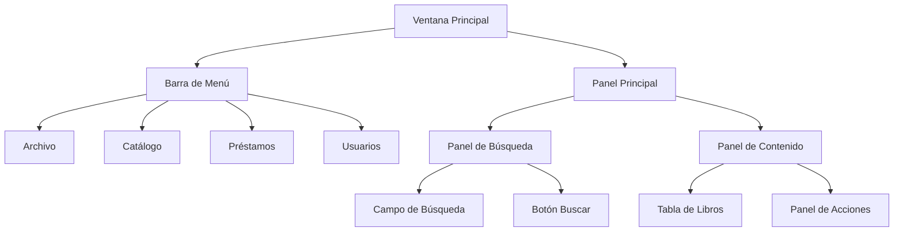
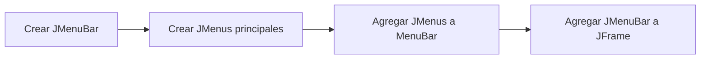
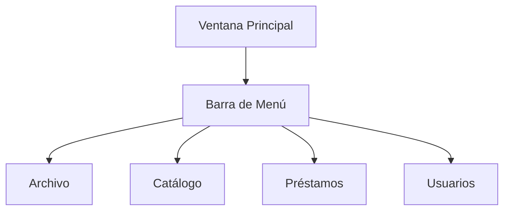
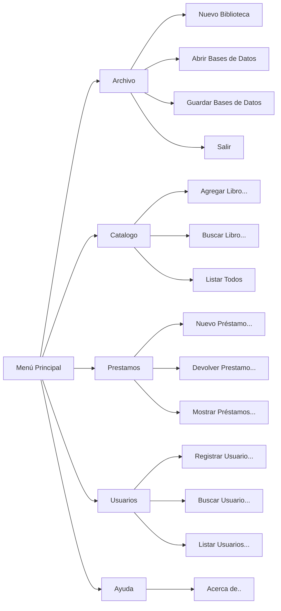

# Laboratorio 10: Sistema de Biblioteca - Interfaz Gráfica

# Sistema de Bibliotecas

## Objetivos

Desarrollar una interfaz gráfica de usuario para un sistema de gestión bibliotecaria implementando elementos básicos de diseño y usabilidad.

## Desarrollo

Para visualizar mejor el diseño de la interfaz principal, aquí hay un diagrama de la estructura propuesta:



La interfaz se compondrá de los siguientes elementos principales:

- **Barra de Menú Superior:** Contendrá las opciones principales del sistema
- **Panel de Contenido:** Mostrará la tabla de libros y opciones de acción
- **Barra de Estado:** Información del sistema en la parte inferior

# Ventana Principal (Interfaz)

## 1. Ventana Principal

1. Crearemos una nueva Clase en nuestra carpeta de Trabajo llamada BibliotecaGUI.java:
    
    ```java
    public class BibliotecaGUI extends JFrame {
    
    }
    ```
    
2. Trabajaremos con las interfaces de usuario en Swing, el modelo de eventos 1.1 y  algunos componentes awt:
    
    ```java
    import javax.swing.*;
    import java.awt.event.*;
    import java.awt.*;
    
    public class BibliotecaGUI {
    
    }
    ```
    
3. Para que mi clase sea una ventana en pantalla deberemos heredarla de JFrame:
    
    ```java
    import javax.swing.*;
    import java.awt.event.*;
    import java.awt.*;
    
    public class BibliotecaGUI extends JFrame {
    
    }
    ```
    
4. Programaremos el método main() para qcrear una instancia de nuestro programa y verla funcionar
    
    ```java
    import javax.swing.*;
    import java.awt.event.*;
    import java.awt.*;
    
    public class BibliotecaGUI extends JFrame {
    
        public static void main(String[] args) {
            
        }
    
    }
    ```
    
5. Dentro del método main() creamos la instancia de nuestra clase;
    
    ```java
    import javax.swing.*;
    import java.awt.event.*;
    import java.awt.*;
    
    public class BibliotecaGUI extends JFrame {
    
        public static void main(String[] args) {
            BibliotecaGUI gui = new BibliotecaGUI();
        }
    
    }
    ```
    
6. Si ejecutamos nuestro programa no veremos nada porque solo la instancia es creada para después terminarse el programa. Debemos configurar las características de la ventana dentro del constructor:
    
    ```java
    import javax.swing.*;
    import java.awt.event.*;
    import java.awt.*;
    
    public class BibliotecaGUI extends JFrame {
    
        public BibliotecaGUI() {
    
        }
    
        public static void main(String[] args) {
            BibliotecaGUI gui = new BibliotecaGUI();
        }
    
    }
    ```
    
7. `setTitle()` es un método heredado de la clase `JFrame` que establece el título que aparecerá en la barra de título de la ventana. Este método modifica directamente la propiedad del título de la ventana actual.
    
    Por otro lado, `super(title)` es una llamada al constructor de la clase padre (JFrame) pasándole el título como parámetro. Esta llamada debe ser la primera instrucción en el constructor de la clase hija.
    
    Ambas formas son válidas y logran el mismo resultado. La diferencia principal es que super() inicializa la ventana con el título desde el principio, mientras que `setTitle()` lo configura después de la creación del objeto.
    
    ```java
    public class BibliotecaGUI extends JFrame {
    
        public BibliotecaGUI() {
            setTitle("Sistema de Biblioteca");
        }
    }
    ```
    
- **Panel de Búsqueda:** Ubicado en la parte superior del panel principal
1. La línea `setSize(800, 600)` establece el tamaño inicial de la ventana. El primer parámetro (800) define el ancho de la ventana en píxeles. El segundo parámetro (600) define el alto de la ventana en píxeles.
    
    ```java
    public class BibliotecaGUI extends JFrame {
    
        public BibliotecaGUI() {
            setSize(800, 600);
        }
    }
    ```
    
2. La línea `setDefaultCloseOperation(JFrame.EXIT_ON_CLOSE)` configura el comportamiento de la ventana cuando el usuario intenta cerrarla. Establece qué debe hacer el programa cuando se presiona el botón de cerrar (X) en la ventana.
    
    `JFrame.EXIT_ON_CLOSE` indica que el programa debe terminar completamente cuando se cierra la ventana. Sin esta línea, el programa seguiría ejecutándose en segundo plano aunque la ventana esté cerrada.
    
    ```java
    public class BibliotecaGUI extends JFrame {
    
        public BibliotecaGUI() {
            setDefaultCloseOperation(JFrame.EXIT_ON_CLOSE);
        }
    }
    ```
    
3. La línea `setVisible(true)` es un método heredado de la clase JFrame que hace visible la ventana en pantalla. Por defecto, las ventanas de Java Swing se crean invisibles, por lo que es necesario llamar a este método para que el usuario pueda ver la interfaz gráfica. Si no se incluye esta línea, la ventana existiría pero permanecería oculta para el usuario.
    
    ```java
    public class BibliotecaGUI extends JFrame {
    
        public BibliotecaGUI() {
    		    //codigo del constructor
            setVisible(true);
        }
    }
    ```
    
    <aside>
    ⚠️
    
    Aseguremos que la ultima sentencia del constructor sea `setVisible()`.
    
    </aside>
    
4. En este momento podemos ejecutar nuestro programa:
    
    
    

## 2. Menú

Una barra de menús es un elemento fundamental en interfaces gráficas que proporciona acceso organizado a las funcionalidades de una aplicación. En Swing, se implementa utilizando las clases JMenuBar, JMenu y JMenuItem. El orden para hacerlo es el siguiente



La implementación básica sigue esta estructura:



1. Definimos los manejadores a la barra de menú. `JMenuBar` es una clase de Swing que proporciona una barra de menú horizontal que puede contener uno o más objetos `JMenu`. Esta barra de menú es típicamente colocada en la parte superior de una ventana y sirve como contenedor principal para organizar los menús desplegables de una aplicación. 
    
    ```java
    public class BibliotecaGUI extends JFrame {
        private JMenuBar menuBar;
    }
    ```
    
2. `JMenuBar` trabaja en conjunto con `JMenu` (que representa un menú desplegable) y `JMenuItem` (que representa una opción específica dentro de un menú). La barra de menú se adhiere automáticamente a las convenciones de la plataforma en la que se ejecuta la aplicación, proporcionando una experiencia de usuario consistente con el sistema operativo.
    
    ```java
    public class BibliotecaGUI extends JFrame {
    
        private JMenuBar menuBar;
        private JMenu mnuArchivo, mnuCatalogo, mnuPrestamo, mnuUsuarios;
    }
    ```
    
3. Crearemos una función `crearMenu()` para separa el código que gestiona la creación del menú.
    
    ```java
    public class BibliotecaGUI extends JFrame {
    
        private void crearMenu() {
        
        }
    }
    ```
    
    <aside>
    ⚠️
    
    Cuando un método se declara como privado, significa que es un método auxiliar o de utilidad que la clase utiliza internamente para realizar sus operaciones, pero que no debe ser visible ni accesible desde otras clases. Esto ayuda a mantener la integridad de los datos y el comportamiento de la clase.
    
    </aside>
    
4. Crearemos la barra de menú (contenedor)
    
    ```java
    public class BibliotecaGUI extends JFrame {
    
        private void crearMenu() {
    		    // Crear la barra de menús
            menuBar = new JMenuBar();
        }
    }
    ```
    
5. Creamos la primera opción de menú correspondiente a “Archivo”:
    
    ```java
    public class BibliotecaGUI extends JFrame {
    
        private void crearMenu() {
    		    // Crear la barra de menús
            menuBar = new JMenuBar();
            // Crear menús principales
            mnuArchivo = new JMenu("Archivo");
        }
    }
    ```
    
6. Agregaremos el menú Archivo creado, al contenedor de menú. El método `add()` de `JMenuBar` se utiliza para agregar componentes de menú (`JMenu`) a la barra de menús. Es un método heredado de la clase Container que permite añadir elementos a la barra de menú de manera secuencial, de izquierda a derecha. Cuando llamamos a `menuBar.add(mnuArchivo)`, el menú "Archivo" se agrega como un nuevo elemento en la barra de menús. Los menús posteriores que se agreguen aparecerán a la derecha del anterior.
    
    ```java
    public class BibliotecaGUI extends JFrame {
    
        private void crearMenu() {
    		    // Crear la barra de menús
            menuBar = new JMenuBar();
            // Crear menús principales
            mnuArchivo = new JMenu("Archivo");
            // Agregar menús a la barra
            menuBar.add(mnuArchivo);
        }
    }
    ```
    
7. El método `setJMenuBar()` es un método especial de `JFrame` que establece la barra de menús para la ventana. Cuando llamamos a este método, la barra de menús se coloca automáticamente en la parte superior de la ventana, justo debajo de la barra de título. 
    
    Es específicamente diseñado para manejar menús y es diferente del método add() normal, ya que reserva un espacio especial para la barra de menús que no interfiere con el área de contenido principal de la ventana.
    
    ```java
    public class BibliotecaGUI extends JFrame {
    
        private void crearMenu() {
    		    // Crear la barra de menús
            menuBar = new JMenuBar();
            // Crear menús principales
            mnuArchivo = new JMenu("Archivo");
            // Agregar menús a la barra
            menuBar.add(mnuArchivo);
            // Establecer la barra de menús en el frame
            setJMenuBar(menuBar);
        }
    }
    ```
    
8. Es importante asegurarse de construir y configurar completamente el menú antes de hacer visible la ventana con `setVisible(true)`. Si intentamos modificar el menú después de que la ventana es visible, podría causar problemas de visualización o comportamiento inconsistente.
    
    ```java
    public class BibliotecaGUI extends JFrame {
    
        public BibliotecaGUI() {
            crearMenu();
            setVisible(true);
    }
    ```
    
9. Podemos ver el avance ejecutando nuestro programa:
    
    
    
10. Completemos el menu creando los objetos mnuCatalogo, mnuPrestamo, mnuUsuarios:
    
    ```java
    public class BibliotecaGUI extends JFrame {
    
        private void crearMenu() {
    		    
            // Crear menús principales
            mnuArchivo = new JMenu("Archivo");
            mnuCatalogo = new JMenu("Catalogo");
            mnuPrestamo = new JMenu("Préstamo");
            mnuUsuarios = new JMenu("Usuarios");
            
        }
    }
    ```
    
11. Agregamos los nuevos menús a nuestro `JMenuBar`:
    
    ```java
    public class BibliotecaGUI extends JFrame {
    
        private void crearMenu() {
    		    
            // Agregar menús a la barra
            menuBar.add(mnuArchivo);
            menuBar.add(mnuCatalogo);
            menuBar.add(mnuPrestamo);
            menuBar.add(mnuUsuarios);
            
        }
    }
    ```
    
12. Terminamos el menú principal de nuestra Aplicación:
    
    
    

Posteriormente añadiremos las opciones de menú internas para nuestra aplicación

## 3. Interfaz de Aplicación

### 3.1 Panel de Búsqueda

El panel de búsqueda es un componente esencial de nuestro sistema bibliotecario que permite a los usuarios localizar libros de manera eficiente. Este panel está ubicado en la parte superior de la ventana principal y contiene los siguientes elementos:

- **Campo de texto (JTextField):** Un campo de entrada con capacidad para 30 caracteres donde los usuarios pueden escribir términos de búsqueda como título, autor o ISBN.
- **Botón de búsqueda (JButton):** Un botón etiquetado como "Buscar" que inicia la búsqueda cuando se hace clic en él.

La implementación del panel se realiza utilizando un `FlowLayout`, que organiza los componentes de manera horizontal:

1. Definiremos los manejadores al botón y al campo de Texto:
    
    ```java
    public class BibliotecaGUI extends JFrame {
        private JTextField txtBusqueda;
        private JButton btnBuscar;
        
    }
    ```
    
2. Los `JPanel` son contenedores ligeros en Swing que se utilizan para organizar y agrupar otros componentes de la interfaz gráfica. Actúan como un lienzo donde podemos colocar diferentes elementos como botones, campos de texto y etiquetas. Los `JPanel` son flexibles y pueden utilizar diferentes administradores de diseño (layout managers) para controlar cómo se organizan los componentes dentro de ellos. 
    
    ```java
    public class BibliotecaGUI extends JFrame {
        private JPanel pnlBusqueda;
        private JTextField txtBusqueda;
        private JButton btnBuscar;
        
    }
    ```
    
3. Crearemos un nuevo método privado en nuestra clase.
    
    ```java
    public class BibliotecaGUI extends JFrame {
    
        private void crearPanelPrincipal() {
            
        }
    }
    ```
    
4. Crearemos el Panel de búsquedas aplicándole el *layout* de  Flow. `FlowLayout` es uno de los gestores de diseño más simples en *Java Swing*. Organiza los componentes en una línea horizontal, similar a como fluye el texto en un documento. Cuando no hay suficiente espacio en una línea, los componentes continúan automáticamente en la siguiente línea. Este gestor de diseño es especialmente útil para paneles pequeños donde los componentes deben aparecer en su tamaño preferido y en el orden en que fueron agregados. Por defecto, los componentes se centran tanto horizontal como verticalmente, aunque esto puede modificarse para alinearlos a la izquierda o derecha. 
    
    ```java
    public class BibliotecaGUI extends JFrame {
    
        private void crearPanelPrincipal() {
            pnlBusqueda = new JPanel(new FlowLayout());
            
        }
    }
    ```
    
5. Crearemos el cuadro de texto y el botón para capturar la búsqueda del libro.  El constructor `JTextField(30)` crea un campo de texto con un ancho preferido de 30 columnas de texto. Este número representa aproximadamente cuántos caracteres pueden mostrarse horizontalmente en el campo. No limita la cantidad de texto que se puede escribir, solo define el tamaño visual inicial del componente en la interfaz.
    
    ```java
    public class BibliotecaGUI extends JFrame {
    
        private void crearPanelPrincipal() {
            txtBusqueda = new JTextField(30);
        }
    }
    ```
    
6. El constructor `JButton("Buscar")` crea un botón con la etiqueta "Buscar" visible para el usuario. El texto pasado como argumento al constructor ("Buscar") define lo que el usuario verá en el botón. Este componente puede ser personalizado con diferentes propiedades como tamaño, color y fuente, y es comúnmente usado para iniciar acciones cuando el usuario hace clic en él.
    
    ```java
    public class BibliotecaGUI extends JFrame {
    
        private void crearPanelPrincipal() {
            txtBusqueda = new JTextField(30);
            btnBuscar = new JButton("Buscar");
        }
    }
    ```
    
7. El método `add()` de los objetos `JPanel` permite agregar componentes visuales al contenedor. Cuando se llama a `add()` en un `JPanel`, el componente se coloca según las reglas del administrador de diseño (*layout manager*) que tenga asignado. En nuestro caso, con `FlowLayout` los componentes se colocan en secuencia horizontal.
    
    ```java
    public class BibliotecaGUI extends JFrame {
    
        private void crearPanelPrincipal() {
            pnlBusqueda.add(txtBusqueda);
            pnlBusqueda.add(btnBuscar);
        }
    }
    ```
    

Terminamos el primer componente de nuestra interfaz. La integraremos junto con los otros componentes ya creados.

### 3.2 Tabla de Libros

La clase `JTable` es un componente de Swing que proporciona una forma de mostrar y editar datos tabulares. Es útil para nuestro sistema de biblioteca ya que nos permite presentar la información de los libros de manera organizada y estructurada, similar a una hoja de cálculo. Cada libro ocupará una fila en la tabla, y sus atributos (como título, autor, ISBN) se mostrarán en columnas separadas.

La `JTable` ofrece funcionalidades integradas cruciales para la gestión de biblioteca, como la capacidad de ordenar los datos por cualquier columna, seleccionar múltiples filas para operaciones por lote, y personalizar el renderizado de las celdas para mostrar diferentes tipos de datos. También permite la edición in-situ de los datos, lo cual es útil para actualizar información de los libros directamente desde la interfaz.

<aside>
⚠️

Una característica especialmente útil de JTable es su integración con el modelo MVC (Modelo-Vista-Controlador), donde podemos separar los datos (el catálogo de libros) de su presentación visual. Esto nos permite actualizar el contenido de la tabla dinámicamente mientras mantenemos una estructura de código limpia y mantenible.

</aside>

1. Crearemos nuestro manejador a objetos JTable:
    
    ```java
    public class BibliotecaGUI extends JFrame {
        private JTable tablaLibros;
        
    }
    ```
    
2. Un Objeto  `DefaultTableModel` es una implementación del modelo de tabla que almacena los datos en un Vector de Vectores. Este modelo proporciona una manera fácil de gestionar los datos que se mostrarán en la tabla. Su constructor más común acepta dos parámetros:
    - **Object[][] datos:** Es una matriz bidimensional de objetos que representa los datos de la tabla- La primera dimensión representa las filas
    - La segunda dimensión representa las columnas
    - Cada elemento puede ser de cualquier tipo de objeto
    - **Object[] columnas:** Es un arreglo de objetos que define los nombres de las columnas- Cada elemento será mostrado como el encabezado de una columna. Típicamente se usan String para los nombres
    
    Deberemos importar el objeto DefaultTableModel
    
    ```java
    import javax.swing.table.DefaultTableModel;
    
    public class BibliotecaGUI extends JFrame {
    
        private void crearPanelPrincipal() {
    		    // Tabla de libros
            String[] columnas = {"Título", "Autor", "ISBN", "Páginas", "Estado"};
            Object[][] datos = {};
            DefaultTableModel modelo = new DefaultTableModel(datos,columnas);
        }
    }
    ```
    
3. Ahora podemos crear un `JTable` pasándole directamente un `DefaultTableModel` como parámetro. Este enfoque es más flexible ya que el DefaultTableModel proporciona métodos adicionales para manipular los datos dinámicamente, como `addRow()` para agregar filas nuevas o removeRow() para eliminarlas.
    
    Por el momento no hay datos que desplegar pero podemos configurar la tabla:
    
    ```java
    public class BibliotecaGUI extends JFrame {
    
        private void crearPanelPrincipal() {
    		    // Tabla de libros
            String[] columnas = {"Título", "Autor", "ISBN", "Páginas", "Estado"};
            Object[][] datos = {};
            DefaultTableModel modelo = new DefaultTableModel(datos,columnas);
            tablaLibros = new JTable(modelo);
        }
    }
    ```
    
4. El Objeto `JScrollPane` es un componente contenedor que proporciona barras de desplazamiento automáticas cuando el contenido que contiene es más grande que el área visible. Este componente es especialmente útil cuando trabajamos con tablas grandes, áreas de texto extensas o cualquier componente que pueda exceder el espacio disponible en la ventana. 
    
    ```java
    public class BibliotecaGUI extends JFrame {
        private JScrollPane scrollTabla;
        
    }
    ```
    
5. Cuando envolvemos un componente como `JTable` en un `JScrollPane`, las barras de desplazamiento aparecerán automáticamente según sea necesario horizontal si el contenido es más ancho que el área visible, y vertical si es más alto.
    
    ```java
    public class BibliotecaGUI extends JFrame {
    
        private void crearPanelPrincipal() {
    		    // Tabla de libros
            scrollTabla = new JScrollPane(tablaLibros);
        }
    }
    ```
    
    <aside>
    ⚠️
    
    El `JScrollPane` maneja automáticamente el *viewport*, que es el área visible del componente contenido, y ajusta las barras de desplazamiento según el tamaño del contenido y el área disponible. 
    
    </aside>
    

Seguimos en la construcción de nuestra interfaz

### 3.3 Panel Acciones

El Panel de Acciones es un componente de la interfaz que agrupa los botones principales para realizar operaciones sobre los libros seleccionados en la tabla. Este panel se ubica estratégicamente en la parte inferior de la ventana principal y proporciona acceso rápido a las funciones más comunes del sistema.

Los principales objetivos del Panel de Acciones son:

- **Accesibilidad:** Proporcionar acceso directo a las operaciones más frecuentes sin necesidad de navegar por los menús.
- **Eficiencia:** Permitir al usuario realizar acciones rápidas sobre los libros seleccionados en la tabla como agregar, editar o eliminar registros.
- **Organización visual:** Agrupar las acciones relacionadas en un área específica de la interfaz, mejorando la usabilidad del sistema.

Este panel utilizará un `FlowLayout` para organizar los botones de manera horizontal, similar al panel de búsqueda, manteniendo así la consistencia en el diseño de la interfaz.

1. Agregamos los manejadores a las acciones de alta, baja 
    
    ```java
    public class BibliotecaGUI extends JFrame {
        private JButton btnBuscar, btnNuevoLibro, btnBuscarLibro, btnEliminarLibro, btnUbicarLibro;
        
    }
    ```
    
2. Agregamos el manejador al nuevo panel:
    
    ```java
    public class BibliotecaGUI extends JFrame {
        private JPanel pnlBusqueda, pnlAcciones;
        
    }
    ```
    
3. Creamos el panel y los botones:
    
    ```java
    public class BibliotecaGUI extends JFrame {
    
        private void crearPanelPrincipal() {
    		    // Panel de acciones
            pnlAcciones = new JPanel();
            btnNuevoLibro = new JButton("Nuevo Libro");
            btnBuscarLibro = new JButton("Editar");
            btnEliminarLibro = new JButton("Eliminar");
            btnUbicarLibro = new JButton("Ubicar Libro");
        }
    }
    ```
    
4. Agregamos los botones al Panel:
    
    ```java
    public class BibliotecaGUI extends JFrame {
    
        private void crearPanelPrincipal() {
    		    // Panel de acciones
            pnlAcciones.add(btnNuevoLibro);
            pnlAcciones.add(btnBuscarLibro);
            pnlAcciones.add(btnEliminarLibro);
            pnlAcciones.add(btnUbicarLibro);
        }
    }
    ```
    

### 3.4 Panel Principal

Es el momento de integrar los paneles en nuestra interfaz. Los paneles pueden anidarse unos dentro de otros, lo que permite crear interfaces complejas y bien organizadas. De esta manera, nuestro panel principal contendrá subpaneles para búsqueda y acciones, cada uno con su propia disposición de componentes. Esta jerarquía de paneles facilita la gestión y el mantenimiento del código de la interfaz.

1. Añadimos el manejador al panel principal:
    
    ```java
    public class BibliotecaGUI extends JFrame {
        private JPanel pnlPrincipal, pnlBusqueda, pnlAcciones;
        
    }
    ```
    
2. Continuamos en el método `crearPanelPrincipal()`:  Vamos a crear el panel principal asignandole el layout de borde,
    
    ```java
    public class BibliotecaGUI extends JFrame {
    
        private void crearPanelPrincipal() {
    		    // Panel principal
            pnlPrincipal = new JPanel(new BorderLayout());
        }
    }
    ```
    
3. `BorderLayout` es un administrador de diseño que organiza los componentes en cinco áreas principales: NORTH (arriba), SOUTH (abajo), EAST (derecha), WEST (izquierda) y CENTER (centro). Es el diseño predeterminado para JFrame y es especialmente útil para crear interfaces que necesitan una organización espacial clara y jerárquica. Cuando se agrega un componente al `BorderLayout`, se debe especificar en qué región se colocará, y el componente se estirará para ocupar todo el espacio disponible en esa región. El área central es la única que se expande tanto horizontal como verticalmente para llenar el espacio restante, lo que la hace ideal para componentes principales como tablas o áreas de texto.
    
    ```java
    public class BibliotecaGUI extends JFrame {
    
        private void crearPanelPrincipal() {
    		    // Panel principal
            pnlPrincipal.add(pnlBusqueda, BorderLayout.NORTH);
            pnlPrincipal.add(scrollTabla, BorderLayout.CENTER);
            pnlPrincipal.add(pnlAcciones, BorderLayout.SOUTH);
        }
    }
    ```
    

Casi terminamos pero nos falta la barra de estado.

### 3.5 Barra de estado

Finalmente, agregaremos una barra de estado en la parte inferior de la ventana para mostrar información relevante al usuario. La barra de estado nos permitirá mostrar mensajes informativos como:

- El estado actual del sistema ("Listo", "Buscando...", etc.)
- Resultados de operaciones ("Libro agregado exitosamente", "Error al guardar", etc.)
- Cantidad de registros encontrados en búsquedas

Podemos actualizar el estado llamando al método `actualizarEstado()` desde cualquier parte del código donde necesitemos informar al usuario sobre alguna acción o resultado.

1. Necesitaremos una etiqueta para mostrar los mensajes
    
    ```java
    public class BibliotecaGUI extends JFrame {
        private JLabel lblEstado;
        
    }
    ```
    
2. Dentro del método `crearPanelPrincipal()` creamos la etiqueta
    
    ```java
    public class BibliotecaGUI extends JFrame {
    
        private void crearPanelPrincipal() {
    		    //  Barra de Estado
            lblEstado = new JLabel(" Listo");
        }
    }
    ```
    
3. El método `setBorder()` es una función de Swing que permite establecer un borde alrededor de un componente. Este método acepta un objeto de tipo Border como parámetro, que define el estilo y apariencia del borde.
    
    ```java
    public class BibliotecaGUI extends JFrame {
    
        private void crearPanelPrincipal() {
    		    //  Barra de Estado
            lblEstado.setBorder();
        }
    }
    ```
    
4. `BorderFactory` es una clase de utilidad que proporciona métodos estáticos para crear diferentes tipos de bordes predefinidos. Esta clase sigue el patrón de diseño Factory, simplificando la creación de bordes complejos.
    
    ```java
    public class BibliotecaGUI extends JFrame {
    
        private void crearPanelPrincipal() {
    		    //  Barra de Estado
            lblEstado.setBorder(BorderFactory);
        }
    }
    ```
    
5. El método `createLoweredBevelBorder()` específicamente crea un borde biselado hundido, que da la apariencia de que el componente está presionado o hundido en la interfaz. Este efecto visual se logra mediante el uso de sombras y luces que crean una ilusión de profundidad, haciendo que el componente parezca estar por debajo del nivel de la superficie circundante.
    
    ```java
    public class BibliotecaGUI extends JFrame {
    
        private void crearPanelPrincipal() {
    		    //  Barra de Estado
            lblEstado.setBorder(BorderFactory.createLoweredBevelBorder());
        }
    }
    ```
    
    Esta combinación de BorderFactory y el borde biselado hundido es comúnmente utilizada en barras de estado para dar una apariencia profesional y consistente con las convenciones de diseño de interfaces de usuario.
    
6. Programemos el método que actualiza la barra de estado.  Crearemos un nuevo método privado `actualizarEstado()` que recibe un String con el mensaje:
    
    ```java
    public class BibliotecaGUI extends JFrame {
    
        private void actualizarEstado(String mensaje) {
            lblEstado.setText(" " + mensaje);
        }
    }
    ```
    
7. El método `setText()` de la clase `JLabel` se utiliza para establecer o actualizar el texto que se muestra en una etiqueta. Este método reemplaza cualquier texto existente con el nuevo texto proporcionado como argumento. La concatenación de un espacio en blanco " " con el mensaje (`" " + mensaje`) se realiza por dos razones principales:
    - **Estética visual:** Agrega un pequeño margen izquierdo al texto dentro de la etiqueta, evitando que el texto quede pegado al borde del componente.
    - **Consistencia en el formato:** Asegura que siempre haya un espacio al inicio del mensaje, independientemente del contenido de la variable mensaje.
    
    ```java
    public class BibliotecaGUI extends JFrame {
    
        private void actualizarEstado(String mensaje) {
            lblEstado.setText(" " + mensaje);
        }
    }
    ```
    

### 3.6 Integración Final

Ahora vamos a integrar todos los componentes que hemos creado hasta el momento para construir la interfaz gráfica completa del sistema de biblioteca. Esta integración incluirá:

- **Panel de Búsqueda:** Con el campo de texto y botón de búsqueda
- **Tabla Central:** Mostrando los libros con scroll automático
- **Panel de Acciones:** Con los botones principales de operaciones
- **Barra de Estado:** Para mostrar mensajes informativos al usuario

El Panel de Busqueda, la tabla central y el panel de acciones ya están integrados en el panel Principal, por lo que solo agregaremos este.

1. El uso de '`this`' en el método `add()` dentro de `crearPanelPrincipal()` se refiere a la instancia actual de la clase `BibliotecaGUI`. Como `BibliotecaGUI` extiende de JFrame, hereda todos los métodos de JFrame, incluyendo `add()`. Al usar `this.add()`, estamos explícitamente indicando que queremos llamar al método add() de la clase JFrame (la clase padre) desde la instancia actual de BibliotecaGUI.
    
    En este contexto específico, this.add(pnlPrincipal, BorderLayout.CENTER) está agregando el panel principal directamente al contenedor de contenido del JFrame.
    
    El panel Pincipal que que tiene los paneles secundarios y la tabla lo colocamos al centro, y la barra de estado al sur del frame. 
    
    ```java
    public class BibliotecaGUI extends JFrame {
    
        private void crearPanelPrincipal() {
    		    // Integración Final
            this.add(pnlPrincipal, BorderLayout.CENTER);
            this.add(lblEstado,BorderLayout.SOUTH);
        }
    }
    ```
    
2. Podemos ya Ejecutar nuestro programa
    
    
    

# Ventana Principal (Funcionalidad)

Para implementar la funcionalidad completa de nuestra aplicación de biblioteca, deberemos basarnos en los casos de uso que fueron definidos y analizados previamente en el laboratorio 9. Estos casos de uso nos servirán como guía para estructurar la lógica de negocio y asegurar que nuestra interfaz gráfica cumpla con todos los requerimientos funcionales del sistema.

Los casos de uso nos ayudarán a:

- Identificar todas las interacciones posibles entre el usuario y el sistema
- Definir el flujo de eventos para cada operación
- Establecer las validaciones necesarias
- Manejar los casos de error y excepciones

Comenzaremos implementando el caso de uso más fundamental: Agregar Nuevo Libro, que se describe a continuación.

## 4.1 Caso de Uso: Agregar Nuevo Libro


Este caso de uso describe el proceso de agregar un nuevo libro al sistema de biblioteca.

| **Nombre** | Agregar Nuevo Libro |
| --- | --- |
| **Número** | 5 |
| **Autor** | Sistema de Biblioteca |
| **Versión o Ultima Actualización** | 1.0 |
| **Suposiciones** | El bibliotecario tiene tiene los permisos necesarios |
| **Precondiciones** | o El sistema está en funcionamiento
o El Bibliotecario tiene acceso al módulo de gestión de libros |
| **Disparador** | El bibliotecario selecciona la opción "Nuevo Libro" en la interfaz principal |
| **Diálogo** | 1. El sistema muestra formulario de entrada (ISBN, Título, Autor, Editorial, Año, Páginas)
2. Bibliotecario ingresa datos
3. Sistema valida campos requeridos
4. Sistema almacena nuevo libro
5. Sistema actualiza tabla de libros

Flujo Alternativo:
- Error si faltan campos requeridos
- Cancelar la acción |
| **Terminación** | Normal: Libro guardado exitosamente
Anormal: Operación cancelada por el Usuario o por errores de validación |
| **Postcondiciones** | - Nuevo libro registrado en el sistema
- Tabla de libros actualizada con el nuevo registro |

Basándonos en este caso de uso, implementaremos un JDialog para capturar los datos del nuevo libro.

### 4.1.1 Dialogo Nuevo Libro

<aside>
⚠️

Comenzaremos a desarrollar los “*cómos*” de los “*que*” especificados en los casos de Uso:

</aside>

| **Diálogo** | 1. El sistema muestra formulario de entrada (ISBN, Título, Autor, Editorial, Año, Páginas) |
| --- | --- |

`JDialog` es una clase en Swing que representa una ventana secundaria o diálogo modal que se utiliza para interactuar con el usuario en situaciones específicas. A diferencia de `JFrame`, un `JDialog` está diseñado para ser una ventana temporal y dependiente de una ventana principal.

**Características principales de `JDialog`:**

- **Modalidad:** Un `JDialog` puede ser modal o no modal:
    - **Modal**: Bloquea la interacción con otras ventanas de la aplicación hasta que se cierre el diálogo
    - **No modal**: Permite interactuar con otras ventanas mientras el diálogo está abierto
- **Ventana padre:** Un `JDialog` generalmente tiene una ventana padre (`Frame` o `Dialog`) de la cual depende. Cuando la ventana padre se minimiza o se cierra, el `JDialog` sigue el mismo comportamiento.
- **Constructores comunes:**
    - `JDialog(Frame owner)`: Crea un diálogo no modal con un `Frame` como propietario
    - `JDialog(Frame owner, String title)`: Igual al anterior pero con un título específico
    - `JDialog(Frame owner, String title, boolean modal)`: Permite especificar si el diálogo es modal

**Usos comunes de JDialog:**

- **Formularios de entrada:** Para capturar datos del usuario en un contexto específico
- **Mensajes de confirmación:** Para solicitar confirmación antes de realizar acciones importantes
- **Ventanas de preferencias:** Para configurar opciones de la aplicación
- **Diálogos de progreso:** Para mostrar el avance de operaciones largas

En nuestro caso, utilizaremos `JDialog` para crear un formulario modal que capture los datos de un nuevo libro, asegurando que el usuario complete esta tarea antes de continuar con otras operaciones en la ventana principal.

La clase `DialogoNuevoLibro` es un excelente ejemplo de los beneficios de la programación orientada a objetos en el diseño de interfaces gráficas:

- **Encapsulamiento:** El diálogo encapsula toda la lógica relacionada con la entrada de datos de un nuevo libro, manteniendo sus componentes y validaciones contenidos en una única clase.
- **Reutilización:** Al ser una clase independiente, puede ser instanciada desde cualquier parte del sistema que necesite capturar datos de un nuevo libro, no solo desde la ventana principal.
- **Mantenibilidad:** Los cambios en la lógica de entrada de datos solo necesitan hacerse en esta clase, sin afectar al resto del sistema.
- **Modularidad:** La ventana principal puede delegar la responsabilidad de capturar datos a este diálogo, manteniendo una clara separación de responsabilidades.

Esta estructura modular permite que el sistema sea más flexible y fácil de mantener, ya que cada componente tiene una responsabilidad específica bien definida.

1. Definimos una nueva clase en su archivo  `DialogoNuevoLibro.java`:
    
    ```java
    public class DialogoNuevoLibro {
    
    }
    ```
    
2. Para que nuestra clase sea una ventana de dialogo deberemos heredar de JDialog a demas de importarla de su paquete:
    
    ```java
    import javax.swing.*;
    import java.awt.*;
    
    public class DialogoNuevoLibro extends JDialog {
    		
    }
    ```
    
3. Necesitamos  varios `JTextFields` que son componentes de entrada de texto que se necesitan como variables de clase para capturar los atributos del Libro. Estas variables se utilizarán posteriormente para crear y configurar los campos de entrada en el formulario del diálogo.
    
    ```java
    public class DialogoNuevoLibro extends JDialog {
    		private JTextField txtISBN, txtTitulo, txtAutor, txtEditorial;
    }
    ```
    
4. El `JSpinner` es un componente de interfaz gráfica en Swing que permite al usuario seleccionar un valor de un rango ordenado. Es especialmente útil para la entrada de valores numéricos con límites definidos. En nuestro caso, utilizaremos un solo JSpinner: **spnPaginas:** Para especificar el número de páginas del libro, asegurando que sea un valor positivo y dentro de un rango realista
    
    ```java
    import javax.swing.*;
    import java.awt.*;
    
    public class DialogoNuevoLibro extends JDialog {
    		private JSpinner spnPaginas;
    }
    ```
    
5. Para nuestro diálogo necesitamos dos botones principales: **btnGuardar:** Este botón permitirá confirmar y guardar los datos del nuevo libro ingresados en el formulario. Cuando se presione, deberá validar que todos los campos requeridos estén completos antes de proceder con el guardado, y **btnCancelar:** Este botón permitirá cerrar el diálogo sin guardar cambios, descartando cualquier información ingresada en el formulario. Es importante tener esta opción para permitir al usuario abandonar la operación si decide no continuar.
    
    ```java
    import javax.swing.*;
    import java.awt.*;
    
    public class DialogoNuevoLibro extends JDialog {
    		private JButton btnGuardar, btnCancelar;
    }
    ```
    
6. Finalmente, `guardadoExitoso` es una bandera que indica si el proceso de guardar un nuevo libro se completó correctamente.
    
    <aside>
    ⚠️
    
    Una **bandera** (también conocida como variable booleana o *flag* en inglés) es una variable que actúa como un indicador para rastrear un **estado** binario (verdadero/falso) en el programa. 
    
    </aside>
    
    Esta bandera es necesaria por varias razones:
    
    - Permite a la ventana principal saber si el usuario completó exitosamente el proceso de guardar un libro o si canceló la operación
    - Facilita la implementación de flujos condicionales basados en si el guardado fue exitoso o no (por ejemplo, actualizar la tabla de libros solo si se guardó correctamente)
    - Ayuda en la gestión del estado de la aplicación, permitiendo realizar acciones apropiadas después de cerrar el diálogo.
    
    ```java
    import javax.swing.*;
    import java.awt.*;
    
    public class DialogoNuevoLibro extends JDialog {
    		private boolean guardadoExitoso = false;
    }
    ```
    
7. Escribamos el constructor de la clase:
    
    ```java
    import javax.swing.*;
    import java.awt.*;
    
    public class DialogoNuevoLibro extends JDialog {
    		public DialogoNuevoLibro() {
            
        }
    }
    ```
    
8. El constructor que invocamos con `super(parent, "Nuevo Libro", true)` es uno de los constructores principales de JDialog que acepta tres parámetros:
    - **parent**: Es el Frame padre del diálogo. Este parámetro establece la ventana propietaria del diálogo, lo que significa que el diálogo siempre se mostrará por encima de esta ventana y se centrará en relación a ella.
    - **"Nuevo Libro"**: Es el String que aparecerá como título en la barra de título del diálogo.
    - **true**: Es el parámetro de modalidad. Al establecerlo como true, hacemos que el diálogo sea modal, lo que significa que:
        - El usuario no podrá interactuar con la ventana principal mientras el diálogo esté abierto
        - El foco de la aplicación permanecerá en el diálogo hasta que se cierre
        - Es útil cuando necesitamos que el usuario complete una acción antes de continuar
    
    Este constructor es ideal para formularios de entrada de datos como el nuestro, ya que asegura que el usuario complete o cancele la operación antes de poder continuar usando la aplicación principal.
    
    ```java
    import javax.swing.*;
    import java.awt.*;
    
    public class DialogoNuevoLibro extends JDialog {
    		
    		public DialogoNuevoLibro(Frame parent) {
            super(parent, "Nuevo Libro", true);
        }
    }
    ```
    
9. Para ver el avance en la creación de nuestra interfaz programaremos el método main() para crear una instancia de la clase y mostrarla en pantalla. Primero: creamos la instancia asignando `null` a la ventana padre. Esto debido que al momento no hay ventana padre.
    
    ```java
    import javax.swing.*;
    import java.awt.*;
    
    public class DialogoNuevoLibro extends JDialog {
    		
    		public static void main(String[] args) {
            DialogoNuevoLibro dialogo = new DialogoNuevoLibro(null);
        }
    }
    ```
    
10. Asignamos un tamaño temporal de (200, 250) y lo mostramos en pantalla:
    
    ```java
    import javax.swing.*;
    import java.awt.*;
    
    public class DialogoNuevoLibro extends JDialog {
    		
    		public DialogoNuevoLibro(Frame parent) {
            super(parent, "Nuevo Libro", true);
    
            setSize(200, 250);
            setVisible(true);
        }
    }
    ```
    
    <aside>
    ⚠️
    
    Mas adelante ajustaremos el tamaño del diálogo y evitaremos el uso de `setSize()`
    
    </aside>
    
11. Ejecutamos el programa.
    
    
    
12. Al ejecutar este programa, veremos que al cerrar la ventana del diálogo la aplicación sigue ejecutándose. Esto es porque el método `setVisible(true)` no detiene la ejecución del programa cuando se cierra la ventana. Para solucionar esto, necesitamos agregar una llamada a `System.exit(0)` en el método main:
    
    ```java
    public class DialogoNuevoLibro extends JDialog {
    		
    		public static void main(String[] args) {
            DialogoNuevoLibro dialogo = new DialogoNuevoLibro(null);
            System.exit(0);
        }
    }
    ```
    
    Ahora cuando cerremos la ventana del diálogo, el programa terminará completamente. 
    
    <aside>
    ⚠️
    
    En una aplicación real, este comportamiento sería gestionado por la ventana principal, pero para propósitos de prueba, necesitamos esta línea adicional.
    
    </aside>
    
13. Comencemos a desarrollar la interfaz de usuario. Para modularizar las  tareas de Constructor separaremos el código en funciones de utilidad (privadas). Escribimos un método privado `inicializarComponentes()`:
    
    ```java
    public class DialogoNuevoLibro extends JDialog {
    
    		private void inicializarComponentes() {
            
        }
    }
    ```
    
14. Utilizaremos el administrador de diseño GridBagLayout. El layout `GridBagLayout` es uno de los administradores de diseño más flexibles y potentes disponibles en Swing (y awt). Permite organizar componentes en una cuadrícula donde las celdas pueden tener diferentes tamaños, y los componentes pueden abarcar múltiples filas y columnas. Sus principales características incluyen:
    - **Control preciso del posicionamiento:** Los componentes pueden colocarse exactamente donde se desee en la cuadrícula.
    - **Tamaño flexible de celdas:** Las celdas pueden tener diferentes dimensiones y los componentes pueden ocupar múltiples celdas.
    - **Espaciado personalizable:** Permite controlar el espacio entre componentes mediante márgenes internos (padding) y externos (insets).
    - **Alineación versátil:** Los componentes pueden alinearse de diferentes formas dentro de sus celdas (centro, izquierda, derecha, etc.).
    
    Aplicaremos GridBagLaout a nuestro JDialog:
    
    ```java
    public class DialogoNuevoLibro extends JDialog {
    
    		private void inicializarComponentes() {
            setLayout(new GridBagLayout());
        }
    }
    ```
    
15. El `GridBagLayout` utiliza un objeto `GridBagConstraints` para especificar cómo se debe colocar cada componente. Las propiedades más importantes de `GridBagConstraints` son:
    - **gridx, gridy:** Especifican la posición del componente en la cuadrícula (coordenadas)
    - **gridwidth, gridheight:** Número de celdas que ocupa el componente horizontal y verticalmente
    - **weightx, weighty:** Determinan cómo se distribuye el espacio extra cuando se redimensiona la ventana
    - **fill:** Indica cómo debe expandirse el componente para llenar su celda
    - **insets:** Especifica el espacio alrededor del componente
    - **anchor:** Define dónde se coloca el componente cuando no ocupa toda su celda
        
        ```java
        public class DialogoNuevoLibro extends JDialog {
        
        		private void inicializarComponentes() {
                setLayout(new GridBagLayout());
                GridBagConstraints gbc = new GridBagConstraints();
            }
        }
        ```
        
16. Configuremos el diseño de nuestro dialogo. La línea `gbc.insets = new Insets(5, 5, 5, 5)` configura un espacio uniforme de 5 píxeles alrededor de cada componente en la interfaz, mejorando su organización visual.
    
    ```java
    lic class DialogoNuevoLibro extends JDialog {
    
    		private void inicializarComponentes() {
            setLayout(new GridBagLayout());
            GridBagConstraints gbc = new GridBagConstraints();
            gbc.insets = new Insets(5, 5, 5, 5);
        }
    }
    ```
    
17. Comencemos por crea los cuadros de texto para la captura:
    
    ```java
    public class DialogoNuevoLibro extends JDialog {
    
    		private void inicializarComponentes() {
            txtISBN = new JTextField(20);
            txtTitulo = new JTextField(20);
            txtAutor = new JTextField(20);
            txtEditorial = new JTextField(20);
        }
    }
    ```
    
18. Como dijimos anteriormente, el `JSPinner` es un componente que permite al usuario seleccionar un valor numérico, fecha u otro tipo de dato secuencial mediante botones de incremento y decremento. En este caso, estamos utilizando `SpinnerNumberModel`, que es un modelo específico para valores numéricos.
    
    <aside>
    ⚠️
    
    En el contexto de Swing y otros frameworks de interfaz gráfica, un "Modelo" es una implementación del patrón de diseño MVC (Modelo-Vista-Controlador). SpinnerNumberModel es un modelo porque encapsula los datos y la lógica de negocio del componente y define las reglas de cómo los valores pueden cambiar
    
    </aside>
    
19. Para el spinner de páginas , `SpinnerNumberModel(1, 1, 9999, 1)` toma cuatro parámetros:
    - 1: Valor inicial (comenzando en página 1)
    - 1: Valor mínimo (un libro debe tener al menos 1 página)
    - 9999: Valor máximo de páginas permitido
    - 1: Incremento de una página a la vez
    
    ```java
    public class DialogoNuevoLibro extends JDialog {
    
    		private void inicializarComponentes() {
            spnPaginas = new JSpinner(new SpinnerNumberModel(1, 1, 9999, 1));
        }
    }
    ```
    
    <aside>
    ⚠️
    
    Este modelo asegura que los usuarios solo puedan ingresar valores válidos dentro de los rangos especificados, previniendo errores de entrada de datos.
    
    </aside>
    
20. Ahora nos corresponde posicionar los componentes en el dialogo. Esto implica manipular para cada control las mismas restricciones por lo que estaríamos innecesariamente repitiendo las mismas líneas de código.  El método `agregarComponente()` es una función de utilidad (privada) que simplifica la adición de componentes al `GridBagLayout` porque:
    - Reduce la duplicación de código al encapsular la lógica común de agregar una etiqueta y su componente correspondiente
    - Mantiene consistente el espaciado y alineación de todos los pares etiqueta-componente
    - Maneja automáticamente la configuración de las restricciones (`GridBagConstraints`) para cada componente
        
        ```java
        public class DialogoNuevoLibro extends JDialog 
        
        		private void agregarComponente() {
        
            }
        }
        ```
        
21. El método `agregarComponente()` tiene cuatro parámetros:
    - **etiqueta**: Una cadena de texto (`String`) que representa la etiqueta descriptiva que aparecerá junto al componente (por ejemplo, "ISBN:", "Título:", etc.)
    - **componente**: Un objeto de tipo `JComponent` que es el control a agregar (puede ser un `JTextField`, `JSpinner`, u otro componente de *Swing*)
    - **gbc**: El objeto `GridBagConstraints` que contiene las restricciones de diseño para posicionar los componentes
    - **y**: Un entero que representa la posición vertical (fila) donde se colocará el par etiqueta-componente en el grid
    
    Este método se encarga de colocar tanto la etiqueta como su componente asociado en la misma fila del `GridBagLayout`, manteniendo un formato consistente en toda la interfaz.
    
    ```java
    public class DialogoNuevoLibro extends JDialog 
    
    		private void agregarComponente(String etiqueta, JComponent componente, GridBagConstraints gbc, int y) {
    
        }
    }
    ```
    
22. Los valores configurados en el GridBagConstraints tienen los siguientes propósitos:
    - **gbc.gridx = 0:** Coloca el componente en la primera columna (columna 0) del grid. Esto asegura que las etiquetas siempre estén alineadas a la izquierda.
    - **gbc.gridy = y:** Determina la fila donde se colocará el componente. El parámetro 'y' se incrementa para cada nuevo par de etiqueta-componente, asegurando que cada uno esté en una fila diferente.
    - **gbc.gridwidth = 1:** Establece que el componente ocupará solo una celda de ancho. Esto mantiene un diseño ordenado donde cada etiqueta y componente tiene su propio espacio definido.
        
        ```java
        public class DialogoNuevoLibro extends JDialog 
        
        		private void agregarComponente(String etiqueta, JComponent componente, GridBagConstraints gbc, int y) {
        				gbc.gridx = 0;
                gbc.gridy = y;
                gbc.gridwidth = 1;
                gbc.anchor = GridBagConstraints.EAST;
            }
        }
        ```
        
    - **gbc.anchor = GridBagConstraints.EAST**: Usamos `EAST` para las etiquetas para alinearlas a la derecha, creando un efecto de "sangría" que mejora la legibilidad de la interfaz,
        
        ```java
        public class DialogoNuevoLibro extends JDialog 
        
        		private void agregarComponente(String etiqueta, JComponent componente, GridBagConstraints gbc, int y) {
        				gbc.gridx = 0;
                gbc.gridy = y;
                gbc.gridwidth = 1;
                gbc.anchor = GridBagConstraints.EAST;
            }
        }
        ```
        
23. En el contexto de nuestro `GridBagLayout`, el método `add()` agrega un componente al contenedor (`JDialog`) especificando sus restricciones de posicionamiento. Con esta llamada estamos: 
    - Creando un nuevo `JLabel` con el texto de la etiqueta
    - Agregándolo al contenedor (el diálogo) en la posición especificada por el `GridBagConstraints gbc`
    - Aplicando todas las restricciones definidas en `gbc` (posición, alineación, márgenes, etc.) descritas en el paso anterior.
    
    ```java
    public class DialogoNuevoLibro extends JDialog 
    
    		private void agregarComponente(String etiqueta, JComponent componente, GridBagConstraints gbc, int y) {
    				add(new JLabel(etiqueta), gbc);
    
        }
    }
    ```
    
24. De la misma manera ubicamos los componentes actualizamos la restricción de x a la segunda columna. Esta vez,, usamos `WEST` para los componentes de entrada para mantenerlos alineados a la izquierda.
    
    ```java
    public class DialogoNuevoLibro extends JDialog 
    
    		private void agregarComponente(String etiqueta, JComponent componente, GridBagConstraints gbc, int y) {
    				gbc.gridx = 1;
            gbc.anchor = GridBagConstraints.WEST;
            add(componente, gbc);
    
        }
    }
    ```
    
25. Terminamos el método por lo que ahora podemos usarlo para ubicar los componentes creados. Continuemos editando `Inicializarcomponentes()`: 
    
    ```java
    public class DialogoNuevoLibro extends JDialog {
    
    		private void inicializarComponentes() {
    		
            // Agregar componentes con sus etiquetas
            agregarComponente("Título:", txtTitulo, gbc, 0);
            agregarComponente("Autor:", txtAutor, gbc, 1);
            agregarComponente("ISBN:", txtISBN, gbc, 2);
            agregarComponente("Páginas:", spnPaginas, gbc, 3);
        }
    }
    ```
    
26. Revisemos nuestra narrativa de casos de Uso:
    
    
    | **Terminación** | **Normal**: Libro guardado exitosamente
    **Operación cancelada** por errores de validación
    **Cancelar**: Operación Cancelada por el Bibliotecario |
    | --- | --- |
    
    Para permitir al usuario confirmar o cancelar la operación de guardar un libro, necesitamos agregar botones de control al diálogo. Estos botones son:
    
    - **Botón Guardar (o Aceptar):** Ejecutará la validación de los campos y, si todo es correcto, guardará el nuevo libro
    - **Botón Cancelar:** Cerrará el diálogo sin guardar ningún cambio
    
    Los botones se agregan en un panel separado para mantenerlos agrupados y alineados. Agregamos un panel a nuestra variables de clase:
    
    ```java
    public class DialogoNuevoLibro extends JDialog {
    		private JPanel pnlBotones;
    }
    ```
    
27. Creamos el Panel, luego los botones y finalmente los agregaremos al panel recordando que el *layout* por defecto es `FlowLayout`. 
    
    ```java
    public class DialogoNuevoLibro extends JDialog {
    
    		private void inicializarComponentes() {
    				// Panel de botones
    		    pnlBotones = new JPanel();
    		    btnGuardar = new JButton("Guardar");
    		    btnCancelar = new JButton("Cancelar");
    		    pnlBotones.add(btnGuardar);
    		    pnlBotones.add(btnCancelar);
           
        }
    }
    ```
    
28. Necesitamos que el panel se centre debajo de todos los campos de entrada y ocupe el ancho completo del diálogo. Por ello, el panel de botones se posiciona usando las siguientes coordenadas en el `GridBagLayout`:
    - **gridx = 0:** Comienza desde la primera columna (extremo izquierdo)
    - **gridy = 7:** Se coloca en la fila 7, después de todos los campos de entrada anteriores
    - **gridwidth = 2:** El panel ocupa dos columnas de ancho, permitiendo que se extienda sobre el área de las etiquetas y los campos de entrada
        
        ```java
        public class DialogoNuevoLibro extends JDialog {
        
        		private void inicializarComponentes() {
        				// Agregar panel de botones al diálogo
        		    gbc.gridx = 0;
        		    gbc.gridy = 7;
        		    gbc.gridwidth = 2;
        		    add(pnlBotones, gbc);
            }
        }
        ```
        

Podemos ya ejecutar nuestro programa pero notaremos varios problemas, Primero: los campos de captura no se muestran porque están bajo el control de layoutManager GridBagConstrains. Si cambiara el tamaño del:


Podemos cambiar el tamaño de la ventana y el layout se corrige pero ahora sobra espacio en el dialogo:


Un buen diseño de interfaces recomienda colocar las los botones alineados a la derecha.

Finalmente las letras acentuadas se muestran con otro tipo de caracteres. Vamos resolviendo los problemas:

1. El método `pack()` es un método heredado de la clase `java.awt.Window` que ajusta automáticamente el tamaño de la ventana para que todos los componentes se muestren en su tamaño preferido. Su responsabilidades son:
    - Calcular el tamaño mínimo necesario para mostrar todos los componentes contenidos en la ventana
    - Ajustar el tamaño de la ventana basándose en los tamaños preferidos de los componentes
    - Asegurarse que todos los componentes sean visibles sin necesidad de especificar manualmente las dimensiones
    
    En lugar de usar `setSize()`, `pack()` es considerado una mejor práctica porque:
    
    - Respeta las preferencias de tamaño de los componentes
    - Se adapta automáticamente a diferentes contenidos y look-and-feels
    - Funciona mejor con distintas resoluciones de pantalla y sistemas operativos
    
    <aside>
    ⚠️
    
    El Look and Feel en Swing se refiere al aspecto visual y comportamiento de los componentes de la interfaz gráfica. Es la forma en que los elementos como botones, menús y ventanas se ven y responden a las interacciones del usuario.
    
    </aside>
    
    ```java
    public class DialogoNuevoLibro extends JDialog {
    		public DialogoNuevoLibro(Frame parent) {
            super(parent, "Nuevo Libro", true);
    
            inicializarComponentes();
    
            // Eliminamos setSize(200, 250);
            pack();
            setVisible(true);
        }
    }
    ```
    
    
    
2. El método `setResizable()` controla si el usuario puede cambiar el tamaño de una ventana mediante arrastre de bordes o esquinas. Recibe un parámetro booleano donde true permite redimensionar la ventana y false lo impide, manteniendo la ventana en un tamaño fijo. Es útil cuando queremos asegurar que el diseño de la interfaz se mantenga exactamente como lo planeamos sin alteraciones por parte del usuario. Agregaremos este método al constructor.
    
    ```java
    public class DialogoNuevoLibro extends JDialog {
    		public DialogoNuevoLibro(Frame parent) {
            super(parent, "Nuevo Libro", true);
    
            inicializarComponentes();
    
            pack();
            setResizable(false);
            setVisible(true);
        }
    }
    ```
    
3. Para alinear los botones a la derecha del diálogo, necesitamos modificar el panel de botones usando `FlowLayout` con alineación derecha:
    
    ```java
    public class DialogoNuevoLibro extends JDialog {
    
    		private void inicializarComponentes() {
    				// Panel de botones
    		    pnlBotones = new JPanel(new FlowLayout(FlowLayout.RIGHT));
    		    btnGuardar = new JButton("Guardar");
    		    btnCancelar = new JButton("Cancelar");
    		    pnlBotones.add(btnGuardar);
    		    pnlBotones.add(btnCancelar);
           
        }
    }
    ```
    
4. Agregar `gbc.fill = GridBagConstraints.HORIZONTAL` para que el panel ocupe todo el ancho disponible
    
    ```java
    public class DialogoNuevoLibro extends JDialog {
    
    		private void inicializarComponentes() {
    				// Agregar panel de botones al diálogo
    		    gbc.gridx = 0;
    		    gbc.gridy = 7;
    		    gbc.gridwidth = 2;
    		    gbc.fill = GridBagConstraints.HORIZONTAL;
    		    add(pnlBotones, gbc);
        }
    }
    ```
    
5. Cuando los caracteres acentuados no se muestran correctamente en Java, generalmente significa que hay un desajuste entre la codificación del archivo fuente y la codificación utilizada para compilar/ejecutar el programa.
    
    UTF-8 (Unicode Transformation Format - 8-bit) es un estándar de codificación de caracteres que permite representar cualquier carácter Unicode utilizando secuencias de bytes. Es especialmente importante para trabajar con texto que contiene caracteres especiales, como letras acentuadas, símbolos y caracteres de diferentes idiomas.
    
    parra corregir este problema hay que usar el parámetro `-encoding` al compilar:
    
    ```bash
    javac -encoding UTF-8 DialogoNuevoLibro.java
    ```
    
6. Si estamos usando la extensión Code Runner en VSCode debemos actualizar la configuración de compilación.
    1. Abre la configuración de VSCode (Ctrl+,)
    2. Busca "code-runner.executorMap"
    3. Haz clic en "Edit in settings.json"
    4. Encuentra la línea que comienza con "java" y modifícala para incluir el parámetro de encoding:
    
    ```json
    "code-runner.executorMap": {
        "java": "cd $dir && javac **-encoding UTF-8** $fileName && java $fileNameWithoutExt"
    }
    ```
    
    De esta manera, Code Runner usará UTF-8 cada vez que compile archivos Java.
    
7. Podemos ejecutar el programa y la interfaz ha mejorado significativamente. 


### 4.1.2. Validación de Datos

Continuamos desarrollando el caso de uso en su diálogo. 

| **Diálogo** | 2. Bibliotecario ingresa datos
3. Sistema valida campos requeridos |  |
| --- | --- | --- |

La forma está lista para que el bibliotecario capture la información. La primera validación que hay que hacer es determinar si los campos contienen información:

1. Crearemos una nueva función de Utilería llamada `validarCampos()`:
    
    ```java
    public class DialogoNuevoLibro extends JDialog {
    
    		private boolean validarCampos() {
    		
        }
    }
    ```
    
2. Para validar que el campo tenga información uasermos el formato
    
    ```java
    txtISBN.getText().trim().isEmpty()
    ```
    
    El método trim() elimina espacios en blanco al inicio y final del texto, mientras que isEmpty() verifica si la cadena está vacía. 
    
3. Usaremos un condicional para validar si los campos de captura contienen información:
    
    ```java
    public class DialogoNuevoLibro extends JDialog {
    
    		private boolean validarCampos() {
    				 if (txtISBN.getText().trim().isEmpty() || txtTitulo.getText().trim().isEmpty() || 
    				     txtAutor.getText().trim().isEmpty()) {
    				 
    				 }
        }
    }
    ```
    
4. La validación retorna un valor booleano: true si todos los campos requeridos tienen datos, o false si alguno está vacío. Cuando un campo está vacío, se muestra un mensaje de error al usuario mediante `JOptionPane`.
    
    ```java
    public class DialogoNuevoLibro extends JDialog {
    
    		private boolean validarCampos() {
    				 if (txtISBN.getText().trim().isEmpty() || txtTitulo.getText().trim().isEmpty() || 
    				     txtAutor.getText().trim().isEmpty() ) {
    								 JOptionPane.showMessageDialog(this, "Por favor complete todos los campos requeridos", "Error de validación", JOptionPane.ERROR_MESSAGE);
    		         return false;
    				 }
        }
    }
    ```
    
    `JOptionPane` es la clase de Swing que proporciona métodos estáticos para mostrar diálogos modales comunes. Muestra cuadros de diálogo predefinidos para mensajes, confirmaciones y entrada de datos a demás de soportar diferentes tipos de mensajes: ERROR_MESSAGE, INFORMATION_MESSAGE, WARNING_MESSAGE, QUESTION_MESSAGE, PLAIN_MESSAGE
    
    <aside>
    ⚠️
    
    Este tipo de validación es una práctica común en interfaces gráficas para prevenir el ingreso de datos incompletos o inválidos al sistema.
    
    </aside>
    
5. Adicionalmente, En el laboratorio “Programación de Objetos” se especifica un formato simple de ISBN;
    - El ISBN sigue un formato específico (ISBN-10 o ISBN-13) que puede incluir caracteres no numéricos como guiones o 'X'
    
    Para validar el formato del ISBN, agregaremos una verificación básica de longitud y caracteres:
    
    ```java
    public class DialogoNuevoLibro extends JDialog {
    
    		private boolean validarCampos() {
    				 if (txtISBN.getText().trim().isEmpty() || txtTitulo.getText().trim().isEmpty() || 
    				     txtAutor.getText().trim().isEmpty() || txtEditorial.getText().trim().isEmpty()) {
    								 JOptionPane.showMessageDialog(this, "Por favor complete todos los campos requeridos", "Error de validación", JOptionPane.ERROR_MESSAGE);
    		         return false;
    				 }
    				 // Validar formato básico ISBN
    			   String isbn = txtISBN.getText().trim().replace("-", ""); // Eliminar guiones
    			   if (isbn.length() != 10 && isbn.length() != 13) {
    			       JOptionPane.showMessageDialog(this, "El ISBN debe tener 10 o 13 dígitos", "Error de validación", JOptionPane.ERROR_MESSAGE);
    		        return false;
    		    }
        }
    }
    ```
    
6. Finalmente, si ambas validaciones fueron correctas, regresaremos `true` indicando que los datos fueron validos.
    
    ```java
    public class DialogoNuevoLibro extends JDialog {
    
    		private boolean validarCampos() {
    				 return true;
        }
    }
    ```
    

### 4.2.3. Manejo de eventos

Sigamos con la Narrativa:

| **Diálogo** | 4. Sistema almacena nuevo libro |  |
| --- | --- | --- |
| **Terminación** | **Normal**: Libro guardado exitosamente
**Anormal**: Operación cancelada por el Usuario o por errores de validación |  |

Para manejar los eventos de éxito o fracaso en el diálogo de nuevo libro, necesitamos implementar los dos escenarios principales:

- **Escenario de Éxito:  (Botón Aceptar)**
    - El usuario completa todos los campos correctamente
    - Los datos pasan todas las validaciones
    - Se guarda el libro exitosamente
    - Se muestra un mensaje de confirmación al usuario
    - Se cierra el diálogo retornando true

- **Escenario de Fracaso: (Botón Cancelar)**
    - El usuario deja campos requeridos vacíos o
    - Los datos no pasan las validaciones o
    - El usuario presiona el botón Cancelar
    - Se muestra un mensaje de error si aplica
        - Se cierra el diálogo retornando false

Para implementar esto, necesitamos una variable booleana que almacene el estado de la operación. Ya tenemos esta bandera declarada en nuestras variables de clase:

```java
public class DialogoNuevoLibro extends JDialog {
		private boolean guardadoExitoso = false;
}
```

1. Programemos el método responsable de guardar el nuevo libro en la base de datos. Crearemos una nueva función llamada `guardarLibro()`:
    
    ```java
    public class DialogoNuevoLibro extends JDialog {
    		
    		private void guardarLibro() {
    		
    		}
    }
    ```
    
2. Deberemos validar los campos antes de proceder a crear y guardar el libro. Utilizaremos una condicional. Si validar campos nos regresa verdadero procedemos a crear y guardar el Libro. En caso contrario no haremos nada.
    
    ```java
    public class DialogoNuevoLibro extends JDialog {
    		
    		private void guardarLibro() {
    				if (validarCampos()) {
    						
    				}
    		}
    }
    ```
    
3. Al momento no tenemos Bases de Datos creadas para guardar el libro, por lo que, de momento, dejaremos pendiente este punto del código y regresaremos mas tarde.
    
    ```java
    public class DialogoNuevoLibro extends JDialog {
    		
    		private void guardarLibro() {
    				if (validarCampos()) {
    						// Lógica para guardar el libro
    				}
    		}
    }
    ```
    
4. Una vez guardado el libro en la base de datos, avisaremos al usuario que el proceso ha sido realizado con éxito y nuestra bandera de exito se activa.
    
    ```java
    public class DialogoNuevoLibro extends JDialog {
    		
    		private void guardarLibro() {
    				if (validarCampos()) {
    						// Lógica para guardar el libro
    						JOptionPane.showMessageDialog(this, "Libro guardado exitosamente", "Éxito", JOptionPane.INFORMATION_MESSAGE);
                guardadoExitoso = true;
    				}
    		}
    }
    ```
    
5. Finalmente, solo queda cerrar la ventana liberando lsus recursos:
    
    ```java
    public class DialogoNuevoLibro extends JDialog {
    		
    		private void guardarLibro() {
    				if (validarCampos()) {
    						// Lógica para guardar el libro
    						JOptionPane.showMessageDialog(this, "Libro guardado exitosamente", "Éxito", JOptionPane.INFORMATION_MESSAGE);
                guardadoExitoso = true;
                dispose();
    				}
    		}
    }
    ```
    
6. Ahora ya estamos en posición de programar los *listeners* que reponderán a los eventos de los botones aceptar y cancelar. Debemos primero importar el paquete de eventos `awt`;
    
    ```java
    import javax.swing.*;
    import java.awt.*;
    import java.awt.event.*;
    
    public class DialogoNuevoLibro extends JDialog {
    		
    }
    ```
    
7. Crearemos nuestra clase interna `BotonGuardar` que implementa `ActionListener`:
    
    ```java
    public class DialogoNuevoLibro extends JDialog {
    
    		private class BotonGuardar implements ActionListener {
    		
    		}
    }
    ```
    
8. `ActionListener` es una clase abstracta por lo que debemos dar `override` a su método abstracto `actionPerformed()`:
    
    ```java
    public class DialogoNuevoLibro extends JDialog {
    
    		private class BotonGuardar implements ActionListener {
    				public void actionPerformed(ActionEvent e) {
    				
    				}
    		}
    }
    ```
    
9. Cuando se responda al evento, se intentará guardar el libro como se programó anteriormente. 
    
    ```java
    public class DialogoNuevoLibro extends JDialog {
    
    		private class BotonGuardar implements ActionListener {
    				public void actionPerformed(ActionEvent e) {
    						guardarLibro();
    				}
    		}
    }
    ```
    
10. Terminamos el “Guardar”. Repetimos el proceso para el “Cancelar” creando la clase `BotonCanclear`:
    
    ```java
    public class DialogoNuevoLibro extends JDialog {
    
    		private class BotonCancelar implements ActionListener {
    				public void actionPerformed(ActionEvent e) {
    						
    				}
    		}
    }
    ```
    
11. En caso de cancelar la operación, solo liberaremos los recursos de la caja de dialogo:
    
    ```java
    public class DialogoNuevoLibro extends JDialog {
    
    		private class BotonCancelar implements ActionListener {
    				public void actionPerformed(ActionEvent e) {
    						dispose();
    				}
    		}
    }
    ```
    
12. Ahora enlacemos los *listeners* con los correspondientes generadores de eventos. Ahora en el método `íncializarComponentes()` al final agregaremos las relaciones al as clases internas:
    
    ```java
    public class DialogoNuevoLibro extends JDialog {
    
    		private void inicializarComponentes() {
    				
    		}
    }
    ```
    
13. Finalmente, proveamos de un getter para el atributo guardadoExitoso. programemos el método isGuardadoExitoso
    
    ```java
    public class DialogoNuevoLibro extends JDialog {
    
    		public boolean isGuardadoExitoso() {
            return guardadoExitoso;
        }
    }
    ```
    
    <aside>
    ⚠️
    
    En Java, cuando un método getter devuelve un valor booleano, es común usar el prefijo "is" en lugar de "get". Este es un estándar de nomenclatura que hace que el código sea más legible y natural.
    
    </aside>
    
14. Podemos probar ya nuestra caja de dialogo:

### 4.2.4. Integración con el programa Principal.

Continuamos con la narrativa de Casos de uso:

| **Disparador** | El bibliotecario selecciona la opción "Nuevo Libro" en la interfaz principal |
| --- | --- |
| **Diálogo** | 5. Sistema actualiza tabla de libros |

Para integrar el diálogo de nuevo libro con el programa principal, necesitamos:

- Crear un método en la clase principal que maneje la creación y visualización del diálogo
- Conectar este método con el evento del menú o botón correspondiente
- Actualizar la tabla de libros cuando se agregue uno nuevo exitosamente
1. Empecemos agregando el método que abrirá el diálogo de nuevo libro en la clase `BibliotecaGUI`:
    
    ```java
    public class BibliotecaGUI extends JFrame {
    
    		private void mostrarDialogoNuevoLibro() {
    		
    		}
    }
    ```
    
2. En este método crearemos un manejador y una instancia de la clase Dialogo nuevo libro. El parámetro '`this`' en el constructor de DialogoNuevoLibro se refiere a la instancia actual de `BibliotecaGUI`, que es la ventana principal. Esto es necesario porque el diálogo necesita conocer su ventana padre para mantener una relación jerárquica adecuada, permitiendo un comportamiento modal correcto y asegurando que el diálogo se posicione relativamente a la ventana principal cuando usamos `setLocationRelativeTo()`.
    
    ```java
    public class BibliotecaGUI extends JFrame {
    
    		private void mostrarDialogoNuevoLibro() {
    				DialogoNuevoLibro dialogo = new DialogoNuevoLibro(this);
    		}
    }
    ```
    
3. El dialogo de nuevo libro se abrirá en este momento con todo lo que hemos programado. A este punto del código regresaremos cuando el dialogo en éxito o fracaso. Por ello preguntaremos qué ocurrió al guardar el libro.
    
    ```java
    public class BibliotecaGUI extends JFrame {
    
    		private void mostrarDialogoNuevoLibro() {
    				DialogoNuevoLibro dialogo = new DialogoNuevoLibro(this);
    				if (dialogo.isGuardadoExitoso()) {
    				
    				}
    		}
    }
    ```
    
4. Si guardar el libro fue exitoso, invocaremos el método actuaizar el catalogo de libros mostrados en la tabla. Esto lo haremos con el método `actualizarTablaLibros()` que programaremos más adelante.
    
    ```java
    public class BibliotecaGUI extends JFrame {
    
    		private void mostrarDialogoNuevoLibro() {
    				DialogoNuevoLibro dialogo = new DialogoNuevoLibro(this);
    				if (dialogo.isGuardadoExitoso()) {
    						// actualizarTablaLibros();
    				}
    		}
    }
    ```
    
5. Ahora necesitamos conectar este método con los elementos de la interfaz. Podemos hacerlo en dos lugares:
    - En el menú Catálogo -> Agregar Libro
    - En el botón "Nuevo Libro" del panel de acciones
    
    Modifiquemos el método `crearMenu()` para agregar la opción de menú al menú principal y el *listener* al ítem de menú: 
    
    ```java
    public class BibliotecaGUI extends JFrame {
    
    		private void crearMenu() {
    				// Creación del lis Items de menu
    				JMenuItem mnuNuevoLibro = new JMenuItem("Agregar Libro");
    				
    				// Establecer la barra de menús en el frame
            setJMenuBar(menuBar);
        }
    }
    ```
    
6. Agreguemos este `JMenuItem` al menu de catalogo
    
    ```java
    public class BibliotecaGUI extends JFrame {
    
    		private void crearMenu() {
    				// Creación del lis Items de menu
    				JMenuItem mnuNuevoLibro = new JMenuItem("Agregar Libro");
            mnuCatalogo.add(mnuNuevoLibro);
    				
    				// Establecer la barra de menús en el frame
            setJMenuBar(menuBar);
        }
    }
    ```
    
7. Asignamos eta opción de menu al listener que programaremos a continuación:
    
    ```java
    public class BibliotecaGUI extends JFrame {
    
    		private void crearMenu() {
    				// Creación del los Items de menu
    				JMenuItem mnuNuevoLibro = new JMenuItem("Agregar Libro");
            mnuCatalogo.add(itemNuevoLibro);
            mnuNuevoLibro.addActionListener(new MostrarDialogoNuevo());
    				
    				// Establecer la barra de menús en el frame
            setJMenuBar(menuBar);
        }
    }
    ```
    
8. Asignamos el mismo *listener* al botón de “Nuevo Libro” del panel de acciones. 
    
    ```java
    public class BibliotecaGUI extends JFrame {
    
    		private void crearPanelPrincipal() {
    				
    				// Panel de acciones
    				btnNuevoLibro = new JButton("Nuevo Libro");
    				
    				// Asignación de Listeners
            btnNuevoLibro.addActionListener( new MostrarDialogoNuevo() );
    		
        }
    }
    ```
    
9. Para que nuestro dialogo aparezca centrada en su ventana padre deberemos invoca el método `setLocationRelativeTo(parent)`.
    
    ```java
    public class DialogoNuevoLibro extends JDialog {
    		public DialogoNuevoLibro(Frame parent) {
            super(parent, "Nuevo Libro", true);
    
            inicializarComponentes();
    
            pack();
            setLocationRelativeTo(parent);
            setResizable(false);
            setVisible(true);
        }
    }
    ```
    
10. Podemos Ejecutar nuestro programa
    
    
    


### 4.2.5. Consideraciones de Diseño

Para integrar correctamente el sistema, debemos considerar la relación entre las clases principales:

Es preferible crear una instancia de `Biblioteca` en `BibliotecaGUI` porque:

- Mantiene una clara separación entre la lógica de negocio (`Biblioteca`) y la interfaz de usuario (`BibliotecaGUI`)
- La GUI actuará como una vista que consume los servicios de la Biblioteca
- Facilita el mantenimiento y las pruebas unitarias al tener la lógica separada de la presentación

Esta estructura sigue el **patrón MVC** (Modelo-Vista-Controlador) donde:

- **Modelo**: Clase Biblioteca (lógica de negocio)
- **Vista**: `BibliotecaGUI` (interfaz gráfica)
- **Controlador**: Métodos en `BibliotecaGUI` que manejan eventos y coordinan Modelo-Vista

Implementemos El patrón MVC en nuestro código: 

1. Crearemos una variable de clase (atributo) en `BibliotecaGUI`:a
    
    ```java
    public class BibliotecaGUI extends JFrame {
    
        // Implementando el modelo
        private Biblioteca biblioteca;
    }
    ```
    
2. Creamos una instancia de la clase Biblioteca:
    
    ```java
    public class BibliotecaGUI extends JFrame {
    
        public BibliotecaGUI() {
    		    biblioteca = new Biblioteca("Biblioteca Central", "Puebla Puebla");
            setTitle("Sistema de Biblioteca");
        }
    }
    ```
    
3. Agregamos el nombre de la biblioteca creada al título de la ventana:
    
    ```java
    public class BibliotecaGUI extends JFrame {
    
        public BibliotecaGUI() {
    		    biblioteca = new Biblioteca("Biblioteca Central", "Puebla Puebla");
            setTitle("Sistema de Biblioteca - " + biblioteca.getNombre());
        }
    }
    ```
    
4. Ahora que tenemos la instancia de la biblioteca, necesitamos obtener los datos del libro desde el diálogo. Regresamos al código que habíamos dejado pendiente en `guardarLibro()` de la clase `DialogoNuevoLibro`:
    
    ```java
    public class DialogoNuevoLibro extends JDialog {
    		
    		private void guardarLibro() {
    				if (validarCampos()) {
    						nuevoLibro = new Libro( txtTitulo.getText().trim(), txtAutor.getText().trim(), 
                                         txtISBN.getText().trim(), (int) spnPaginas.getValue());
    						JOptionPane.showMessageDialog(this, "Libro guardado exitosamente", "Éxito", JOptionPane.INFORMATION_MESSAGE);
                guardadoExitoso = true;
                dispose();
    				}
    		}
    }
    ```
    
5. Ahora, modificaremos la clase `DialogoNuevoLibro` para crear y retornar un objeto Libro. Primero necesitamos una instancia de Libro para crear el nuevo Libro:
    
    ```java
    public class DialogoNuevoLibro extends JDialog {
    		private Libro nuevoLibro; 
    		
    }
    ```
    
6. Agregaremos un método *getter* llamado `getLibro()` para devolver desde el dialogo el libro que se ha creado
    
    ```java
    public class DialogoNuevoLibro extends JDialog {
    
    		public Libro getLibro() {
            return nuevoLibro;
        }		
    }
    ```
    
7. 
8. Ahora modificamos el método `mostrarDialogoNuevoLibro()` en `BibliotecaGUI` para agregar el libro a la biblioteca. Usaremos el método getLibro para obtener el libro creado:
    
    ```java
    public class BibliotecaGUI extends JFrame {
    
    		private void mostrarDialogoNuevoLibro() {
            DialogoNuevoLibro dialogo = new DialogoNuevoLibro(this);
            if (dialogo.isGuardadoExitoso()) {
                Libro nuevoLibro = dialogo.getLibro();
                //actualizarTablaLibros();
            }
        }
    }
    ```
    
9. Ya con el libro en el contexto donde existe la biblioteca podemos usar el método `agregarLibro()`:
    
    ```java
    public class BibliotecaGUI extends JFrame {
    
    		private void mostrarDialogoNuevoLibro() {
            DialogoNuevoLibro dialogo = new DialogoNuevoLibro(this);
            if (dialogo.isGuardadoExitoso()) {
                Libro nuevoLibro = dialogo.getLibro();
                biblioteca.agregarLibro(nuevoLibro);
                //actualizarTablaLibros();
            }
        }
    }
    ```
    
10. Actualizamos la barra de estado del programa para avisar al usuario que el libro se creo y se agregó a la biblioteca.
    
    ```java
    public class BibliotecaGUI extends JFrame {
    
    		private void mostrarDialogoNuevoLibro() {
            DialogoNuevoLibro dialogo = new DialogoNuevoLibro(this);
            if (dialogo.isGuardadoExitoso()) {
                Libro nuevoLibro = dialogo.getLibro();
                biblioteca.agregarLibro(nuevoLibro);
                actualizarEstado("Catalogo Actualizado");
                //actualizarTablaLibros();
            }
        }
    }
    ```
    
    
    

### 4.2.6. Conceptos Básicos de TableModel

Los **TableModel** son componentes esenciales en Swing que actúan como intermediarios entre los datos y su representación visual en JTables. Estos objetos manejan la estructura, contenido y comportamiento de las tablas, permitiendo una gestión eficiente y organizada de la información tabular en las interfaces gráficas.

**DefaultTableModel:** Es la implementación más común y sencilla del marco de trabajo `TableModel`, que proporciona una estructura eficiente para almacenar y gestionar datos tabulares en una matriz interna. Esta implementación ofrece una forma directa y flexible de manejar datos en forma de tabla, permitiendo operaciones básicas como agregar, eliminar y modificar filas y columnas de manera dinámica.

Los TableModel proporcionan métodos esenciales como:

- **getRowCount()**: Devuelve el número de filas en la tabla
- **getColumnCount()**: Devuelve el número de columnas
- **getValueAt(row, col)**: Obtiene el valor en una celda específica
- **setValueAt(value, row, col)**: Establece un valor en una celda

En nuestro caso, utilizamos `DefaultTableModel` para: mostrar la lista de libros en formato tabular,  actualizar dinámicamente el contenido cuando se agregan nuevos libros y mantener sincronizada la vista con el modelo de datos de la biblioteca

1. Programaremos un método que dejamos pendiente llamado `actualizarTablaLibros()`:
    
    ```java
    public class BibliotecaGUI extends JFrame {
    
        private void actualizarTablaLibros() {
            
        }
    }
    ```
    
2. Creamos un manejador a 
    
    ```java
    public class BibliotecaGUI extends JFrame {
    
        private void actualizarTablaLibros() {
            DefaultTableModel modelo;
        }
    }
    ```
    
3. Para obtener el modelo de la tabla, usamos el método `getModel()` y lo convertimos al tipo `DefaultTableModel`. Esto nos permite manipular los datos de la tabla.
    
    ```java
    public class BibliotecaGUI extends JFrame {
    
        private void actualizarTablaLibros() {
            DefaultTableModel modelo = (DefaultTableModel) tablaLibros.getModel();
        }
    }
    ```
    
4. Para actualizar la tabla deberemos vaciar la tabla con la información antigua. El método `setRowCount(0)` es una función de `DefaultTableModel` que elimina todas las filas existentes en la tabla, efectivamente limpiándola. Esto es útil cuando queremos actualizar completamente el contenido de la tabla con nueva información, ya que evita duplicación de datos al actualizar la tabla y asegura que la tabla comience vacía antes de agregar nuevos registros:
    
    ```java
    public class BibliotecaGUI extends JFrame {
    
        private void actualizarTablaLibros() {
            DefaultTableModel modelo = (DefaultTableModel) tablaLibros.getModel();
            modelo.setRowCount(0); 
        }
    }
    ```
    
5. Una vez vacía la tabla recorreremos la colección de libros en la biblioteca:
    
    ```java
    public class BibliotecaGUI extends JFrame {
    
        private void actualizarTablaLibros() {
            DefaultTableModel modelo = (DefaultTableModel) tablaLibros.getModel();
            modelo.setRowCount(0); 
            
            for (Libro libro : biblioteca.getLibros()) {
    		        
            }
        }
    }
    ```
    
6. Determinamos si el libro está prestado para no representar este estado con un valor booleano:
    
    ```java
    public class BibliotecaGUI extends JFrame {
    
        private void actualizarTablaLibros() {
            DefaultTableModel modelo = (DefaultTableModel) tablaLibros.getModel();
            modelo.setRowCount(0); 
            String estado;
            for (Libro libro : biblioteca.getLibros()) {
    		        if(libro.isPrestado())
                    estado = new String ("Prestado");
                else 
                    estado = new String ("Disponible");
            }
        }
    }
    ```
    
7. Crearemos entonces el arreglo de cadenas para colocar en el renglo del JTable.
    
    ```java
    public class BibliotecaGUI extends JFrame {
    
        private void actualizarTablaLibros() {
            DefaultTableModel modelo = (DefaultTableModel) tablaLibros.getModel();
            modelo.setRowCount(0); 
            String estado;
            for (Libro libro : biblioteca.getLibros()) {
    		        if(libro.isPrestado())
                    estado = new String ("Prestado");
                else 
                    estado = new String ("Disponible");
                Object[] fila = {
                    libro.getTitulo(),
                    libro.getAutor(),
                    libro.getIsbn(),
                    libro.getNumPaginas(),
                    estado
                };
            }
        }
    }
    ```
    
8. Finalmente agregamos el renglon 
    
    ```java
    public class BibliotecaGUI extends JFrame {
    
        private void actualizarTablaLibros() {
            DefaultTableModel modelo = (DefaultTableModel) tablaLibros.getModel();
            modelo.setRowCount(0); 
            String estado;
            for (Libro libro : biblioteca.getLibros()) {
    		        if(libro.isPrestado())
                    estado = new String ("Prestado");
                else 
                    estado = new String ("Disponible");
                Object[] fila = {
                    libro.getTitulo(),
                    libro.getAutor(),
                    libro.getIsbn(),
                    libro.getNumPaginas(),
                    estado
                };
                modelo.addRow(fila);
            }
        }
    }
    ```
    
9. Hemos terminado. Podemos ejecutar el programa:


---

## 5. Implementación de Búsqueda Rápida

Llevemos a código otro caso de Uso:


| **Nombre** | Búsqueda rápida de Libro |
| --- | --- |
| **Número** | 5 |
| **Autor** | Sistema de Biblioteca |
| **Versión o Ultima Actualización** | 1.0 |
| **Suposiciones** | El bibliotecario tiene tiene los permisos necesarios
El Alumno tiene los permisos necesarios
Existen libros registrados en el sistema |
| **Precondiciones** | o El sistema está en funcionamiento
o El Bibliotecario y/o Alumno tiene acceso al módulo de gestión de libros
o Existen libros registrados en el sistema |
| **Disparador** | El bibliotecario/alumno  selecciona la opción "Busca" en la interfaz principal. |
| **Diálogo** | 1. El usuario selecciona la opción de búsqueda
2. El sistema muestra el diálogo de búsqueda
3. El sistema muestra los resultados que coinciden
4. El usuario selecciona un libro específico
5. El sistema muestra los detalles del libro
 |
| **Terminación** | Normal: Se muestran los libros que cumplen el criterio |
| **Postcondiciones** | - Se muestra la información del libro consultado |

Para implementar la búsqueda rápida en el panel de búsqueda, necesitamos hacer unos ajustes al sistema como está ahora.

1. Deberemos importar la interfaz `List` para poderla usar en nuestro código (Hasta ahora solo la usa la clase Biblioteca)
    
    ```java
    import java.util.List;
    
    public class BibliotecaGUI extends JFrame {
    
        
    }
    ```
    
2. Necesitamos generalizar el método `actulizarTablaLibros()` para que reciba como argumento una Lista de libros y actualice el objeto `tablaLibros` con los libros guardados en dicha lista. Agregamos el argumento **`List<Libro> libros`** al método
    
    ```java
    public class BibliotecaGUI extends JFrame {
    
        private void actualizarTablaLibros(**List<Libro> libros**) {
            DefaultTableModel modelo = (DefaultTableModel) tablaLibros.getModel();
            modelo.setRowCount(0); 
            String estado;
            for (Libro libro : biblioteca.getLibros()) {
    		        if(libro.isPrestado())
                    estado = new String ("Prestado");
                else 
                    estado = new String ("Disponible");
                Object[] fila = {
                    libro.getTitulo(),
                    libro.getAutor(),
                    libro.getIsbn(),
                    libro.getNumPaginas(),
                    estado
                };
                modelo.addRow(fila);
            }
        }
    }
    ```
    
3. Ahora vamos a reemplazar la llamada a `getLibros()` en el `for` reemplazandolo por el argumento `libros`:
    
    ```java
    public class BibliotecaGUI extends JFrame {
    
        private void actualizarTablaLibros(**List<Libro> libros**) {
            DefaultTableModel modelo = (DefaultTableModel) tablaLibros.getModel();
            modelo.setRowCount(0); 
            String estado;
            for (Libro libro : libros) {
    		        if(libro.isPrestado())
                    estado = new String ("Prestado");
                else 
                    estado = new String ("Disponible");
                Object[] fila = {
                    libro.getTitulo(),
                    libro.getAutor(),
                    libro.getIsbn(),
                    libro.getNumPaginas(),
                    estado
                };
                modelo.addRow(fila);
            }
        }
    }
    ```
    
4. Nuestro programa continua funcionando normalmente.
    
    
    
5. Agregaremos a nuestra clase `BibliotecaGUI` un nuevo método de utilería (privado) llamado `realizaBusquedaRapida()`:
    
    ```java
    public class BibliotecaGUI extends JFrame {
    
        private void realizaBusquedaRapida() {
    
        }
    }
    ```
    
6. Extraemos el texto del campo de captura guardándolo en una variable `String`:
    
    ```java
    public class BibliotecaGUI extends JFrame {
    
        private void realizaBusquedaRapida() {
    				String termino = txtBusqueda.getText().trim();
        }
    }
    ```
    
7. El bibliotecario/Alumno pudo haber dado *click* en el botón “Buscar” sin haber capturado texto de búsquedas. Si hubiera un texto realizamos la búsqueda:
    
    ```java
    public class BibliotecaGUI extends JFrame {
    
        private void realizaBusquedaRapida() {
    				String termino = txtBusqueda.getText().trim();
    				if (!termino.isEmpty()) {
    						
    				}
        }
    }
    ```
    
8. Invocamos el método de la clase Biblioteca `buscarLibrosPorTitulo()` con el término de búsqueda. El resultado de esta invocación es una colección de libros que cumplen el criterio de búsqueda.
    
    ```java
    public class BibliotecaGUI extends JFrame {
    
        private void realizaBusquedaRapida() {
    				String termino = txtBusqueda.getText().trim();
    				if (!termino.isEmpty()) {
    						List<Libro> resultados = biblioteca.buscarLibrosPorTitulo(termino);
    				}
        }
    }
    ```
    
9. Enviamos al método `actualizarTablaLibros()` actualizado el conjunto de libros que cumplieron el criterio de búsquedas. 
    
    ```java
    public class BibliotecaGUI extends JFrame {
    
        private void realizaBusquedaRapida() {
    				String termino = txtBusqueda.getText().trim();
    				if (!termino.isEmpty()) {
    						List<Libro> resultados = biblioteca.buscarLibrosPorTitulo(termino);
    						actualizarTablaLibros(resultados);
    				}
        }
    }
    ```
    
10. Terminamos actualizando la barra de estado con el número de Libros encontrados:
    
    ```java
    public class BibliotecaGUI extends JFrame {
    
        private void realizaBusquedaRapida() {
    				String termino = txtBusqueda.getText().trim();
    				if (!termino.isEmpty()) {
    						List<Libro> resultados = biblioteca.buscarLibrosPorTitulo(termino);
    						actualizarTablaLibros(resultados);
    						actualizarEstado("Búsqueda rápida completada: " + resultados.size() + " libros encontrados");
    				}
        }
    }
    ```
    
11. Podemos probar nuestro nuestro programa pero para ver funcionar mejor, vamos a llenar la base con algunos libros que copiaremos de nuestro archivo de pruebas JUnit. Agreguemos un método privado llenaBase(), y que invocaremos en el constructor: 
    
    ```java
    public class BibliotecaGUI extends JFrame {
    
    		public BibliotecaGUI() {
    				biblioteca = new Biblioteca("Biblioteca Central", "Puebla Puebla");
    				llenaBase();
    		}
    
        private void llenaBase() {
            biblioteca.agregarLibro(new Libro("Don Quijote de la Mancha", "Miguel de Cervantes", "9788424922498", 863));
            biblioteca.agregarLibro(new Libro("Cien años de soledad", "Gabriel García Márquez", "9780307474728", 417));
            biblioteca.agregarLibro(new Libro("El Principito", "Antoine de Saint-Exupéry", "9788498381498", 96));
            biblioteca.agregarLibro(new Libro("1984", "George Orwell", "9788499z90944", 326));
            actualizarTablaLibros(biblioteca.getLibros());
        }
    }
    ```
    
12. Probemos nuestro programa:
    
    
    
13. Al escribir la cadena de búsqueda y presionar el botón buscar, los libros se filtran de acuerdo al criterio:
    
    
    

## 6. Implementación de Ubicación de libro

En las siguientes secciones del laboratorio, implementaremos un sistema de visualización gráfica para mostrar la ubicación física de los libros en la biblioteca. Esta funcionalidad se activará cuando el usuario necesite localizar un libro específico.

Al igual que los diálogos que hemos creado anteriormente para otras funcionalidades (como agregar libros o realizar búsquedas), crearemos una nueva ventana que se abrirá cuando el usuario solicite ver la ubicación de un libro. Esta ventana contendrá un panel personalizado donde dibujamos el mapa de la biblioteca usando las capacidades gráficas de Java2D en un laboratorio anterior.

La ventana mostrará una representación visual de las estanterías, pasillos y secciones de la biblioteca, resaltando la ubicación exacta del libro seleccionado. Esta visualización ayudará a los usuarios a encontrar rápidamente los materiales que buscan en el espacio físico de la biblioteca.

### 6.1. Casos de Uso Mostrar ubicación


| **Nombre** | Ubicar Libro |
| --- | --- |
| **Número** | 9 |
| **Autor** | Sistema de Biblioteca |
| **Versión o Ultima Actualización** | 1.0 |
| **Suposiciones** | - El libro está registrado en el sistema
- El ISBN del libro contiene al menos 3 dígitos
- Los últimos 3 dígitos del ISBN indican el número de librero |
| **Precondiciones** | - El sistema está en funcionamiento
- El libro está seleccionado en la interfaz
- El libro tiene un ISBN válido |
| **Disparador** | El usuario selecciona la opción "Ubicar Libro" para un libro específico |
| **Diálogo** | 1. El usuario selecciona un libro de la lista
2. El usuario solicita ver la ubicación del libro
3. El sistema extrae los últimos 3 dígitos del ISBN
4. El sistema muestra una ventana con el mapa de la biblioteca
5. El sistema resalta el librero correspondiente en el mapa
6. El sistema muestra el número de librero y la ubicación específica |
| **Terminación** | Normal: Se muestra el mapa con la ubicación del libro resaltada |
| **Postcondiciones** | - Se visualiza la ubicación física del libro en el mapa de la biblioteca
- El usuario puede identificar el librero donde se encuentra el material |

Vamos a programar este caso de uso notando que muchas instrucciones ya se han explicado anteriormente por lo que los bloques de código serán más grandes. 

1. Crearemos un nuevo archivo para implementar la nueva caja de dialogo con el mapa de la biblioteca llamada `DialogoUbicación.java`:
    
    ```java
    
    ```
    
2. Importaremos todo el paquete Swing, awt y event
    
    ```java
    import javax.swing.*;
    import java.awt.*;
    import java.awt.event.*;
    
    ```
    
3. Creamos la clase `DialogoUbicación` heredando de `JDialog` para ser una ventana de dialogo.
    
    ```java
    public class DialogoUbicacion extends JDialog {
    
    }
    ```
    
4. Necesitamos un manejador a nuestra clase `DiagramaBiblioteca` (creada en el Laboratorio de Java 2D) y un manejador a Libro (creado en el Laboratorio interacciones de Objetos):
    
    ```java
    public class DialogoUbicacion extends JDialog {
    		private DiagramaBiblioteca diagrama;
        private Libro libro;
        
    }
    ```
    
5. El constructor recibe el *frame* al cual se enlaza el dialogo como padre y el libro que se va a ubicar en los estantes. 
    
    ```java
    public class DialogoUbicacion extends JDialog {
    
    		public DialogoUbicacion(JFrame parent, Libro libro) {
            super(parent, "Ubicación del Libro", true);
            this.libro = libro;
        }
        
    }
    ```
    
6. Definimos el tamaño del diálogo (800x700), ubicamos el dialogo al centro de la pantalla y le aplicamos el layout de Borde
    
    ```java
    public class DialogoUbicacion extends JDialog {
    
    		public DialogoUbicacion(JFrame parent, Libro libro) {
            
            // Configuración básica del diálogo
            setSize(800, 700);
            setLocationRelativeTo(parent);
            setLayout(new BorderLayout());
        }
        
    }
    ```
    
7. Creamos de el diagrama de biblioteca que dibujamos en el lanoratorio de Java2D y lo colocamos al centro del dialogo.
    
    ```java
    public class DialogoUbicacion extends JDialog {
    
    		public DialogoUbicacion(JFrame parent, Libro libro) {
            
            // Crear y agregar el diagrama
            diagrama = new DiagramaBiblioteca();
            add(diagrama, BorderLayout.CENTER);
        }
        
    }
    ```
    
    <aside>
    ⚠️
    
    Recuerda que si no ocupas un borde en `BorderLayout`, la posición del Centro toma ese espacio.
    
    </aside>
    
8. `BoxLayout` es un administrador de diseño en Swing que organiza los componentes de manera secuencial, ya sea en una fila horizontal o en una columna vertical. Las principales características del `BoxLayout` son:
    - Organización unidimensional: Los componentes se colocan en una sola fila o columna
    - Orientación configurable: Se puede especificar si los componentes se organizan horizontal (X_AXIS) o verticalmente (Y_AXIS)
    - Respeto al tamaño preferido: Mantiene el tamaño preferido de los componentes cuando es posible
    - Alineación flexible: Permite alinear componentes usando struts y glue
    
    En el código siguiente, usamos `BoxLayout` con orientación `Y_AXIS` para organizar verticalmente las etiquetas de información del libro en el panel:
    
    ```java
    public class DialogoUbicacion extends JDialog {
    
    		public DialogoUbicacion(JFrame parent, Libro libro) {
            
            // Panel de información
            JPanel infoPanel = new JPanel();
            infoPanel.setLayout(new BoxLayout(infoPanel, BoxLayout.Y_AXIS));
        }
        
    }
    ```
    
9. Extraemos el ISBN del libro que queremos ubicar en una cadena. Luego separamos los 3 últimos dígitos de la siguiente manera:
    - `isbn.length() - 3`: Calcula la posición donde comenzarán los últimos 3 dígitos del ISBN
    - `Math.max(0, isbn.length() - 3)`: Asegura que no obtengamos un índice negativo si el ISBN tiene menos de 3 caracteres
    - `isbn.substring(...)`: Extrae la subcadena desde la posición calculada hasta el final del ISBN
    
    ```java
    public class DialogoUbicacion extends JDialog {
    
    		public DialogoUbicacion(JFrame parent, Libro libro) {
            
            // Extraer últimos 3 dígitos del ISBN
            String isbn = libro.getIsbn();
            String ubicacion = isbn.substring(Math.max(0, isbn.length() - 3));
            int numLibrero = Integer.parseInt(ubicacion);
            diagrama.setLibroUbicacion(numLibrero);
        }
        
    }
    ```
    
10. Ya que separamos los 3 últimos dígitos los convertimos a entero y se lo asignamos al objeto que lo va a graficar mediante `setLibroUbicación()`. Este metodo no existe ahora pero cuando editemos `DiagramaBiblioteca.java` lo agregaremos. 
    
    ```java
    public class DialogoUbicacion extends JDialog {
    
    		public DialogoUbicacion(JFrame parent, Libro libro) {
            
            // Extraer últimos 3 dígitos del ISBN
            int numLibrero = Integer.parseInt(ubicacion);
            diagrama.setLibroUbicacion(numLibrero);
        }
        
    }
    ```
    
11. Crearemos tres etiquetas (JLabel) para el titulo, ISBD y el librero donde se ubica el libro.
    
    ```java
    public class DialogoUbicacion extends JDialog {
    
    		public DialogoUbicacion(JFrame parent, Libro libro) {
            
            // Etiquetas de información
            JLabel titleLabel = new JLabel("Título: " + libro.getTitulo());
            JLabel isbnLabel = new JLabel("ISBN: " + libro.getIsbn());
            JLabel ubicacionLabel = new JLabel("Número de Librero: " + numLibrero);
        }
        
    }
    ```
    
12. Agregamos las etiquetas al panel infoPanel.  Este panel tien el layout BoxLayout por lo que las etiquetasse ubicarán una bajo la otra.
    
    ```java
    public class DialogoUbicacion extends JDialog {
    
    		public DialogoUbicacion(JFrame parent, Libro libro) {
            
            // Etiquetas de información
            infoPanel.add(titleLabel);
            infoPanel.add(isbnLabel);
            infoPanel.add(ubicacionLabel);
        }
        
    }
    ```
    
13. Crearemos un borde invisible alrededor del panel de información, agregando un espacio de 10 píxeles en cada lado (superior, inferior, izquierdo y derecho). Esto mejora la apariencia visual al crear un margen uniforme alrededor del contenido del panel. Luego lo agregaremos a la parte superior del dialogo.
    
    ```java
    public class DialogoUbicacion extends JDialog {
    
    		public DialogoUbicacion(JFrame parent, Libro libro) {
            
            // Etiquetas de información
            infoPanel.setBorder(BorderFactory.createEmptyBorder(10, 10, 10, 10));
            add(infoPanel, BorderLayout.NORTH);
        }
        
    }
    ```
    
14. Creamos un botón para cerrar el dialogo y le asignamos su *listener*. Este *listener* lo crearemos a continuación.
    
    ```java
    public class DialogoUbicacion extends JDialog {
    
    		public DialogoUbicacion(JFrame parent, Libro libro) {
            
            // Botón de cerrar
            JButton closeButton = new JButton("Cerrar");
            closeButton.addActionListener(new CierraDialogo());
        }
        
    }
    ```
    
15. Agregamos el botón al panel  buttonPanel y este lo ubicaremos en la parte inferior del dialogo.
    
    ```java
    public class DialogoUbicacion extends JDialog {
    
    		public DialogoUbicacion(JFrame parent, Libro libro) {
            
            // Botón de cerrar
            JPanel buttonPanel = new JPanel();
            buttonPanel.add(closeButton);
            add(buttonPanel, BorderLayout.SOUTH);
        }
        
    }
    ```
    
16. Finalmente agregamos el listener para cerrar el dialogo.
    
    ```java
    public class DialogoUbicacion extends JDialog {
    
    		private class CierraDialogo implements ActionListener {
            public void actionPerformed(ActionEvent e) {
                dispose();
            }
        }
        
    }
    ```
    
17. Ahora hagamos algunas modificaciones a la clase que grafica el plano de la Biblioteca, la clase `DiagramaBiblioteca.` Necesitamos una variable de clase para ubicar el librero correspondiente. Inicializamos la variable a un numero negativo pues no hay libro con tal número.
    
    ```java
    public class DiagramaBiblioteca extends Canvas {
    		private int libroUbicacion = -1;
        
    }
    ```
    
18. El método que asigna valor a esta variable recibe como argumento el numero de ubicación en los estantes del al biblioteca
    
    ```java
    public class DiagramaBiblioteca extends Canvas {
    		
    		public void setLibroUbicacion(int ubicacion) {
            this.libroUbicacion = ubicacion;
        }
        
    }
    ```
    
19. Ya con el número de estateria disponible deberemos redibujar la pantalla invocando el método `repaint()`:
    
    ```java
    public class DiagramaBiblioteca extends Canvas {
    		
    		public void setLibroUbicacion(int ubicacion) {
            this.libroUbicacion = ubicacion;
            repaint();
        }
        
    }
    ```
    
20. Para dibujar la posición del libro en las estanterías de la biblioteca necesitamos programar una “**extensión**” del método paint(). Sin embargo, tenemos un problema: para continuar dibujando en el lienzo del `Canvas` necesitamos el objeto `Graphics2D`. Pero como se ha dicho anteriormente,  este no es un objeto que podamos crear en código. Crearemos el método `marcarUbicacion()` que recibirá como argumento un objeto `Graphics2D`. El único lugar donde disponemos de un Objeto `Graphics2D` es en el método `paint()` por lo que tendremos que invocar este método desde ahí. Recibiremos también el numero de posición del libro.
    
    ```java
    public class DiagramaBiblioteca extends Canvas {
    		
    		private void marcarUbicacion(Graphics2D g2d, int numLibrero) {
    				
        }
        
    }
    ```
    
21. Necesitamos un par de variable para ubicar el librero correspondiente 
    
    ```java
    public class DiagramaBiblioteca extends Canvas {
    		
    		private void marcarUbicacion(Graphics2D g2d, int numLibrero) {
    				// Determinar en qué estantería se encuentra basado en el rango
            int x = 0, y = 0;
        }
        
    }
    ```
    
22. Si el libro cae en el intervalo de 100 a 200, guardamos las coordenadas centrales del primer librero.
    
    ```java
    public class DiagramaBiblioteca extends Canvas {
    		
    		private void marcarUbicacion(Graphics2D g2d, int numLibrero) {
    				// Determinar en qué estantería se encuentra basado en el rango
            int x = 0, y = 0;
            if (numLibrero >= 100 && numLibrero <= 200) { x = 140; y = 130; }
        }
        
    }
    ```
    
23. Hacemos la misma revisión por los rangos de los números restantes:
    
    ```java
    public class DiagramaBiblioteca extends Canvas {
    		
    		private void marcarUbicacion(Graphics2D g2d, int numLibrero) {
    				// Determinar en qué estantería se encuentra basado en el rango
            int x = 0, y = 0;
            if (numLibrero >= 100 && numLibrero <= 200) { x = 140; y = 130; }
            else if (numLibrero >= 201 && numLibrero <= 300) { x = 140; y = 230; }
            else if (numLibrero >= 301 && numLibrero <= 400) { x = 140; y = 330; }
            else if (numLibrero >= 401 && numLibrero <= 500) { x = 140; y = 430; }
            else if (numLibrero >= 501 && numLibrero <= 600) { x = 660; y = 130; }
            else if (numLibrero >= 601 && numLibrero <= 700) { x = 660; y = 230; }
            else if (numLibrero >= 701 && numLibrero <= 800) { x = 660; y = 330; }
            else if (numLibrero >= 801 && numLibrero <= 900) { x = 660; y = 430; }
        }
        
    }
    ```
    
24. Ya con las posición del librero podemos trazar una X en el librero Correspondiente.
    
    ```java
    public class DiagramaBiblioteca extends Canvas {
    		
    		private void marcarUbicacion(Graphics2D g2d, int numLibrero) {
    				
            // Dibujar X en rojo
            g2d.setColor(Color.RED);
            g2d.setStroke(new BasicStroke(3.0f));
            int size = 20;
            g2d.drawLine(x - size/2, y - size/2, x + size/2, y + size/2);
            g2d.drawLine(x - size/2, y + size/2, x + size/2, y - size/2);
        }
        
    }
    ```
    
25. Como este código es una extensión de `paint()`, debemos ubicarnos al final del método para invocar el método `marcarUbicación()`: Si hay libro que ubicar, invocamos el método marcarUbicación()
    
    ```java
    public class DiagramaBiblioteca extends Canvas {
    		
    		public void paint(Graphics g) {
    				// Si hay ubicación definida, marcarla
            if (libroUbicacion >= 0) {
                marcarUbicacion((Graphics2D)g, libroUbicacion);
            }
        }
        
    }
    ```
    
26. Finalmente unos ajustes a la clase `BibliotecaGUI` para asociar el *listener* y el manejador de Evento al botón `btnUbicarLibro`:
    
    ```java
    public class BibliotecaGUI extends JFrame {
    		
    		private void crearPanelPrincipal() {
    				// Asignación de Listeners
            btnUbicarLibro.addActionListener(new MostrarUbicacion());
        }
        
        private class MostrarUbicacion implements ActionListener {
            @Override
            public void actionPerformed(ActionEvent e) {
                mostrarDialogoUbicacion();
                
            }
        }
        
    }
    ```
    
27. Crearemos ahora la función `mostrarDialogoUbicacion()` en `BibliotecaGUI.java`:
    
    ```java
    public class BibliotecaGUI extends JFrame {
    		
    		public void mostrarDialogoUbicacion() {
    				
    		}
        
    }
    ```
    
28. Consultaremos el renglón (libro) seleccionado en la tabla de nuestra interfaz:
    
    ```java
    public class BibliotecaGUI extends JFrame {
    		
    		public void mostrarDialogoUbicacion() {
    				int filaSeleccionada = tablaLibros.getSelectedRow();
    		}
        
    }
    ```
    
29. Debe de haber una fila seleccionada al menos para mostrar su ubicación, por lo que fila seleccionada debe ser mayor o igual que 0.
    
    ```java
    public class BibliotecaGUI extends JFrame {
    		
    		public void mostrarDialogoUbicacion() {
    		
    				if (filaSeleccionada >= 0) {
    						
    				} else {
    						
    				}
    		}
        
    }
    ```
    
30. Nuestro objeto `DiagramaBiblioteca` requiere un libro para mostrar su ubicación. Extraemos los datos del libro seleccionado en la tabla. 
    
    ```java
    public class BibliotecaGUI extends JFrame {
    		
    		public void mostrarDialogoUbicacion() {
    		
    				if (filaSeleccionada >= 0) {
    						String titulo = (String) tablaLibros.getValueAt(filaSeleccionada, 0);
                String autor = (String) tablaLibros.getValueAt(filaSeleccionada, 1);
                String isbn = (String) tablaLibros.getValueAt(filaSeleccionada, 2);
    				} else {
    						
    				}
    		}
        
    }
    ```
    
31. Con esos datos creamos un objeto Libro.
    
    ```java
    public class BibliotecaGUI extends JFrame {
    		
    		public void mostrarDialogoUbicacion() {
    		
    				if (filaSeleccionada >= 0) {
    						
    						// Crear un nuevo objeto Libro con los datos
                Libro libroSeleccionado = new Libro();
                libroSeleccionado.setTitulo(titulo);
                libroSeleccionado.setAutor(autor);
                libroSeleccionado.setIsbn(isbn);
    				} else {
    						
    				}
    		}
        
    }
    ```
    
32. Con el libro creado, podemos ahora crear el objeto `DialogoUbicación` y mostrarlo en pantalla
    
    ```java
    public class BibliotecaGUI extends JFrame {
    		
    		public void mostrarDialogoUbicacion() {
    		
    				if (filaSeleccionada >= 0) {
    						
    						DialogoUbicacion dialog = new DialogoUbicacion(this, libroSeleccionado);
                dialog.setVisible(true);
    				} else {
    						
    				}
    		}
        
    }
    ```
    
33. En caso de que no hay libro seleccionado en la tabla, mostraremos un JDialogPane para mostrar el error:
    
    ```java
    public class BibliotecaGUI extends JFrame {
    		
    		public void mostrarDialogoUbicacion() {
    		
    				if (filaSeleccionada >= 0) {
    				
    				} else {
    						JOptionPane.showMessageDialog(this, 
                    "Por favor, seleccione un libro para ubicar",
                    "Error", JOptionPane.WARNING_MESSAGE);
    				}
    		}
        
    }
    ```
    
34. Podemos Ejecutar ahora nuestro programa: Seleccionamos uno de los libros de la tabla:
    
    
    

Seleccionamos el botón Ubicar Libro


El plano de la biblioteca con los datos del Libro y su ubicación, se muestra:


# Mejoras al Sistema

1. Crear todo el sistema de Menus de la aplicación (crear todos los `JMenuItem`’s)



1. Implementar los casos de Uso:
    - Listar todos los libros
    - Buscar Libros. Crear un dialogo con un campo de captura para la busqueda y con JCheckbox para el criterio (Titulo, Autor, ISBN) Las opciones de búsquedas no son excluyentes.
    - Nuevo Préstamo. Crear caja de dialogo para pedir los datos)
    - Devolución de Libro. incluir impresión de multa por retraso
    - Consultar préstamos. Mostrar en un dialogo un `JTable` con un listado de prestamos del usuario
    - Registrar Usuario. Crear dialogo para captura de datos
    - Buscar Usuario
    - Listar Usuarios
    - Mostrar en pantalla las estadísticas por mes de prestamos
    - Incluir en la búsqueda rápida el ISBN y el Autor (Modificar la búsqueda)
    - Incluir una caja de diálogo “Acerca de…” donde se muestre la versión del programa y los nombres de los integrantes del Equipo.

Este diagrama muestra la jerarquía y el orden de creación de los menús en el sistema de biblioteca, desde la barra de menú principal hasta los elementos individuales de cada menú.

[](https://www.notion.so/bb7345b2b5b382d38fac8133037174b8?pvs=21)

[Consulta ](https://www.notion.so/Consulta-236345b2b5b382c89d4401f981edbd0f?pvs=21)